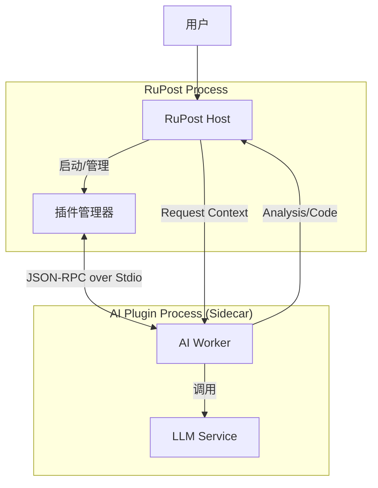
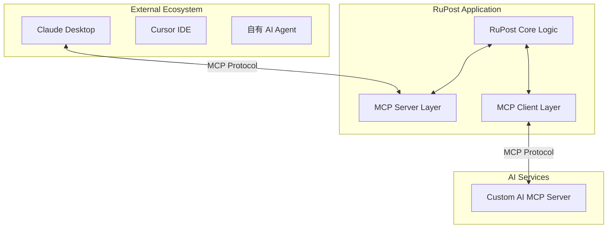

# RuPost AI 接入技术方案与架构设计

本文档详细阐述了 RuPost 接入 AI 能力的三种技术方案，分析其优劣势，并提供架构图。

## 方案概览

*   **方案 A**: 嵌入式集成 (Embedded Integration) —— *轻量级、开箱即用*
*   **方案 B**: 插件化/Sidecar 架构 (Plugin/Sidecar) —— *解耦、扩展性强*
*   **方案 C**: MCP 原生架构 (MCP-First) —— *面向未来的 Agent 生态*

---

## 方案 A: 嵌入式集成 (Embedded Integration)

### 1. 核心思想
将 AI Client 直接集成到 RuPost 的 Rust 二进制文件中。通过 `async-openai` 或 `reqwest` 直接调用 LLM API。

### 2. 架构设计

```mermaid
graph TD
    User[用户 (CLI/TUI)] -->|交互| App[RuPost Core]
    
    subgraph RuPost Process
        App -->|拥有| Config[配置模块]
        App -->|调用| AiClient[AI Client 模块]
        AiClient -->|Trait| Provider{AI Provider Trait}
    end
    
    Provider -->|HTTP| OpenAiAPI[OpenAI API]
    Provider -->|HTTP| Ollama[Local Ollama]
    Provider -->|HTTP| DeekSeek[DeepSeek API]
    
    Config -->|读取 API Keys| EnvFile[.env / config.toml]
```

### 3. 说明
*   **AI Client 模块**: 负责构建 Prompt、管理上下文窗口、处理流式响应。
*   **配置**: 用户在 `rupost.toml` 中配置 `[ai]` 字段。

### 4. 优劣势分析
| 维度 | 优势 | 劣势 |
| :--- | :--- | :--- |
| **实施难度** | **低**。直接依赖 Rust crate，无需进程间通信。 | 耦合度高，主程序体积增加。 |
| **性能** | **高**。无 IPC 开销。 | AI 请求阻塞或 Panic 可能影响主程序（需由 Async 保证）。 |
| **用户体验** | **好**。开箱即用，无需安装额外组件。 | 升级 AI 逻辑需要更新整个 RuPost 版本。 |
| **隐私性** | **中**。代码开源，但用户需信任二进制文件行为。 | 难以灵活替换底层实现。 |

---

## 方案 B: 插件化/Sidecar 架构 (Plugin/Sidecar)

### 1. 核心思想
AI 功能剥离为独立进程（或 WASM 插件），RuPost 主程序通过标准协议（JSON-RPC/gRPC/Stdin）与 AI 服务通信。

### 2. 架构设计



### 3. 说明
*   **解耦**: AI 逻辑可以是 Python 写的（利用 Python 丰富的 AI 生态），也可以是另一个 Rust binary。
*   **通信**: 使用 JSON-RPC over Standard I/O，类似 LSP (Language Server Protocol)。

### 4. 优劣势分析
| 维度 | 优势 | 劣势 |
| :--- | :--- | :--- |
| **实施难度** | **中**。需定义清晰的 通信协议。 | 用户可能需要安装 Python 环境或下载额外 Binary。 |
| **扩展性** | **极高**。社区可编写不同 AI 插件支持不同模型。 | 进程管理复杂（僵尸进程、通信超时）。 |
| **稳定性** | **高**。AI 插件崩溃不影响主程序。 | IPC 通信有一定延迟。 |

---

## 方案 C: MCP 原生架构 (MCP-First Agentic)

### 1. 核心思想
**拥抱未来**。RuPost 不仅仅“调用”AI，更是将自己封装为 **MCP Server** (Model Context Protocol)。
1.  **作为 Server**: 允许 Cursor、Claude Desktop 等外部强大 Agent 直接操作 RuPost 进行测试。
2.  **作为 Client**: RuPost 内部集成 MCP Client，连接到专门的 "AI Analysis Server"。

### 2. 架构设计



### 3. 说明
*   **双向能力**: RuPost 既能被 AI 控制（自动化测试 Agent），也能调用 AI 工具（智能分析）。
*   **标准化**: 遵循 Anthropic 推出的 MCP 标准，复用生态。

### 4. 优劣势分析
| 维度 | 优势 | 劣势 |
| :--- | :--- | :--- |
| **实施难度** | **高**。MCP 协议尚新，Rust SDK 需要调研。 | 生态尚在早期，普通用户可能不理解。 |
| **前景** | **极好**。符合 AI Agent 发展趋势，可被集成到更大工作流。 | 通信链路较长。 |
| **灵活性** | **极高**。可以将 RuPost 串联进复杂的 DevOps Agent chain 中。 | 增加了理解门槛。 |

---

## 综合推荐方案

建议采用 **“阶段演进策略”**：

### 阶段 1：方案 A (MVP)
*   **理由**: 快速落地，用户无感知。RuPost 目前定位是 CLI/TUI 工具，直接集成 `async-openai` 能以最小成本提供 80% 的价值（补全、简单的分析）。
*   **实现**: 在 `Cargo.toml` 添加 `async-openai`，在 `src/ai/` 实现。

### 阶段 2：方案 C (Evolution)
*   **理由**: 当功能稳定后，将 RuPost 的核心能力暴露为 MCP Server。这不冲突方案 A，而是扩展 RuPost 的边界，让其成为 Agent 可调用的“工具”。
*   **实现**: 引入 MCP Server SDK，暴露 `run_request`, `get_history` 等 Tool。

### 不推荐方案 B
*   **理由**: 除非为了引入 Python 生态，否则 Sidecar 模式增加了发布和运维复杂度，对于单纯调用 HTTP API 的 LLM 场景属于过度设计。

## 详细实施建议 (基于方案 A)

### 技术栈
*   **HTTP Client**: `reqwest` (已有) 或 `async-openai` (推荐，封装好)。
*   **Prompt 模板**: 使用 Rust 的 `minijinja` 或 `tera` 渲染 Prompt，方便管理。
*   **Token 计算**: `tiktoken-rs` (可选，用于本地估算 token 避免超限)。
*   **Streaming**: 必须支持 SSE (Server-Sent Events) 流式输出，通过 TUI 的回调实时显示字符，避免用户等待焦虑。

### 数据流 (以智能分析为例)
1.  用户在 TUI 选中一条失败记录。
2.  按下 `a` (Analyze)。
3.  RuPost 提取 Request (URL, Method, truncated Body) 和 Response (Status, truncated Body)。
4.  构建 Prompt: `Analyize this HTTP failure:\nRequest: ...\nResponse: ...`
5.  调用配置的 Provider (e.g., DeepSeek V3 via SiliconFlow)。
6.  接收流式响应，更新 TUI 弹窗。
