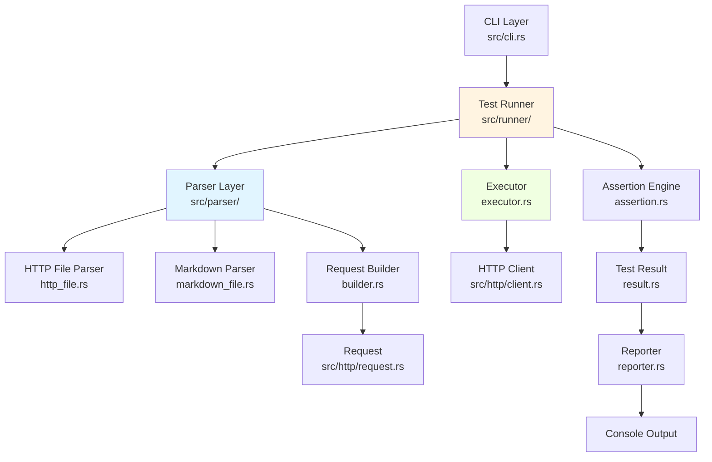
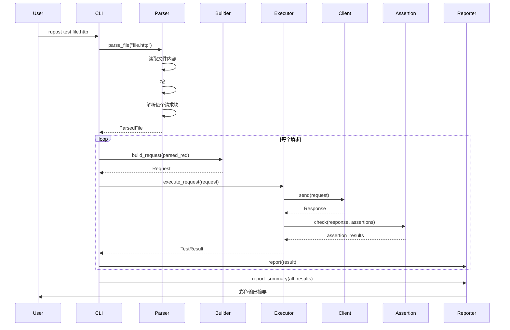

# Phase 2: 文档驱动测试功能 - 实现计划

## 概述

本计划旨在实现 RuPost 的核心差异化功能：**基于文档的 API 测试能力**。该功能允许用户从文件中读取、解析和批量执行 HTTP 请求，支持 `.http` 和 `.md` 两种文件格式，实现"文档即测试"的理念。

### 背景与动机

- **问题**: 现有工具 (curl/httpie) 缺乏文档管理能力，Postman 等 GUI 工具不适合版本控制和 CI/CD
- **解决方案**: 支持基于纯文本文件的请求定义，易于版本控制、代码审查和自动化测试
- **差异化**: 同时支持专用的 `.http` 格式和通用的 `.md` 格式，实现"文档即测试"(Literate Programming)

---

## 用户审核要点

> [!IMPORTANT]
> **核心设计决策**
> 
> 1. **双格式支持**: 同时支持 `.http`（专用格式）和 `.md`（通用文档格式）
>    - `.http`: 适合纯 API 测试场景，语法简洁
>    - `.md`: 适合 API 文档场景，文档与测试融合
> 
> 2. **断言语法**: 使用注释形式的断言 `@assert status == 200`
>    - 优点: 不影响原始 HTTP 请求格式，易于阅读
>    - 缺点: 需要自定义解析逻辑
> 
> 3. **执行模式**: 顺序执行所有请求，默认不共享上下文
>    - 初期简单实现，后续可扩展为支持变量传递

> [!WARNING]
> **潜在影响**
> 
> - 引入新的依赖可能增加编译时间和二进制大小
> - 解析错误需要友好的错误提示，否则用户体验差
> - 批量请求可能对目标服务器造成压力，需考虑限流

---

## 实现方案

### 架构设计



### 模块职责划分

按照 Clean Architecture 原则，模块划分如下：

#### 1. Parser Layer (解析层)
**路径**: `src/parser/`

**职责**: 将文件内容解析为结构化数据

- **[NEW] [mod.rs](file:///Users/zsyzzx/project/rust/rupost/src/parser/mod.rs)**
  - 导出公共接口
  - 提供统一的 `parse_file(path)` 入口，根据扩展名分发到不同解析器

- **[NEW] [types.rs](file:///Users/zsyzzx/project/rust/rupost/src/parser/types.rs)**
  - `ParsedRequest` - 单个解析后的请求
  - `ParsedFile` - 整个文件的解析结果
  - `ParseError` - 解析错误类型
  - `Assertion` - 断言定义

- **[NEW] [http_file.rs](file:///Users/zsyzzx/project/rust/rupost/src/parser/http_file.rs)**
  - 解析 `.http` 文件
  - 按 `###` 分割请求块
  - 解析请求行、Headers、Body
  - 解析元数据注释 (`@name`, `@skip`, `@assert`)

- **[NEW] [markdown_file.rs](file:///Users/zsyzzx/project/rust/rupost/src/parser/markdown_file.rs)**
  - 解析 `.md` 文件
  - 提取 ` ```http ` 和 ` ```rest ` 代码块
  - 将代码块内容委托给 HTTP 解析器
  - 提取代码块前的 Markdown 标题作为请求名称

- **[NEW] [builder.rs](file:///Users/zsyzzx/project/rust/rupost/src/parser/builder.rs)**
  - 将 `ParsedRequest` 转换为 `Request` 对象
  - 处理默认值（如默认 method 为 GET）
  - Body 类型推断（JSON/Plain Text）

- **[NEW] [assertion.rs](file:///Users/zsyzzx/project/rust/rupost/src/parser/assertion.rs)**
  - 解析断言语法
  - 定义 `Assertion` 枚举类型（StatusCode, BodyContains, HeaderEquals）

---

#### 2. Runner Layer (执行层)
**路径**: `src/runner/`

**职责**: 批量执行测试并收集结果

- **[NEW] [mod.rs](file:///Users/zsyzzx/project/rust/rupost/src/runner/mod.rs)**
  - 导出公共接口

- **[NEW] [executor.rs](file:///Users/zsyzzx/project/rust/rupost/src/runner/executor.rs)**
  - `TestExecutor` - 测试执行器
  - `execute_file(path)` - 执行整个文件
  - `execute_request(parsed_req)` - 执行单个请求
  - 跳过标记为 `@skip` 的请求
  - 收集执行时间和错误信息

- **[NEW] [result.rs](file:///Users/zsyzzx/project/rust/rupost/src/runner/result.rs)**
  - `TestResult` - 单个测试结果
  - `TestSummary` - 整体测试摘要（成功/失败计数）

- **[NEW] [assertion.rs](file:///Users/zsyzzx/project/rust/rupost/src/runner/assertion.rs)**
  - `AssertionExecutor` - 断言执行器
  - `check(response, assertions)` - 执行断言检查
  - 返回断言失败详情

- **[NEW] [reporter.rs](file:///Users/zsyzzx/project/rust/rupost/src/runner/reporter.rs)**
  - `TestReporter` - 测试报告器
  - 彩色输出成功/失败结果
  - 显示摘要报告
  - 支持 `--verbose` 详细模式

---

#### 3. CLI Layer (接口层)
**路径**: `src/cli.rs`

**职责**: 提供命令行接口

- **[MODIFY] [cli.rs](file:///Users/zsyzzx/project/rust/rupost/src/cli.rs)**
  - 添加 `test` 子命令
  - 支持参数: `rupost test <file> [--verbose] [--stop-on-error]`
  - 集成 `TestExecutor`
  - 根据测试结果设置退出码

---

### 数据流



---

## 文件格式规范

### `.http` 文件格式

```http
### 登录接口
# @name login
# @assert status == 200
# @assert body contains "token"
POST https://api.example.com/login
Content-Type: application/json

{
  "username": "test",
  "password": "123456"
}

### 获取用户信息
# @skip 暂时跳过此测试
GET https://api.example.com/user/profile
Authorization: Bearer {{token}}
```

**语法说明**:
- `###` - 请求分隔符
- `# @name <name>` - 请求名称（可选）
- `# @skip` - 跳过该请求（可选）
- `# @assert <condition>` - 断言语句（可选，可多个）
- 第一行非注释行为请求行: `METHOD URL`
- 后续 `Key: Value` 为 Headers
- 空行后为 Body

---

### `.md` 文件格式

````markdown
# API 文档

## 用户登录

登录接口用于获取访问令牌。

```http
POST https://api.example.com/login
Content-Type: application/json

{"username": "test", "password": "123456"}
```

## 获取用户信息

使用令牌获取用户资料。

```rest
GET https://api.example.com/user/profile
Authorization: Bearer token123
```
````

**语法说明**:
- 提取所有 ` ```http ` 和 ` ```rest ` 代码块
- 代码块前的最近一个 Markdown 标题作为请求名称
- 代码块内容按 `.http` 格式解析

---

## 验证计划

### 单元测试

每个模块需包含完整的单元测试:

- **Parser 测试**: [`tests/parser_test.rs`](file:///Users/zsyzzx/project/rust/rupost/tests/parser_test.rs)
  - 测试各种合法/非法格式
  - 边界情况（空文件、纯注释）
  - Markdown 代码块提取
  
- **Builder 测试**: [`tests/builder_test.rs`](file:///Users/zsyzzx/project/rust/rupost/tests/builder_test.rs)
  - 测试 ParsedRequest → Request 转换
  - 测试默认值处理
  - 测试 Body 类型推断

- **Assertion 测试**: [`tests/assertion_test.rs`](file:///Users/zsyzzx/project/rust/rupost/tests/assertion_test.rs)
  - 测试各种断言类型
  - 测试断言成功/失败场景

### 集成测试

- **[NEW] [tests/file_test.rs](file:///Users/zsyzzx/project/rust/rupost/tests/file_test.rs)**
  - 端到端测试完整流程
  - 使用真实示例文件
  - 验证输出格式和退出码

### 手动测试

使用公共测试 API (httpbin.org):

```bash
# 测试单个 .http 文件
cargo run -- test examples/basic.http

# 测试 Markdown 文件
cargo run -- test examples/api-docs.md

# 详细模式
cargo run -- test examples/advanced.http --verbose

# 失败时停止
cargo run -- test examples/multiple.http --stop-on-error
```

---

## 实施步骤

### Stage 1: 格式设计与示例 (1-2 天)
- [ ] 完善 `.http` 和 `.md` 格式规范文档
- [ ] 创建 `examples/` 目录和示例文件
- [ ] 与用户确认格式规范

### Stage 2: 解析器实现 (3-4 天)
- [ ] 实现 `types.rs` 数据结构
- [ ] 实现 HTTP 文件解析器
- [ ] 实现 Markdown 文件解析器
- [ ] 完成解析器单元测试

### Stage 3: 请求构建器 (1 天)
- [ ] 实现 `builder.rs`
- [ ] 完成构建器测试

### Stage 4: 执行引擎 (2-3 天)
- [ ] 实现 `executor.rs`
- [ ] 实现 `result.rs`
- [ ] 集成到 CLI 命令
- [ ] 完成执行器测试

### Stage 5: 断言系统 (2-3 天)
- [ ] 实现断言解析
- [ ] 实现断言执行器
- [ ] 集成到执行流程
- [ ] 完成断言测试

### Stage 6: 输出报告 (1-2 天)
- [ ] 实现 `reporter.rs`
- [ ] 实现彩色输出
- [ ] 实现摘要报告
- [ ] 设置正确的退出码

### Stage 7: 验证与文档 (1-2 天)
- [ ] 端到端集成测试
- [ ] 真实 API 手动测试
- [ ] 性能测试
- [ ] 更新 README 和文档

**总计**: 约 11-17 天 (根据复杂度调整)

---

## 风险与应对

| 风险 | 影响 | 应对策略 |
|------|------|---------|
| 解析逻辑复杂，边界情况多 | 高 | 先实现最小可用版本，逐步增加边界情况测试 |
| Markdown 代码块提取可能不准确 | 中 | 使用成熟的 Markdown 解析库（如 `pulldown-cmark`） |
| 断言语法扩展性不足 | 中 | 初期仅支持基础断言，预留扩展接口 |
| 性能问题（大文件解析） | 低 | 使用流式解析，避免一次性加载整个文件 |

---

## 依赖项

新增 Cargo 依赖:

```toml
[dependencies]
# Markdown 解析
pulldown-cmark = "0.9"

# 正则表达式（用于断言解析）
regex = "1.10"
```

---

## 成功标准

✅ 能够正确解析 `.http` 和 `.md` 文件  
✅ 支持批量执行多个请求  
✅ 支持基础断言验证（状态码、Body 包含）  
✅ 提供清晰的彩色输出和摘要报告  
✅ 单元测试覆盖率 > 80%  
✅ 通过真实 API 的端到端测试  
✅ 文档完善，用户能快速上手
