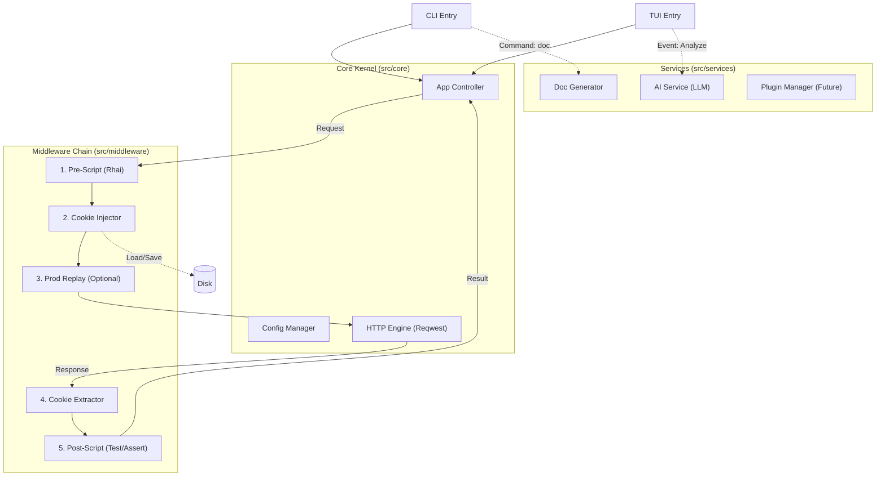

# RuPost 总体架构规划与技术演进方案 (Master Architecture Plan)

## 1. 核心设计理念
**"Kernel + Middleware + UI"**
将 RuPost 重构为微内核架构。核心负责 Request/Response 的生命周期管理，所有高级功能（Cookie、脚本、AI、生产调试）都作为 **中间件 (Middleware)** 或 **服务 (Service)** 挂载到内核上。

目标：确保在 P0/P1 阶段快速迭代的同时，不破坏 P2/P3 阶段需要的扩展性。

## 2. 总体架构图 (Target Architecture)



## 3. 分阶段技术落地详细方案

### Phase 1: 坚实基础 (Cookies + AI + TUI Base)

**对应功能**: Cookie (P0), AI Analysis (P1), TUI Upgrade (P1.5)

**架构变动**:
1.  **Cookie Middleware**:
    *   **接口**: 定义 `Middleware` trait。
        ```rust
        trait Middleware {
            async fn before_request(&self, req: &mut Request) -> Result<()>;
            async fn after_response(&self, resp: &Response) -> Result<()>;
        }
        ```
    *   **实现**: `CookieMiddleware` 持有 `Arc<CookieStore>`，在 `before_request` 注入 Header，在 `after_response` 更新 Store 并异步落盘。
2.  **AI Service**:
    *   **解耦**: 不嵌入 HTTP 流程，而是作为独立 Service。
    *   **TUI 改造**: 引入 `tokio::sync::mpsc` 通道。TUI 只有 `EventLoop`，AI 请求在后台线程执行，通过 Channel 发送 `AiChunk(String)` 回 TUI 用于流式渲染。

**测试用例 (Phase 1)**:
*   [Cookie] **302 跳转测试**: 模拟登录后 302 跳转到首页，验证 Cookie 是否在重定向请求中携带。
*   [Cooke] **并发锁测试**: 启动两个终端同时运行 RuPost，验证 `fs2` 文件锁是否生效，避免 JSON 损坏。
*   [AI] **超时截断**: 模拟 LLM 30秒无响应，验证 TUI 是否卡死（预期：显示超时提示，UI 仍可响应按键）。
*   [AI] **乱码处理**: 给 AI 发送二进制 Response Body，验证截断逻辑是否生效。

### Phase 2: 深度能力 (Scripting + Prod Debug)

**对应功能**: Production Debug (P2), Dynamic Scripting (P2.5)

**架构变动**:
1.  **Scripting Middleware**:
    *   引入 `rhai` 引擎。注意 `ScriptEngine` 初始化开销，需全局单例。
    *   **关键点**: 在 `before_request` 中，需要将 Rust 的 `Request` 对象转换为 Rhai 的 `Map`，执行完再从 `Map` 映射回 Rust 对象（会有少量性能损耗，但为了灵活性值得）。
2.  **Prod Debug Loader**:
    *   这是一个“特殊的 Request Source”。
    *   实现 `LogParser` trait，将 Nginx/Application Log 转换为标准 `Request` 对象，然后复用现有的 HTTP 执行链路。

**测试用例 (Phase 2)**:
*   [Script] **死循环防护**: 在脚本中写 `while(true){}`，验证 RuPost 能否在 1秒内强行终止并报错。
*   [Script] **签名正确性**: 使用 Python 生成标准 HMAC-SHA256，与 Rhai 脚本计算结果比对。
*   [Prod] **脏数据清洗**: 导入包含乱码或不完整 JSON 的日志文件，验证 Parser 是否能跳过错误行而不是 Panic。

### Phase 3: 生态扩展 (Doc Gen + Plugins)

**对应功能**: Doc Gen (P3), Plugins (P4)

**架构变动**:
1.  **Static Analyzer**:
    *   复用 Parser，但增加 `CommentBlock` 提取能力。
    *   **Schema Inference**: 编写算法，输入 `serde_json::Value`，递归输出 `OpenAPI Schema`。
2.  **Plugin System (预留)**:
    *   在 `Middleware` trait 的每个 Hook 点，预留 `PluginDispatch` 调用。暂不通过 WASM 实现，先通过 `Command` 调用外部脚本（如 Python 脚本）作为 MVP 插件方案。

**测试用例 (Phase 3)**:
*   [Doc] **类型推导边界**: 测试 `null`, 空数组 `[]`, 混合类型数组 `[1, "a"]`，验证 Schema 生成的健壮性。
*   [Doc] **敏感数据泄露**: 验证生成的 `openapi.json` 中是否自动剔除了 `Authorization` 等敏感 Header。

## 4. 接口预留与扩展性总结

为了支持上述演进，核心代码 (`src/lib.rs` / `src/core/`) 需主要定义以下 Traits：

1.  **`AiProvider`**: `async fn complete(...)` (支持 OpenAI, Ollama, Claude)。
2.  **`Middleware`**: `before_request(...)`, `after_response(...)` (支持 Cookie, Script, Plugins)。
3.  **`LogSource`**: `fn next_request(...)` (支持 File Log, TCP Stream, Kafka)。
4.  **`DocExporter`**: `fn export(...)` (支持 OpenAPI, Markdown, Postman)。

## 5. 总结
本架构通过 **Middleware 链式处理** 解决了从 Cookie 到 脚本的一系列拦截需求，通过 **Service 异步化** 解决了 AI 和 TUI 的交互卡顿问题。
从 Phase 1 到 Phase 3，每一步都是在“微内核”上做加法，避免了大规模重构的风险。
