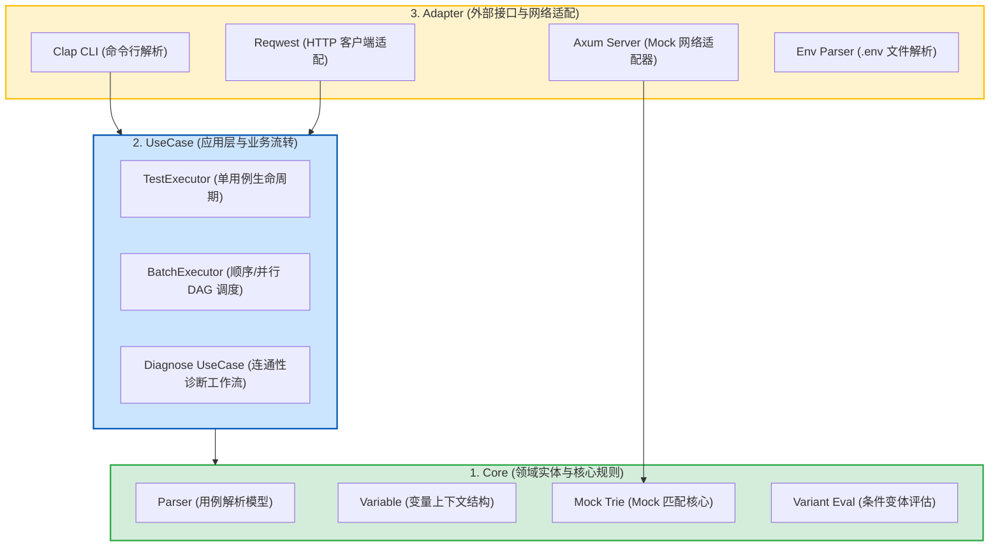

# RuPost 架构设计与开发者扩展指南 (Architecture & Extension Guide)

本文档旨在帮助开发者了解 RuPost 内部的架构分层、核心模块设计原则（遵循 **Clean Architecture**），以及如何在此架构下进行后续特性的二次开发与功能扩展。

---

## 1. Clean Architecture 架构分层

RuPost 核心引擎遵循 Clean Architecture（清洁架构）原则设计，严格保持“内层核心逻辑不依赖外层适配器，外部框架仅作为可插拔插件”的依赖关系。



### 1.1 Core (领域实体层)
*   **职责**：定义整个系统的最基本数据模型与通用计算规则。绝不引入任何外部网络连接、文件 I/O 模块。
*   **包含组件**：
    *   `src/parser/types.rs`：存储从 `.http`/`.md` 文件解析出的结构体，如 `ParsedRequest`、`Assert`、`Capture`。
    *   `src/variable/types.rs`：包含 `VariableContext`、`VariableConfig` 的实体定义。
    *   `src/mock/trie.rs` / `src/mock/matcher.rs`：内存级 Trie 树路由算法，独立进行路径分词和模糊匹配。
    *   `src/mock/variant.rs`：内存中根据 Header/Query/JSONPath 的内容评估 `MockVariant` 命中的核心纯函数。

### 1.2 UseCase (应用用例层)
*   **职责**：实现应用程序的核心业务逻辑，编排实体层以实现特定的用例（如串/并行测试流、网络指标拆分）。
*   **包含组件**：
    *   `src/runner/executor.rs`：驱动单个 API 的整个执行流程（渲染变量 -> 发送 -> 执行断言 -> 执行变量捕获）。
    *   `src/runner/batch.rs` / `src/runner/parallel.rs`：接收扫描的文件映射，计算 DAG 依赖，分配线程调度并控制 Fail-Fast 异常退出。
    *   `src/http/diagnose.rs`：处理 `diagnose` 连通性分析的时序编排工作。

### 1.3 Adapter (接口适配器层)
*   **职责**：负责与外部环境、第三方框架和底层操作系统的网络/文件接口进行数据转换与桥接。
*   **包含组件**：
    *   `src/http/client.rs`：基于 `reqwest` 实现 `HttpClient` 适配器。
    *   `src/mock/server.rs`：基于 `axum` 实现的 Mock HTTP 网络服务端。它本身不参与任何路由规则计算，而是直接持有并调用底层的 `RouteMatcher` 核心接口。如果未来需要替换为 `actix-web` 或 `warp`，只需重新编写一个适配器实现即可，核心 Trie 匹配规则完全无需修改。
    *   `src/variable/env_file.rs`：负责从操作系统读取 `.env` 等纯文本的环境变量并转换为系统的 KV 结构。

---

## 2. 核心流转机制设计解密

### 2.1 Trie 模糊路由匹配与路径提取
在 Mock 服务中，路由被存储在一个嵌套的 `TrieNode` 结构中：
```rust
struct TrieNode {
    children: HashMap<String, TrieNode>,
    param_child: Option<(String, Box<TrieNode>)>, // 对应 :id 等路径参数
    wildcard_child: Option<Box<TrieNode>>,        // 对应 *
    double_wildcard_child: Option<Box<TrieNode>>, // 对应 **
    variants: Vec<MockVariant>,                   // 命中该路由的变体规则集
}
```
当请求到来时，路径按 `/` 进行切片，依次向下匹配。如果是 `:id` 节点，匹配成功的同时还会将实际路由中的对应部分提取为参数（例如 `/users/123` 命中 `/users/:id`，则捕获 `id = 123`），并将此捕获结果合并到该请求上下文 `VariableContext` 中，从而实现动态的响应体内容占位替换。

### 2.2 状态单向克隆并发传递原理 (State Cloning)
在并行模式下，测试任务通过 `tokio::task::JoinSet` 并发运行。为实现拓扑顺序上局部变量和 Cookie 的级联传递，RuPost 通过如下多线程安全的克隆逻辑来实现：
1.  **节点状态锁定**：当前置测试文件 A（例如 `01_login.http`）运行完成后，系统对 A 的最终 `Context` 和 `CookieStore` 提取出来，对其进行序列化（转换为 JSON 格式或纯文本）。
2.  **子节点环境初始化**：当依赖于 A 的子用例 B（例如 `02_profile.http`）准备运行时，RuPost 在为 B 分配的隔离线程中，将前置的上下文数据**进行深拷贝（Deep Clone）**，反序列化合并到 B 的沙箱上下文中。
3.  **并发隔离**：B 的所有后续运行不会再修改 A 的 Context。由于在 DAG 图中，可能有多个子节点同时依赖于 A，这种**单向克隆（Single-Direction Cloning）**模式既允许状态下发，又规避了多线程并发访问同一状态的写冲突与死锁风险。

---

## 3. 开发者扩展指引 (Extension Guide)

当您需要在 RuPost 中开发新特性时，请严格遵守以下开发规范。

### 3.1 增加一条新的 CLI 子命令
1.  **修改 Adapter 层 CLI 定义** (`src/cli.rs`)：
    *   在 `Commands` 枚举中增加您的新命令与别名。
    *   使用 `clap` 的属性宏定义需要的参数。
2.  **修改主入口逻辑** (`src/main.rs`)：
    *   在 `main` 函数的 `match cli.command` 块中添加对应的分支。
3.  **实现 UseCase 层核心**：
    *   如果逻辑复杂，应在 `src/runner/` 或相应模块下新建一个独立的 UseCase 结构。
    *   原则上，`main.rs` 和 `cli.rs` 中不应该有具体的业务逻辑代码，保持它们仅作为命令行参数分发的职责。

### 3.2 实现 Sprint 3 中的脚本与流程控制引擎 (最佳实践示例)
当您需要为用例引入前/后置 Javascript 脚本以及条件判断 `@skip-if` 时：
1.  **Core 层扩展**：
    *   在 `src/parser/types.rs` 的 `ParsedRequest` 中扩充 `pre_script: Option<String>` 和 `post_script: Option<String>`。
2.  **UseCase 层拦截**：
    *   在 `src/runner/executor.rs` 执行 HTTP 请求前，调用脚本解释器。
    *   在执行后、执行断言前，提取 Response 的 body 与 headers，传入后置脚本解释器。
3.  **Adapter 层适配器桥接**：
    *   如果使用 `deno_core` 或 `v8` 作为 JS 引擎，应创建一个独立的 `src/script/` 适配器包。
    *   核心 `TestExecutor` 不应当直接硬编码 `deno` 细节，而是通过定义一个 `ScriptEngine` 的 Trait，外部适配器实现该 Trait 并注入，从而维持架构的清洁性与跨平台编译的可行性。
