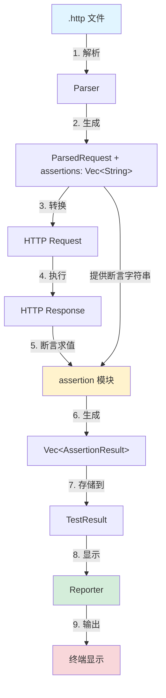

# 断言系统数据流转详解

本文档详细讲解 RuPost 断言系统从 `.http` 文件到最终结果输出的完整数据流转过程。

---

## 🔄 断言系统数据流转全景图



---

## 📝 详细流程分解

### **阶段 1：解析 HTTP 文件** 📄 → ⚙️

**用户输入** (`examples/assertions.http`):
```http
@name User Login
@assert status == 200
@assert body.token exists
@assert body.user.id > 0
POST https://api.example.com/login

{"username": "test"}
```

**Parser 处理** ([http_file.rs:252](file:///Users/zsyzzx/project/rust/rupost/src/parser/http_file.rs#L252-L256)):
```rust
// parse_metadata_line() 识别 @assert
else if let Some(assertion) = line.strip_prefix("@assert") {
    metadata.assertions.push(assertion.trim().to_string());
}
```

**生成数据结构** ([types.rs](file:///Users/zsyzzx/project/rust/rupost/src/parser/types.rs#L55-L69)):
```rust
ParsedRequest {
    name: Some("User Login"),
    method: Some("POST"),
    url: "https://api.example.com/login",
    metadata: RequestMetadata {
        name: Some("User Login"),
        skip: false,
        timeout: None,
        assertions: vec![
            "status == 200",           // ← 原始字符串
            "body.token exists",       // ← 原始字符串
            "body.user.id > 0"         // ← 原始字符串
        ]
    },
    headers: [...],
    body: Some("{\"username\": \"test\"}")
}
```

---

### **阶段 2：执行 HTTP 请求** ⚙️ → 🌐

**Executor 处理** ([executor.rs:50-54](file:///Users/zsyzzx/project/rust/rupost/src/runner/executor.rs#L50-L54)):
```rust
// 1. 提前保存断言列表（在 parsed 被移动前）
let assertions_to_eval = parsed.metadata.assertions.clone();
// assertions_to_eval = ["status == 200", "body.token exists", "body.user.id > 0"]

// 2. 转换为 HTTP Request
let request = parsed.try_into()?;

// 3. 执行请求
let response = self.client.execute(request).await?;
```

**获得 Response**:
```rust
Response {
    status: Status(200),
    headers: {
        "content-type": "application/json",
        ...
    },
    body: r#"{"token": "abc123", "user": {"id": 42, "name": "test"}}"#,
    duration: Duration(234ms)
}
```

---

### **阶段 3：断言求值** 🌐 → 🔍

这是**核心流程**，涉及 4 个子步骤：

#### **3.1 循环处理每个断言字符串**

**Executor 代码** ([executor.rs:72-88](file:///Users/zsyzzx/project/rust/rupost/src/runner/executor.rs#L72-L88)):
```rust
let mut assertion_results = Vec::new();

for assertion_str in &assertions_to_eval {
    // 处理 "status == 200"
    // 处理 "body.token exists"
    // 处理 "body.user.id > 0"
}
```

#### **3.2 解析断言字符串 → 抽象语法树**

**Parser 模块** ([assertion/parser.rs](file:///Users/zsyzzx/project/rust/rupost/src/assertion/parser.rs#L11-L60)):

```rust
// 输入: "status == 200"
parse_assertion("status == 200")

// 内部处理:
// 1. 查找运算符 "=="
// 2. 分割: left="status", right="200"
// 3. 解析左值路径: ValuePath::Status
// 4. 解析右值: AssertValue::Number(200.0)

// 输出: 
AssertExpr::Compare {
    left: ValuePath::Status,
    op: CompareOp::Equal,
    right: AssertValue::Number(200.0)
}
```

**另一个例子**:
```rust
// 输入: "body.user.id > 0"
parse_assertion("body.user.id > 0")

// 输出:
AssertExpr::Compare {
    left: ValuePath::Body(vec!["user", "id"]),
    op: CompareOp::Greater,
    right: AssertValue::Number(0.0)
}
```

**exists 断言**:
```rust
// 输入: "body.token exists"
parse_assertion("body.token exists")

// 输出:
AssertExpr::Exists {
    path: ValuePath::Body(vec!["token"])
}
```

#### **3.3 值提取：从 Response 中提取实际值**

**Extractor 模块** ([assertion/extractor.rs](file:///Users/zsyzzx/project/rust/rupost/src/assertion/extractor.rs#L5-L32)):

```rust
// 根据 ValuePath 提取值
extract_value(&response, &ValuePath::Status)
// → AssertValue::Number(200.0)

extract_value(&response, &ValuePath::Body(vec!["token"]))
// → 解析 JSON: {"token": "abc123", ...}
// → 访问路径: ["token"]
// → 获取值: "abc123"
// → AssertValue::String("abc123")

extract_value(&response, &ValuePath::Body(vec!["user", "id"]))
// → 解析 JSON
// → 访问路径: ["user"]["id"]
// → 获取值: 42
// → AssertValue::Number(42.0)
```

**JSON 路径提取细节**:
```rust
fn extract_from_json_body(body: &str, segments: &[String]) -> Result<AssertValue> {
    let json_value: serde_json::Value = serde_json::from_str(body)?;
    // json_value = {"token": "abc123", "user": {"id": 42, "name": "test"}}
    
    let mut current = &json_value;
    for segment in segments {  // ["user", "id"]
        current = current.get(segment)?;
        // 第1次: current = {"id": 42, "name": "test"}
        // 第2次: current = 42
    }
    
    json_value_to_assert_value(current)  // → AssertValue::Number(42.0)
}
```

#### **3.4 求值：比较实际值与期望值**

**Evaluator 模块** ([assertion/evaluator.rs](file:///Users/zsyzzx/project/rust/rupost/src/assertion/evaluator.rs#L6-L58)):

```rust
// 断言 #1: status == 200
evaluate_assertion(
    &AssertExpr::Compare {
        left: ValuePath::Status,
        op: CompareOp::Equal,
        right: AssertValue::Number(200.0)
    },
    &response
)

// 流程:
// 1. 提取实际值: extract_value() → AssertValue::Number(200.0)
// 2. 比较: 200.0 == 200.0 → true
// 3. 生成结果:
AssertionResult {
    raw: "status == 200",
    passed: true,
    actual: Some("200"),
    expected: "== 200",
    message: None
}
```

**失败的断言示例**:
```rust
// 断言 #2: body.user.id > 100 (实际值是 42)
evaluate_assertion(...)

// 流程:
// 1. 提取: extract_value() → AssertValue::Number(42.0)
// 2. 比较: 42.0 > 100.0 → false
// 3. 生成结果:
AssertionResult {
    raw: "body.user.id > 100",
    passed: false,
    actual: Some("42"),
    expected: "> 100",
    message: Some("Expected body.user.id to be > 100, but got 42")
}
```

---

### **阶段 4：收集断言结果** 🔍 → 📊

**Executor 完成求值** ([executor.rs:72-106](file:///Users/zsyzzx/project/rust/rupost/src/runner/executor.rs#L72-L106)):
```rust
let mut assertion_results = Vec::new();

for assertion_str in &assertions_to_eval {
    match parse_assertion(assertion_str) {
        Ok(assertion_expr) => {
            let result = evaluate_assertion(&assertion_expr, &response);
            assertion_results.push(result);
        }
        Err(e) => {
            assertion_results.push(AssertionResult::error(assertion_str.clone(), e));
        }
    }
}

// 结果:
assertion_results = vec![
    AssertionResult { raw: "status == 200", passed: true, ... },
    AssertionResult { raw: "body.token exists", passed: true, ... },
    AssertionResult { raw: "body.user.id > 0", passed: true, ... }
]
```

---

### **阶段 5：创建 TestResult** 📊 → 📦

**Executor 生成最终结果** ([executor.rs:90-106](file:///Users/zsyzzx/project/rust/rupost/src/runner/executor.rs#L90-L106)):
```rust
// 创建成功的测试结果
let mut test_result = TestResult::success(
    request_number,
    name,
    method,
    url,
    response,
);

// 附加断言结果
test_result.assertions = assertion_results;

// 如果有断言失败，标记测试为失败
if test_result.assertions.iter().any(|a| !a.passed) {
    test_result.success = false;  // ← 关键逻辑
}

// 最终数据:
TestResult {
    request_number: 1,
    name: Some("User Login"),
    method: "POST",
    url: "https://api.example.com/login",
    status: Some(200),
    duration: Duration(234ms),
    success: true,  // 所有断言都通过
    error: None,
    response: Some(...),
    skipped: false,
    assertions: vec![
        AssertionResult { raw: "status == 200", passed: true, ... },
        AssertionResult { raw: "body.token exists", passed: true, ... },
        AssertionResult { raw: "body.user.id > 0", passed: true, ... }
    ]
}
```

---

### **阶段 6：统计汇总** 📦 → 📈

**TestSummary 聚合统计** ([types.rs:126-145](file:///Users/zsyzzx/project/rust/rupost/src/runner/types.rs#L126-L145)):
```rust
TestSummary::from_results(&results)

// 统计断言
let total_assertions = results.iter().map(|r| r.assertions.len()).sum();
// = 3 + 4 + 2 + ... = 26

let passed_assertions = results
    .iter()
    .flat_map(|r| &r.assertions)
    .filter(|a| a.passed)
    .count();
// = 21

let failed_assertions = results
    .iter()
    .flat_map(|r| &r.assertions)
    .filter(|a| !a.passed)
    .count();
// = 5

// 结果:
TestSummary {
    total: 10,
    passed: 6,
    failed: 4,
    skipped: 0,
    total_duration: Duration(4318ms),
    total_assertions: 26,    // ← 断言统计
    passed_assertions: 21,   // ← 断言统计
    failed_assertions: 5     // ← 断言统计
}
```

---

### **阶段 7：显示输出** 📈 → 🖥️

**Reporter 格式化输出** ([reporter.rs:92-107](file:///Users/zsyzzx/project/rust/rupost/src/runner/reporter.rs#L92-L107)):

```rust
// 显示断言结果
if !result.assertions.is_empty() {
    println!("   Assertions:");
    for assertion in &result.assertions {
        if assertion.passed {
            println!("     {} {}", "✓".green(), assertion.raw);
        } else {
            println!("     {} {}", "✗".red(), assertion.raw);
            if let Some(msg) = &assertion.message {
                println!("       {}", msg.red());
            }
        }
    }
}
```

**终端输出**:
```
 ✓ [1] User Login - POST https://api.example.com/login [200] (234ms)
   Assertions:
     ✓ status == 200
     ✓ body.token exists
     ✓ body.user.id > 0

━━━━━━━━━━━━━━━━━━━━━━━━━━━━━━━━━━━━━━━━━━━━━━━━━━
Summary
━━━━━━━━━━━━━━━━━━━━━━━━━━━━━━━━━━━━━━━━━━━━━━━━━━
  Tests: 1 passed, 0 failed, 1 total
  Assertions: 3 passed, 0 failed, 3 total
  Duration: 0.234s
```

---

## 🎯 关键数据结构总结

| 阶段 | 数据类型 | 示例 | 位置 |
|------|---------|------|------|
| **解析** | `Vec<String>` | `["status == 200"]` | `RequestMetadata.assertions` |
| **解析AST** | `AssertExpr` | `Compare { left: Status, op: Equal, right: Number(200) }` | 内存临时 |
| **提取值** | `AssertValue` | `Number(200.0)` | 内存临时 |
| **求值结果** | `AssertionResult` | `{ raw: "...", passed: true, ... }` | 内存临时 |
| **收集** | `Vec<AssertionResult>` | `[result1, result2, ...]` | `TestResult.assertions` |
| **统计** | `TestSummary` | `{ total_assertions: 26, ... }` | 最终汇总 |

---

## 💡 设计亮点

### 1. **延迟解析 (Lazy Parsing)**
- Parser 阶段只存储字符串：`Vec<String>`
- Executor 阶段才解析为 AST：`AssertExpr`
- **好处**：解析失败不影响文件解析，错误在执行时才报告

### 2. **不可变借用 (Immutable Borrowing)**
```rust
// assertions 先 clone，避免 parsed 被移动后无法访问
let assertions_to_eval = parsed.metadata.assertions.clone();
let request = parsed.try_into()?;  // parsed 被移动
// 之后仍可使用 assertions_to_eval
```

### 3. **Pipeline 模式**
```
String → Parse → AST → Extract → Value → Compare → Result
```
每个模块职责单一，易于测试和扩展。

### 4. **错误传播**
```rust
match parse_assertion(assertion_str) {
    Ok(expr) => { /* 正常流程 */ }
    Err(e) => {
        // 解析错误也生成 AssertionResult
        assertion_results.push(AssertionResult::error(...));
    }
}
```
确保即使解析失败，也能生成结果显示给用户。

---

## 🔥 完整示例流程

假设我们有这个请求：
```http
@assert status == 200
@assert body.id > 0
POST https://httpbin.org/post
```

**数据流转**:
```
1. Parser: 
   assertions = ["status == 200", "body.id > 0"]

2. Executor 执行请求:
   Response { status: 200, body: '{"id": 42}', ... }

3. 断言 #1 处理:
   "status == 200"
   → parse → Compare { Status, ==, 200 }
   → extract → 200
   → compare → 200 == 200 → true
   → AssertionResult { passed: true }

4. 断言 #2 处理:
   "body.id > 0"
   → parse → Compare { Body(["id"]), >, 0 }
   → extract → 42 (from JSON)
   → compare → 42 > 0 → true
   → AssertionResult { passed: true }

5. 收集:
   TestResult.assertions = [result1, result2]
   TestResult.success = true (所有断言通过)

6. 显示:
   ✓ status == 200
   ✓ body.id > 0
```

---

## 📚 核心模块概览

### assertion 模块结构
```
src/assertion/
├── mod.rs          # 模块导出
├── types.rs        # 数据类型定义 (280行, 3测试)
├── parser.rs       # 断言解析器 (273行, 13测试)
├── extractor.rs    # 值提取器 (163行, 10测试)
└── evaluator.rs    # 断言求值引擎 (190行, 10测试)
```

### 各模块职责

**types.rs**:
- 定义核心数据类型
- 实现值比较逻辑
- 提供 Display trait

**parser.rs**:
- 字符串 → AST 转换
- 运算符识别
- 路径解析

**extractor.rs**:
- Response → AssertValue 提取
- JSON 路径访问
- 类型转换

**evaluator.rs**:
- AST + Response → AssertionResult
- 调用 extractor 和 types
- 生成友好错误消息

---

## 🎓 学习要点

### 1. 数据流向
```
.http文件 → 字符串 → AST → 提取值 → 比较 → 结果 → 显示
```

### 2. 关键转换点
- **Parser**: 文本 → 数据结构
- **断言解析**: 字符串 → AST
- **值提取**: Response → AssertValue
- **求值**: (实际值, 期望值) → bool
- **Reporter**: 数据 → 彩色文本

### 3. 错误处理策略
- 解析错误 → AssertionResult::error
- 提取错误 → AssertionResult::error
- 比较错误 → AssertionResult::failure
- 所有错误都转化为用户友好的消息

---

这就是 RuPost 断言系统的完整数据流转过程！每一步都有清晰的职责，确保了系统的模块化和可维护性。🎯
