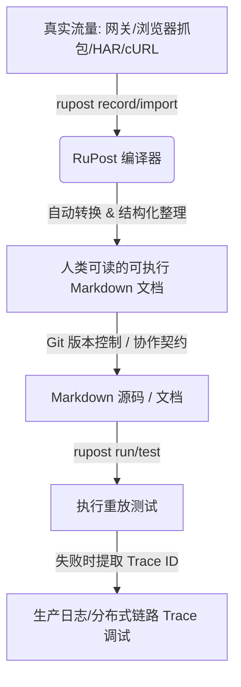

# 流量录制与重放（Traffic Record & Replay）技术专题分析与 RuPost 设计规划

## 1. 行业背景与核心痛点

在 API 开发与生命周期管理中，测试的编写与维护面临着两个难以调和的矛盾：
1. **断言编写耗时**：为了保证测试的有效性，开发者必须手动编写大量的 JSONPath、状态码和数据类型断言。
2. **依赖 Mock 复杂**：微服务架构下，一个 API 往往依赖于复杂的数据库状态、Redis 缓存以及第三方 API，构造这些外部依赖的 Mock 耗费了大量时间。

为了解决这一问题，市场上演化出了**“录制与重放 (Record & Replay)”**的技术流派，旨在通过捕捉真实的网络流量来自动生成测试。本报告将深度解构该技术，并探讨 RuPost 如何在“文档即测试”的理念下，设计出差异化的重放方案。

---

## 2. 主流重放机制深度解构

目前市场上的“重放”功能主要分为两个维度：**调试级单请求重放**（以 Reqable 为代表）与 **Mock级自动回归重放**（以 Keploy 为代表）。

### 2.1 调试级重放：Reqable / Charles Proxy
*   **技术原理**：
    1. 客户端通过中间人代理（MITM Proxy）拦截终端设备（PC/移动端）发出的 HTTP/HTTPS 请求。
    2. 将请求的头部、路径、参数和 Body 保存在内存/本地数据库中。
    3. 用户在 GUI 上右键点击某条历史记录，直接重新发送该请求，或者修改（Compose）其中的字段后再发送。
*   **适用场景**：单接口的即时网络联调、问题排查、API 篡改（修改请求参数）测试。
*   **核心痛点**：
    *   **缺少自动化环境与状态保持**：如果重放的 API 依赖于前置登录 Token 或特定的数据库数据，在一段时间后重放往往会因为过期或数据冲突而失败。
    *   **难以版本化管理**：所有的抓包数据都是私有格式的 DB 或者是臃肿的 HAR，不适合 Git 提交，无法作为持续集成的回归测试套件。
    *   **仅存在于 GUI 闭环内**：无法在无头（Headless）服务器或 CI/CD 流水线中自动运行。

---

### 2.2 Mock级自动回归重放：Keploy / GoReplay
*   **技术原理**：
    1. **录制阶段（Record）**：利用 eBPF（系统调用拦截）或者代码级驱动代理，拦截应用程序所有的进出流量（包括入站 HTTP 请求，以及出站的 DB 查询、Redis 读写、第三方 HTTP 调用）。
    2. **持久化**：将这组“入站请求 + 所有外部依赖的出站请求与响应 + 最终入站响应”保存为 YAML 格式的文件。
    3. **重放测试阶段（Replay）**：在测试环境中启动应用（通常是一个干净的沙箱环境），重新发送之前录制的入站 HTTP 请求。
    4. **自动 Mock**：当应用在执行过程中尝试读取 DB 或调用第三方 API 时，Keploy 拦截该系统调用，直接返回先前录制好的 Mock 响应，而无需真实连接数据库或网络。最后比对当前响应与录制响应的差异。
*   **适用场景**：复杂的微服务回归测试、重度依赖数据库与第三方组件的集成测试。
*   **核心痛点**：
    *   **“机器生成测试”的不可读性**：录制产生的 YAML 文件极其庞大且杂乱（包含大量的 SQL 语句、十六进制字节码等），人类根本无法阅读和编辑，**彻底失去了“文档”属性**。
    *   **无法用于 TDD（测试驱动开发）**：开发者必须先写出可运行的程序，并且在生产或测试环境中产生实际流量才能进行录制。在 API 设计阶段，该工具无法提供任何帮助。
    *   **环境漂移与时间敏感性**：如果 API 的业务逻辑强依赖于当前系统时间（如过期检查）或随机数，重放往往会因为动态字段的不一致而报错，需要配置繁琐的忽略规则。
    *   **架构极其沉重**：对底层的技术栈（如 Go gRPC 库、Java JDBC 驱动）有高度绑定，或者需要 Root 权限安装 eBPF 模块，部署成本极高。

---

## 3. RuPost 的差异化机会：文档化重放（Document-driven Replay）

### 3.1 核心洞察
RuPost 秉持 **“让 API 文档变得可测试，让 API 测试变得可阅读”** 的愿景。我们认为，测试不应只是机器跑的代码，它同时应该是**团队沟通的契约与人类可读的规范**。

因此，RuPost 不应该照抄 Keploy 的“黑盒 YAML 重放”或 Reqable 的“GUI 调试重放”，而是实现 **“流量录制为 Markdown，执行为重放调试”（Traffic to Literate Document）**。



---

### 3.2 方案规划与架构构想

我们计划在后续 Phase 中，分阶段引入以下两大核心重放能力：

#### 核心能力 1：`Traffic to Document` —— 流量式文档自动生成（Record）
不同于传统工具录制出冷冰冰的机器码，RuPost 将提供录制并翻译为**人类友好 Markdown 文档**的能力：
1.  **多源导入与拦截**：
    *   支持解析标准 `HAR`（HTTP Archive）文件。
    *   支持直接将 Chrome/Firefox 开发者工具中复制的 `curl` 命令行，一键转换为可执行的 `.http` 文件或 Markdown 里的 ```http 代码块。
    *   提供极轻量的 CLI 代理接收器（例如 `rupost record --port 8080 --output api_spec.md`），在联调时作为网关拦截几条核心流量。
2.  **契约化整理**：
    *   自动识别 URL 路径中的 Dynamic Segment（如将 `/api/v1/users/123` 识别为 `/api/v1/users/{{userId}}`）。
    *   自动提取 Header 中的认证信息，并将其转化为模板变量（如 `Authorization: Bearer {{token}}`）。
3.  **智能断言生成（Inferring Asserts）**：
    *   自动推导基础断言。例如，解析返回的 JSON，自动生成 `@assert status == 200`，并利用 JSON Schema 推导出字段的类型断言（如 `@assert jsonpath "$.user.id" isInteger`）。
    *   生成包含标准 Markdown 标题和描述骨架的文档，开发者只需在生成的 Markdown 里补上几句业务描述，即可交付给前端或其他团队。

#### 核心能力 2：`Trace-aware Replay` —— 链路追踪式重放（Replay）
结合 RuPost 独特的“生产调试”定位，重放不仅仅是“发送请求比对结果”，而是具有**端到端故障诊断能力**：
1.  **环境变量注入重放**：支持通过 `rupost test api_spec.md --env staging` 将录制的用例在不同环境中重放，自动替换 Host、账号等参数。
2.  **日志与 Trace 一体化校验**：
    *   当重放测试失败时，RuPost 能够根据响应头中提取的 `Trace-ID`（如 `X-B3-TraceId` 或 `x-request-id`），自动触发底层的生产调试中间件。
    *   自动通过 SSH/Kubernetes API 收集对应服务实例在那个时间戳附近的系统日志，甚至集成 Loki/Jaeger 链路，并在终端以高亮形式打印出：
        > ❌ 重放失败：预期状态码 200，实际 500。  
        > 🔍 检测到 TraceID: `8f9c2d...`  
        > 🪵 关联后端 Pod (auth-service) 异常日志：  
        > `[ERROR] Database connection timeout to host: db-master.`

---

## 4. Clean Architecture 下的代码结构设计

为了让重放与录制功能保持高内聚、低耦合，且符合**开闭原则**，在 `rupost` 的架构中，我们将这些能力作为“核心引擎”之外的外围插件/应用层来设计：

### 4.1 核心数据结构与 Trait

```rust
// rupost-core/src/model/traffic.rs
pub struct TrafficSession {
    pub name: String,
    pub request: crate::model::HttpRequest,
    pub response: crate::model::HttpResponse,
}

// rupost-import/src/lib.rs
/// 定义流量转换引擎接口，遵循开闭原则，方便后续支持 HAR、cURL、eBPF 等多种导入源
pub trait TrafficConverter {
    fn convert(&self, raw_data: &[u8]) -> Result<Vec<TrafficSession>, crate::error::Error>;
}

// 示例：实现 HAR 转换器
pub struct HarConverter;
impl TrafficConverter for HarConverter {
    fn convert(&self, raw_data: &[u8]) -> Result<Vec<TrafficSession>, crate::error::Error> {
        // 解析 HAR 并生成 TrafficSession 数组的逻辑
        todo!()
    }
}

// rupost-codegen/src/markdown.rs
/// 将 TrafficSession 数组格式化输出为符合 RuPost 规范的 Markdown 示例文档
pub struct MarkdownSpecGenerator;
impl MarkdownSpecGenerator {
    pub fn generate(sessions: &[TrafficSession]) -> String {
        // 自动将 HTTP 流量转化为优雅的 Markdown 可运行文档
        todo!()
    }
}
```

### 4.2 模块依赖关系

```mermaid
graph TD

    subgraph Core
        Core[rupost-core: 基础 HTTP 请求、断言定义]
    end


    subgraph Adapters / Infrastructure
        Import[rupost-import: HAR/cURL 流量导入]
        Codegen[rupost-codegen: Markdown/HTTP 模板生成]
        Debug[rupost-debug: Kubernetes/SSH 日志拉取]
    end

    subgraph CLI Entry point
        Cli[rupost CLI: 命令分发]
    end

    Cli --> Import
    Cli --> Codegen
    Import --> Core
    Codegen --> Core
    Debug --> Core
```

通过这一 Clean Architecture 模式的设计，`rupost` 的核心测试解析执行引擎（`rupost-core`）可以保持纯粹和轻量，而流量录制（`import`/`codegen`）和链路追踪调试（`debug`）则作为适配器模块独立演进，不会污染核心的 HTTP 解析与执行流。

---

## 5. 总结

| 特性 | Reqable (调试重放) | Keploy (黑盒回归) | RuPost (文档化回放) |
| :--- | :--- | :--- | :--- |
| **第一性定位** | 网络拦截与包篡改工具 | 机器生成零配置回归测试桩 | **API 契约文档与可读测试集** |
| **测试媒介** | 抓包历史 / GUI Tabs | YAML 文件（自动生成，人不可读） | **Markdown + `.http`（Git 友好）** |
| **外部 Mock** | 手动 Mock Map / 拦截 | 自动录制拦截级 Mock | 手动定义模板 / 🔮规划自动 Mock |
| **生产集成** | ❌ 仅限开发机 | ❌ 适合测试沙箱，生产环境风险大 | **✅ 生产 Trace ID 与日志拉取集成** |

**结论**：RuPost 的重放战略是 **“可读性优先”**。我们致力于为开发者提供“能自动录制、生成的优美 Markdown 接口规格书，且能一键执行重放测试，在失败时自动定位至分布式日志”的极致调试体验。
