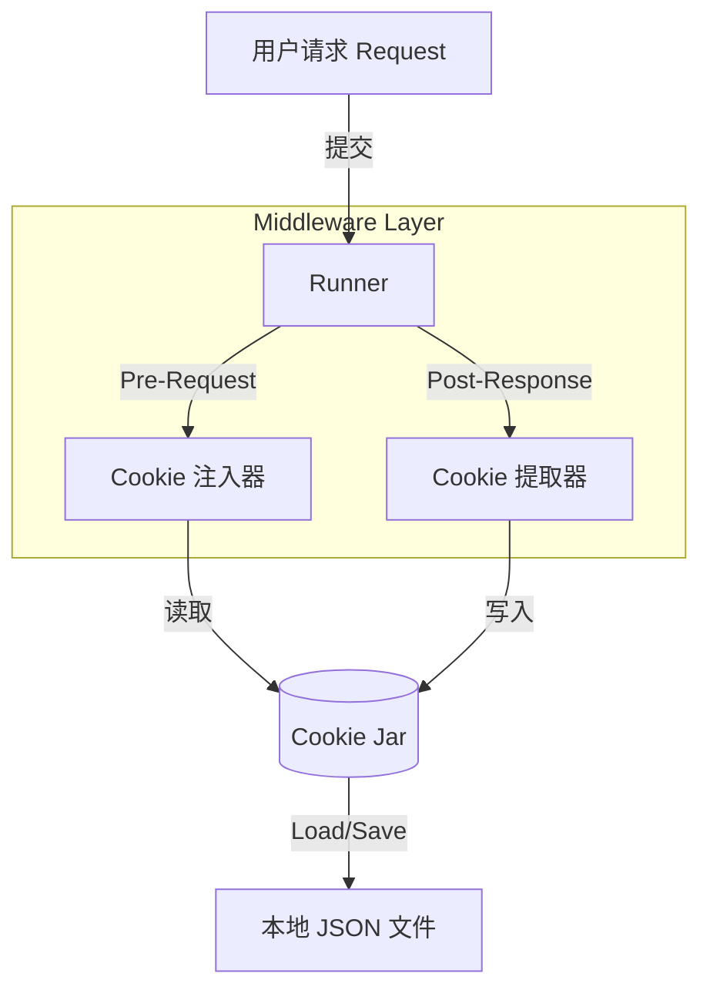

# RuPost Cookie 管理功能实施方案

## 1. 概述
Cookie 管理是 RuPost 模拟真实浏览器行为、支持有状态测试（如登录态保持、购物车流程）的基础设施。
本方案旨在实现自动化的 Cookie 捕获、存储、发送，并提供透明的 UI 管理能力。

## 2. 核心需求 (Mandatory Requirements)

以下功能点为 MVP (Minimum Viable Product) **必须要实现**的内容：

### 2.1 自动捕获与发送 (Auto-Jar)
*   **Set-Cookie 解析**: 当 HTTP 响应包含 `Set-Cookie` 头时，必须自动解析并存储到内部 Cookie Jar。
*   **自动携带**: 后续请求若匹配 Domain 和 Path 规则，必须自动在 Header 中携带 `Cookie` 字段。
*   **Redirect 支持**: 在 302/301 跳转过程中，中间产生的 Cookie 必须能被后续重定向的请求携带。

### 2.2 持久化存储 (Persistence)
*   **文件存储**: Cookie 必须持久化保存到本地文件（如 `.rupost/cookies.json` 或工作区特定文件）。
*   **会话隔离**: 只有当用户显式选择“保存会话”或配置开启时才持久化。CLI 模式下默认应支持通过参数指定 Cookie 文件（类似 Curl `-b/-c`）。

### 2.3 作用域与有效期 (Scope & Policies)
*   **Domain/Path 匹配**: 必须严格遵循 HTTP 标准 (RFC 6265)。发往 `api.example.com` 的请求不能携带 `baidu.com` 的 Cookie。
*   **过期清除**: 过期的 Cookie 不应被发送，且应从存储中自动清理。

### 2.4 手动干预 (Manual Override)
*   **显式覆盖**: 如果用户在 `.http` 文件中手动写了 `Cookie: key=value` Header，该值应与 Cookie Jar 中的值合并（Header 优先级通常更高或合并发送）。

---

## 3. 技术方案设计

### 3.1 架构层级



### 3.2 存储选型
建议基于 `reqwest_cookie_store` crate，它封装了标准且线程安全的实现。

*   **内存**: `Arc<reqwest_cookie_store::CookieStoreMutex>`
*   **持久化**: 该 crate 支持序列化为 JSON。我们只需在 App 启动时 Load，关闭时 Save。

### 3.3 TUI 界面集成方案
在 TUI 中新增 `Cookie Manager` 面板（建议快捷键 `c`），提供以下交互：

1.  **列表视图**: 表格展示 `Domain | Path | Name | Value | Expires`。
2.  **搜索/过滤**: 按域名快速筛选。
3.  **CRUD 操作**:
    *   **Delete**: 删除特定 Cookie（模拟登出）。
    *   **Add/Edit**: 手动添加/修改 Cookie（模拟伪造 Session，调试安全漏洞）。
    *   **Clear All**: 一键清空 Cookie Jar。

---

## 4. 实施细节与注意事项

### 4.1 CLI 参数支持
```bash
# 从文件加载 cookie，并把新 cookie 存回该文件
rupost test api.http --cookie-jar ./my-cookies.txt
```

### 4.2 隐私安全 (Security)
> [!IMPORTANT]
> Cookie 文件可能包含敏感 Session ID。
*   **GitIgnore**: 默认将 `*.cookie` 或 `cookies.json` 加入 `.gitignore`。
*   **脱敏**: 在 TUI 展示 Value 时，默认隐藏（显示 `******`），按需点击查看。

### 4.3 多环境隔离
不同环境（Dev/Prod）的 Cookie 必须隔离。
*   **方案**: Cookie 文件名与环境名绑定，例如 `cookies_dev.json`, `cookies_prod.json`。切换环境时自动切换 Cookie Jar。

## 5. 开发任务清单
- [ ] 引入 `reqwest_cookie_store` 依赖。
- [ ] 改造 `HttpClient`，注入全局 Cookie Store 实例。
- [ ] 实现 Cookie 的 Load/Save 逻辑，对接文件系统。
- [ ] TUI 实现 `CookieManager` Widget。
- [ ] CLI 增加 `--cookie-jar` 参数解析。

## 6. 潜在风险与挑战 (Potential Risks)

在实施过程中，可能会遇到以下几类问题，需提前规划对策：

### 6.1 并发写入冲突 (Concurrent File Access)
*   **问题**: 如果用户打开了多个终端 (Terminal Tabs) 同时运行 RuPost，且都指向同一个 `cookies.json`，可能会发生即使写入覆盖 (Last-Write-Wins) 或文件损坏。
*   **对策**: 建议使用文件锁 (`fs2` crate) 在写入时独占文件，或者在 CLI 启动时若发现文件被锁则报错/等待。

### 6.2 隐式状态导致的“幽灵测试” (Implicit State Confusion)
*   **问题**: Cookie 是“隐式”的全局状态。用户可能上次测试登录成功了，几天后测试另一个接口，仅仅因为旧 Cookie 还在且未过期而通过。这会导致脚本在纯净环境（如 CI/CD）中失败。
*   **对策**: 
    1.  **CI 模式默认不仅用**: 在 CI 环境下（检测 `CI=true` 环境变量），默认**不**加载本地 Cookie 文件，除非显式指定。
    2.  **UI 提示**: TUI 界面底部状态栏应显示 "Cookies Loaded: 5" 等字样，提醒用户当前有激活的 Cookie。

### 6.3 安全性 (Security)
*   **问题**: `cookies.json` 是明文存储。如果包含 `SESSION_ID` 或 `access_token`，且该文件被误提交到 GitHub，会导致严重安全事故。
*   **对策**: 自动将默认的 Cookie 文件名添加到 `.gitignore`。

### 6.4 本地开发环境的 Domain 限制
*   **问题**: 开发者常用 `localhost` 或 `127.0.0.1`。某些 Cookie 设置了 `Domain=example.com` 或 `Secure` (HTTPS only)，可能导致在本地 HTTP 环境下无法 Set 或 Send。
*   **对策**: 提供一个 `--insecure-cookies` 参数，允许在 localhost 环境下放宽 `Secure` 和 `Domain` 的限制。
