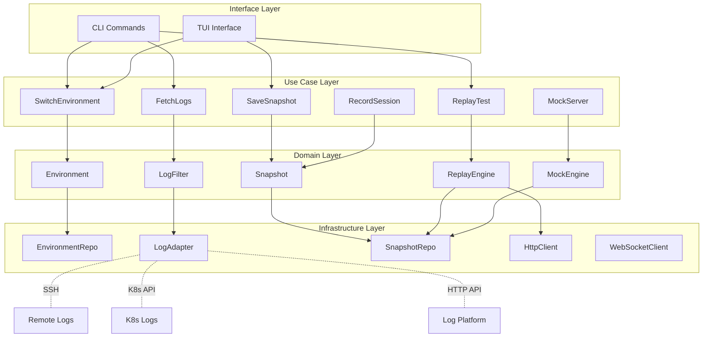

# 生产调试模式功能评估报告

> **文档信息**  
> 创建日期：2026-02-04  
> 项目：RuPost  
> 功能模块：生产调试模式（项目规划 3.0）

---

## 目录

1. [执行摘要](#执行摘要)
2. [功能概述](#功能概述)
3. [技术可行性分析](#技术可行性分析)
4. [架构设计方案](#架构设计方案)
5. [实施方案对比](#实施方案对比)
6. [MVP实施规划](#mvp实施规划)
7. [风险评估与对策](#风险评估与对策)
8. [与其他功能的协同](#与其他功能的协同)
9. [实施建议](#实施建议)

---

## 执行摘要

**核心价值**：生产调试模式旨在解决开发者在生产环境遇到问题时的快速定位、重现和调试难题，是提升 RuPost 实用性的关键功能。

**整体评估**：
- ✅ **可行性**：高（技术成熟，架构清晰）
- ⚠️ **复杂度**：中高（涉及多系统集成）
- 📅 **周期**：4-6周（完整实现）
- 🎯 **优先级**：**高**（核心调试能力）

**推荐方案**：**渐进式 + 插件化混合方案**
- Phase 1（2周）：实现 MVP 核心（环境变量、测试重现）
- Phase 2（1-2周）：日志集成
- Phase 3-4（2-3周）：高级重现功能

---

## 功能概述

### 3.1 环境变量管理

**需求描述**：支持多环境配置切换（dev、staging、prod），实现环境隔离和快速切换。

**核心能力**：
- 多环境配置文件管理
- 环境变量继承与覆盖
- 与现有变量系统无缝集成
- 环境切换的上下文保持（Cookie、Token等）

**用户场景**：
```bash
# 切换到生产环境
rupost env use prod

# 执行测试（自动应用生产环境变量）
rupost test api/login.http

# 对比不同环境的结果
rupost test api/login.http --env dev,staging,prod --compare
```

---

### 3.2 获取日志，支持过滤

**需求描述**：集成远程日志系统，自动关联请求与服务端日志，支持智能过滤。

**核心能力**：
- **Trace ID 自动提取**：从响应头（X-Trace-Id、X-Request-Id等）自动提取
- **多源日志集成**：
  - SSH 远程日志文件
  - Kubernetes API（kubectl logs）
  - 日志聚合平台（ELK、Loki、Datadog等）
- **智能过滤**：
  - 按 Trace ID 过滤
  - 按时间范围过滤
  - 按日志级别过滤（ERROR、WARN等）
  - 按关键词过滤

**用户场景**：
```bash
# 执行请求并自动获取关联日志
rupost test api/order.http --fetch-logs

# 查看特定 Trace ID 的日志
rupost logs --trace-id abc123 --level ERROR

# 查看最近 5 分钟的错误日志
rupost logs --time 5m --level ERROR --keywords "timeout,connection"
```

**技术挑战**：
- 不同日志系统的 API 适配
- Trace ID 格式的多样性
- 大量日志的传输和解析性能

---

### 3.3 获取测试结果

**需求描述**：增强现有的测试结果存储和查询能力。

**核心能力**：
- 测试结果持久化（SQLite 或 JSON）
- 结果查询和过滤（按时间、状态、环境等）
- 结果对比（历史对比、环境对比）

**用户场景**：
```bash
# 查看最近的测试结果
rupost history list --limit 10

# 对比两次测试结果
rupost history diff <id1> <id2>

# 查看失败的测试
rupost history list --status failed --env prod
```

---

### 3.4 获取响应结果

**需求描述**：增强响应结果的存储和查看能力。

**核心能力**：
- 响应详情查看（headers、body、时间统计）
- 大响应体的分页显示
- 响应格式化（JSON、XML、HTML等）

**用户场景**：
```bash
# 查看特定请求的响应
rupost history show <id> --response

# 导出响应到文件
rupost history export <id> --output response.json
```

---

### 3.5 重现测试

**需求描述**：一键重现历史测试，包含完整的上下文（变量、环境、Cookie等）。

**核心能力**：
- **完整上下文保存**：
  - 请求参数（URL、method、headers、body）
  - 环境变量快照
  - Cookie 和认证状态
  - 依赖的前置请求
- **一键重现**：
  - 恢复所有上下文
  - 执行请求
  - 对比结果差异

**用户场景**：
```bash
# 重现历史测试
rupost history replay <id>

# 重现并对比结果
rupost history replay <id> --compare

# 重现到不同环境
rupost history replay <id> --env staging
```

**技术要点**：
- 快照存储格式设计（需要平衡完整性和存储大小）
- 状态恢复的准确性（Cookie 有效期、Token 过期等）

---

### 3.6 开发环境重现生产环境测试

这是最复杂的功能，分为三个子功能：

#### 3.6.1 前端重现（Response 数据重现）

**需求描述**：录制生产环境的响应数据，在开发环境通过 Mock 服务器重现。

**核心能力**：
- 响应录制（保存完整的 response）
- Mock 服务器（提供本地 HTTP 服务）
- 请求匹配（按 URL、method 匹配录制的响应）
- 响应变体（支持多个响应版本）

**用户场景**：
```bash
# 录制生产环境的响应
rupost record start --env prod
rupost test api/*.http
rupost record stop --save prod-snapshot-20260204

# 在开发环境启动 Mock 服务器
rupost mock start --snapshot prod-snapshot-20260204 --port 8080

# 前端连接到 Mock 服务器进行开发
# http://localhost:8080 会返回录制的生产数据
```

**技术方案**：
- 使用 `axum` 或 `actix-web` 构建 Mock 服务器
- 响应匹配算法（精确匹配、模糊匹配、正则匹配）

---

#### 3.6.2 后端重现（Request 数据重现）

**需求描述**：录制生产环境的请求数据，在开发环境重放，用于后端调试。

**核心能力**：
- 请求录制（保存完整的 request）
- 请求重放（按时间序列或手动触发）
- 请求编辑（修改参数进行调试）
- 批量重放

**用户场景**：
```bash
# 录制生产环境的请求
rupost record requests --env prod --duration 1h --filter "/api/orders/*"

# 在开发环境重放请求
rupost replay requests ./prod-requests.json --target http://localhost:3000

# 编辑并重放特定请求
rupost replay edit <request-id> --target http://localhost:3000
```

**技术要点**：
- 请求序列化和去敏感化（移除生产 Token、密码等）
- 请求依赖关系处理（某些请求依赖前置请求的结果）

---

#### 3.6.3 WebSocket 数据重现（一段时间）

**需求描述**：录制生产环境的 WebSocket 通信数据，在开发环境按时序重放。

**核心能力**：
- WebSocket 消息录制（双向、带时间戳）
- 时序重放（按录制的时间间隔重放）
- 交互式重放（手动控制进度）
- 消息编辑和过滤

**用户场景**：
```bash
# 录制 WebSocket 通信
rupost ws record wss://prod.example.com/ws --duration 5m

# 重放录制的 WebSocket 数据
rupost ws replay ./ws-session.json --target ws://localhost:8080/ws

# 查看录制的消息
rupost ws inspect ./ws-session.json
```

**技术挑战**：
- **依赖功能点 4**（WebSocket 基础支持）
- 时序控制的精确度
- 大量消息的存储和性能
- 双向通信的状态同步

---

## 技术可行性分析

### 子功能评估矩阵

| 功能 | 可行性 | 复杂度 | 优先级 | 估时 | 依赖 |
|------|--------|--------|--------|------|------|
| 3.1 环境变量 | ✅ 高 | ⭐⭐ 低 | 🔴 高 | 2-3天 | 无 |
| 3.2 日志获取 | ✅ 高 | ⭐⭐⭐⭐ 高 | 🟡 中 | 1-2周 | 无 |
| 3.3 测试结果 | ✅ 高 | ⭐⭐ 低 | 🟢 中低 | 1-2天 | 无 |
| 3.4 响应结果 | ✅ 高 | ⭐⭐ 低 | 🟢 中低 | 1-2天 | 无 |
| 3.5 重现测试 | ✅ 高 | ⭐⭐⭐ 中 | 🔴 高 | 3-5天 | 无 |
| 3.6.1 前端重现 | ✅ 高 | ⭐⭐⭐⭐ 高 | 🟡 中 | 5-7天 | 无 |
| 3.6.2 后端重现 | ✅ 高 | ⭐⭐⭐⭐ 高 | 🟡 中 | 5-7天 | 无 |
| 3.6.3 WS重现 | ⚠️ 中高 | ⭐⭐⭐⭐⭐ 很高 | 🟢 低 | 1-2周 | **功能点4** |

**总体可行性**：✅ **高度可行**

所有子功能在技术上都有成熟的实现方案，主要挑战在于：
1. 多系统集成的复杂性（日志系统）
2. 时序控制的精确性（WebSocket）
3. 数据存储的规模管理

---

## 架构设计方案

### 整体架构（Clean Architecture）



### 核心数据模型

#### Environment 配置

```rust
/// 环境配置
#[derive(Debug, Clone, Serialize, Deserialize)]
pub struct Environment {
    /// 环境名称（dev、staging、prod等）
    pub name: String,
    
    /// 环境变量
    pub variables: HashMap<String, String>,
    
    /// 父环境（支持继承）
    pub parent: Option<String>,
    
    /// 基础 URL
    pub base_url: Option<String>,
    
    /// 超时配置
    pub timeout: Option<Duration>,
    
    /// 元数据
    pub metadata: EnvironmentMetadata,
}

#[derive(Debug, Clone, Serialize, Deserialize)]
pub struct EnvironmentMetadata {
    pub description: Option<String>,
    pub created_at: DateTime<Utc>,
    pub updated_at: DateTime<Utc>,
    pub tags: Vec<String>,
}
```

**配置文件格式（YAML）**：

```yaml
# .rupost/environments/prod.yaml
name: prod
base_url: https://api.example.com
parent: staging  # 继承 staging 的配置

variables:
  API_KEY: ${SECRET_PROD_API_KEY}  # 支持从系统环境变量读取
  REGION: us-west-2
  
timeout: 30s

metadata:
  description: "生产环境配置"
  tags: ["production", "critical"]
```

---

#### Snapshot 快照

```rust
/// 测试快照
#[derive(Debug, Clone, Serialize, Deserialize)]
pub struct Snapshot {
    /// 快照 ID
    pub id: String,
    
    /// 时间戳
    pub timestamp: DateTime<Utc>,
    
    /// 环境名称
    pub environment: String,
    
    /// 请求信息
    pub request: SnapshotRequest,
    
    /// 响应信息
    pub response: Option<SnapshotResponse>,
    
    /// 关联日志
    pub logs: Option<Vec<LogEntry>>,
    
    /// 元数据
    pub metadata: SnapshotMetadata,
}

#[derive(Debug, Clone, Serialize, Deserialize)]
pub struct SnapshotRequest {
    pub method: String,
    pub url: String,
    pub headers: HashMap<String, String>,
    pub body: Option<String>,
    
    /// 变量快照（执行时的变量值）
    pub variables: HashMap<String, String>,
    
    /// Cookie 快照
    pub cookies: Vec<Cookie>,
}

#[derive(Debug, Clone, Serialize, Deserialize)]
pub struct SnapshotResponse {
    pub status: u16,
    pub headers: HashMap<String, String>,
    pub body: Option<String>,
    pub elapsed: Duration,
    
    /// 提取的 Trace ID
    pub trace_id: Option<String>,
}

#[derive(Debug, Clone, Serialize, Deserialize)]
pub struct SnapshotMetadata {
    pub name: Option<String>,
    pub tags: Vec<String>,
    pub notes: Option<String>,
}
```

---

#### LogFilter 日志过滤器

```rust
/// 日志过滤器
#[derive(Debug, Clone, Serialize, Deserialize)]
pub struct LogFilter {
    /// Trace ID
    pub trace_id: Option<String>,
    
    /// 日志级别
    pub level: Option<LogLevel>,
    
    /// 时间范围
    pub time_range: Option<(DateTime<Utc>, DateTime<Utc>)>,
    
    /// 关键词（AND 逻辑）
    pub keywords: Vec<String>,
    
    /// 排除关键词
    pub exclude_keywords: Vec<String>,
    
    /// 最大条目数
    pub limit: Option<usize>,
}

#[derive(Debug, Clone, Serialize, Deserialize)]
pub enum LogLevel {
    Trace,
    Debug,
    Info,
    Warn,
    Error,
    Fatal,
}

#[derive(Debug, Clone, Serialize, Deserialize)]
pub struct LogEntry {
    pub timestamp: DateTime<Utc>,
    pub level: LogLevel,
    pub message: String,
    pub trace_id: Option<String>,
    pub source: String,  // 日志来源（文件名、服务名等）
    pub metadata: HashMap<String, String>,
}
```

---

#### LogAdapter 抽象接口

```rust
/// 日志适配器 trait（支持插件化）
#[async_trait]
pub trait LogAdapter: Send + Sync {
    /// 获取日志
    async fn fetch_logs(&self, filter: &LogFilter) -> Result<Vec<LogEntry>>;
    
    /// 测试连接
    async fn test_connection(&self) -> Result<()>;
    
    /// 获取适配器名称
    fn name(&self) -> &str;
}

/// SSH 日志适配器
pub struct SshLogAdapter {
    host: String,
    port: u16,
    username: String,
    key_path: Option<PathBuf>,
    log_path: String,
}

/// Kubernetes 日志适配器
pub struct K8sLogAdapter {
    namespace: String,
    pod_selector: String,
    container: Option<String>,
}

/// HTTP 日志平台适配器（通用）
pub struct HttpLogAdapter {
    base_url: String,
    api_key: Option<String>,
    query_builder: Box<dyn QueryBuilder>,
}
```

---

### 模块结构

```
src/
├── debug_mode/
│   ├── mod.rs
│   ├── environment/
│   │   ├── mod.rs
│   │   ├── manager.rs        # 环境管理器
│   │   ├── loader.rs          # 配置加载器
│   │   └── switcher.rs        # 环境切换器
│   ├── snapshot/
│   │   ├── mod.rs
│   │   ├── recorder.rs        # 快照录制
│   │   ├── storage.rs         # 快照存储
│   │   └── replayer.rs        # 快照重放
│   ├── logs/
│   │   ├── mod.rs
│   │   ├── adapter/           # 日志适配器
│   │   │   ├── mod.rs
│   │   │   ├── ssh.rs
│   │   │   ├── k8s.rs
│   │   │   └── http.rs
│   │   ├── extractor.rs       # Trace ID 提取器
│   │   └── filter.rs          # 日志过滤器
│   ├── mock/
│   │   ├── mod.rs
│   │   ├── server.rs          # Mock 服务器
│   │   ├── matcher.rs         # 请求匹配器
│   │   └── responder.rs       # 响应生成器
│   └── replay/
│       ├── mod.rs
│       ├── request.rs         # 请求重放
│       ├── websocket.rs       # WebSocket 重放
│       └── timeline.rs        # 时间线管理
```

---

## 实施方案对比

### 方案 A：渐进式实现（推荐 ⭐）

**策略**：按功能优先级分阶段实现，快速验证核心价值。

**优点**：
- ✅ 风险低，每个阶段都能交付可用功能
- ✅ 快速获得用户反馈，及时调整方向
- ✅ 减轻开发压力，避免大规模重构
- ✅ 符合 MVP 原则

**缺点**：
- ⚠️ 功能不完整，可能影响用户体验
- ⚠️ 需要多次迭代，总周期可能更长

**适用场景**：资源有限，需要快速验证需求

---

### 方案 B：完整实现

**策略**：一次性实现所有子功能，提供完整的调试体验。

**优点**：
- ✅ 功能完整，用户体验统一
- ✅ 避免多次迭代的架构调整
- ✅ 一次性完成，后续维护成本低

**缺点**：
- ❌ 周期长（4-6周），风险高
- ❌ 难以快速验证核心价值
- ❌ 可能过度设计，浪费资源

**适用场景**：资源充足，需求明确

---

### 方案 C：插件化实现

**策略**：核心功能内置，复杂或多变的功能（如日志集成）作为插件。

**优点**：
- ✅ 灵活可扩展，用户可按需安装
- ✅ 降低核心复杂度
- ✅ 社区可贡献插件（如不同的日志平台适配器）

**缺点**：
- ⚠️ 需要先实现插件系统（功能点 1）
- ⚠️ 增加用户学习成本

**适用场景**：配合功能点 1 规划

---

### 推荐方案：**A + C 混合方案** 🎯

**策略**：
1. 先用方案 A 实现 MVP（Phase 1-2）
2. 同时为日志集成预留插件接口
3. Phase 3 时评估是否转为插件化

**优势**：
- 快速交付核心价值
- 预留扩展性
- 灵活调整架构

---

## MVP实施规划

### Phase 1：核心基础（优先级：🔴 高，周期：2周）

**目标**：实现最小可用的调试能力，验证核心价值。

**包含功能**：
- ✅ 3.1 环境变量管理
  - 多环境配置文件（YAML）
  - 环境切换命令（`rupost env use <name>`）
  - 变量继承机制
- ✅ 3.5 基础测试重现
  - 快照保存（请求 + 响应 + 变量）
  - 一键重现命令（`rupost history replay <id>`）
- ✅ 3.3 测试结果增强
  - 结果查询命令（`rupost history list/show`）
  - 基础对比功能（`rupost history diff`）

**交付成果**：
- 用户可以定义多个环境
- 用户可以快速切换环境并执行测试
- 用户可以保存和重现历史测试

**验收标准**：
```bash
# 切换环境
rupost env use prod

# 执行测试并自动保存快照
rupost test api/login.http

# 查看历史
rupost history list

# 重现测试
rupost history replay <id>

# 对比结果
rupost history diff <id1> <id2>
```

**技术任务**：
1. 设计环境配置文件格式（YAML）
2. 实现环境加载器和切换器
3. 扩展快照存储（包含环境和变量）
4. 实现重放引擎（恢复上下文）
5. 增强 history 命令（list、show、diff、replay）
6. 编写单元测试和集成测试

---

### Phase 2：日志集成（优先级：🟡 中，周期：1-2周）

**目标**：实现基础的日志获取能力，自动关联请求和日志。

**包含功能**：
- ✅ 3.2 基础日志获取
  - Trace ID 自动提取（从响应头）
  - SSH 日志适配器（连接远程服务器，读取日志文件）
  - 基础日志过滤（trace-id、时间范围、关键词）

**交付成果**：
- 用户执行请求后，自动提取 Trace ID
- 用户可以通过 Trace ID 获取远程日志
- 用户可以过滤日志（级别、关键词）

**验收标准**：
```bash
# 执行请求（自动提取 Trace ID）
rupost test api/order.http

# 查看 Trace ID
rupost history show <id> --trace-id

# 获取日志（需要配置 SSH）
rupost logs --trace-id abc123 --level ERROR

# 配置日志源
rupost logs config --type ssh --host prod.example.com --path /var/log/app.log
```

**技术任务**：
1. 实现 Trace ID 提取器（支持多种响应头格式）
2. 设计 LogAdapter trait
3. 实现 SshLogAdapter
4. 实现日志过滤器
5. 实现日志配置管理
6. 编写测试（包含 SSH mock）

**风险**：SSH 连接可能需要用户配置密钥，需要提供清晰的文档。

---

### Phase 3：高级重现（优先级：🟡 中，周期：2周）

**目标**：实现请求/响应的录制和重放，支持前后端调试。

**包含功能**：
- ✅ 3.6.2 后端重现（request 数据）
  - 请求录制（保存完整请求）
  - 请求重放（批量或单个）
  - 请求编辑（去敏感化、修改参数）
- ✅ 3.6.1 前端重现（response 数据）
  - Mock 服务器（基于 axum）
  - 请求匹配器（URL、method）
  - 响应返回

**交付成果**：
- 用户可以录制生产请求，在开发环境重放
- 用户可以启动 Mock 服务器，返回录制的响应

**验收标准**：
```bash
# 录制请求
rupost record requests --env prod --duration 1h --output prod-requests.json

# 重放请求到本地
rupost replay requests prod-requests.json --target http://localhost:3000

# 启动 Mock 服务器
rupost mock start --snapshot <snapshot-id> --port 8080

# 前端访问 http://localhost:8080，获得生产响应数据
```

**技术任务**：
1. 实现请求录制器
2. 实现请求重放引擎（支持批量）
3. 实现去敏感化逻辑（移除 Token、密码等）
4. 使用 axum 构建 Mock 服务器
5. 实现请求匹配器（精确、模糊、正则）
6. 编写测试

---

### Phase 4：WebSocket 重现（优先级：🟢 低，周期：1-2周）

**目标**：实现 WebSocket 通信的录制和时序重放。

**包含功能**：
- ✅ 3.6.3 WebSocket 数据重现
  - 消息录制（双向、带时间戳）
  - 时序重放（按录制间隔）
  - 交互式控制（暂停、快进、编辑）

**依赖**：需要先实现功能点 4（WebSocket 基础支持）

**交付成果**：
- 用户可以录制 WebSocket 会话
- 用户可以在开发环境按时序重放

**验收标准**：
```bash
# 录制 WebSocket
rupost ws record wss://prod.example.com/ws --duration 5m --output ws-session.json

# 重放 WebSocket
rupost ws replay ws-session.json --target ws://localhost:8080/ws

# 查看录制的消息
rupost ws inspect ws-session.json

# 交互式重放（TUI）
rupost ws replay ws-session.json --interactive
```

**技术任务**：
1. 实现 WebSocket 客户端（基于 `tokio-tungstenite`）
2. 实现消息录制器（双向、时间戳）
3. 实现时序控制器（播放、暂停、快进）
4. 实现交互式 TUI（配合功能点 10）
5. 编写测试

---

## 风险评估与对策

### 高风险项

#### 风险 1：日志系统集成的多样性

**描述**：不同公司使用的日志系统差异巨大（文件、ELK、Loki、Datadog、云平台等），难以提供统一的集成方案。

**影响**：⭐⭐⭐⭐（高）

**对策**：
1. **插件化设计**：定义 `LogAdapter` trait，允许用户或社区贡献适配器
2. **优先支持通用方案**：SSH（文件）、Kubernetes（kubectl logs）
3. **提供插件开发文档**（配合功能点 1）
4. **HTTP 适配器**：提供通用的 HTTP API 适配器，用户可配置查询模板

**示例配置**：
```yaml
# .rupost/logs/custom-platform.yaml
type: http
base_url: https://logs.example.com/api
headers:
  Authorization: "Bearer ${LOG_API_KEY}"
query_template: |
  {
    "query": "trace_id:{{trace_id}} AND level:{{level}}",
    "from": "{{start_time}}",
    "to": "{{end_time}}"
  }
response_parser: jsonpath  # 或 jq
response_path: "$.hits[*].message"
```

---

#### 风险 2：快照数据的存储规模

**描述**：响应 body 可能很大（几 MB 甚至几十 MB），大量快照会占用大量磁盘空间。

**影响**：⭐⭐⭐（中高）

**对策**：
1. **压缩存储**：使用 gzip 或 zstd 压缩快照
2. **选择性保存**：允许用户配置是否保存 body（默认保存，可关闭）
3. **自动清理**：提供清理策略（如保留最近 100 个快照，或 30 天内的快照）
4. **外部存储**：支持将快照导出到云存储（S3、OSS 等）

**配置示例**：
```yaml
# .rupost/config.yaml
snapshot:
  compression: zstd
  max_count: 100
  max_age_days: 30
  save_response_body: true
  max_body_size: 10MB  # 超过此大小不保存 body
```

---

#### 风险 3：WebSocket 时序重放的准确性

**描述**：WebSocket 是双向通信，重放时需要精确控制时序，且服务端的响应可能与录制时不同。

**影响**：⭐⭐⭐⭐（高）

**对策**：
1. **时间戳精确记录**：录制每条消息的相对时间戳（毫秒级）
2. **两种重放模式**：
   - **Strict 模式**：严格按时序发送，不等待服务端响应
   - **Interactive 模式**：等待服务端响应，用户可手动控制进度
3. **差异对比**：提供录制时响应与重放时响应的对比视图
4. **部分重放**：允许用户选择重放某个时间段的消息

---

### 中风险项

#### 风险 4：环境切换时的状态管理

**描述**：切换环境时，Cookie、Token 等认证状态可能失效或混乱。

**影响**：⭐⭐⭐（中）

**对策**：
1. **隔离存储**：每个环境维护独立的 Cookie jar
2. **自动清理**：切换环境时，可选择清理 Cookie（默认保留）
3. **状态检查**：提供命令检查当前环境的认证状态（`rupost env status`）

---

#### 风险 5：Trace ID 格式的多样性

**描述**：不同服务使用的 Trace ID 响应头名称和格式不同（X-Trace-Id、X-Request-Id、Traceparent 等）。

**影响**：⭐⭐（中低）

**对策**：
1. **配置化**：允许用户配置 Trace ID 的响应头名称
2. **多头支持**：尝试多个常见的响应头（X-Trace-Id、X-Request-Id、X-B3-TraceId 等）
3. **正则提取**：支持正则表达式从响应头或 body 中提取 Trace ID

**配置示例**：
```yaml
# .rupost/config.yaml
trace_id:
  headers:
    - X-Trace-Id
    - X-Request-Id
    - Traceparent
  extract_regex: "trace_id=([a-f0-9-]+)"
```

---

### 低风险项

#### 风险 6：SSH 密钥配置的用户体验

**描述**：SSH 连接需要用户配置密钥，可能增加使用门槛。

**影响**：⭐⭐（中低）

**对策**：
1. **向导式配置**：提供交互式配置命令（`rupost logs setup --type ssh`）
2. **支持密码认证**：作为备选方案（安全性较低）
3. **详细文档**：提供 SSH 密钥配置的图文教程

---

## 与其他功能的协同

### 与功能点 1（插件系统）的协同

**协同点**：
- 日志适配器（3.2）可以作为插件扩展点
- Mock 服务器的响应生成器可以插件化（支持自定义逻辑）

**建议**：
- Phase 2 实现日志集成时，为插件化预留接口
- 定义 `LogAdapter` trait 时，考虑插件 API 的兼容性

---

### 与功能点 4（WebSocket）的协同

**依赖关系**：
- 3.6.3（WebSocket 重现）**强依赖**功能点 4 的 WebSocket 基础支持

**建议**：
- **优先实现功能点 4 的 Phase 1-2**（基础 WebSocket 支持）
- Phase 4（WebSocket 重现）在功能点 4 稳定后再实施

---

### 与功能点 6（Cookie 管理）的协同

**协同点**：
- 环境切换（3.1）需要考虑 Cookie 的作用域和有效期
- 测试重现（3.5）需要保存和恢复 Cookie 状态

**建议**：
- 环境管理器与 Cookie 管理器共享接口
- 快照中包含 Cookie 信息

---

### 与功能点 10（TUI 界面）的协同

**协同点**：
- 调试模式的许多功能适合 TUI 展示：
  - 日志查看（实时滚动、语法高亮）
  - 快照对比（side-by-side diff）
  - WebSocket 交互式重放（进度条、消息列表）

**建议**：
- Phase 1-2 先实现 CLI 版本
- 后续配合功能点 10 添加 TUI 界面

---

### 与功能点 8（CI/CD）的协同

**协同点**：
- 环境变量管理（3.1）可以用于 CI 环境
- 测试快照可以用于 CI 的回归测试

**建议**：
- 设计环境配置时，考虑 CI 环境的特殊需求（如从环境变量读取敏感信息）

---

## 实施建议

### 短期（1-2 周）

**目标**：快速验证核心价值

**行动项**：
1. ✅ **启动 Phase 1 开发**
   - 实现环境变量管理（3.1）
   - 实现基础测试重现（3.5）
   - 增强测试结果查询（3.3）
2. ✅ **设计插件接口**（为 Phase 2 日志集成预留扩展性）
3. ✅ **编写单元测试和集成测试**

**交付成果**：
- 用户可以切换环境并执行测试
- 用户可以保存和重现测试
- 提供基础的使用文档

---

### 中期（3-4 周）

**目标**：实现日志集成和高级重现

**行动项**：
1. ✅ **Phase 2：日志集成**
   - 实现 Trace ID 提取器
   - 实现 SSH 日志适配器
   - 实现日志过滤功能
2. ✅ **Phase 3：高级重现**
   - 实现请求/响应录制
   - 实现 Mock 服务器
   - 实现请求重放引擎

**交付成果**：
- 用户可以自动获取生产日志
- 用户可以录制和重放请求
- 用户可以启动 Mock 服务器进行前端开发

---

### 长期（5-6 周及以后）

**目标**：完善 WebSocket 支持和插件生态

**行动项**：
1. ✅ **协调功能点 4**（WebSocket 基础）
2. ✅ **Phase 4：WebSocket 重现**
   - 实现 WebSocket 录制和重放
   - 实现交互式 TUI（配合功能点 10）
3. ✅ **插件生态**
   - 发布日志适配器插件开发文档
   - 社区贡献 ELK、Loki 等适配器

**交付成果**：
- 完整的生产调试能力
- 丰富的插件生态

---

### 开发规范

**代码质量**：
- ✅ 遵循 Clean Architecture 分层
- ✅ 单元测试覆盖率 > 80%
- ✅ 集成测试覆盖核心流程
- ✅ 使用 `clippy` 和 `rustfmt` 保证代码质量

**文档**：
- ✅ API 文档（rustdoc）
- ✅ 用户手册（Markdown）
- ✅ 插件开发指南（配合功能点 1）

**版本管理**：
- ✅ 每完成一个 Phase，使用 `jj` 提交
- ✅ 打 tag（如 `v0.5.0-debug-phase1`）

---

## 总结与决策建议

### 核心评估结论

1. **可行性**：✅ **高度可行**，所有子功能都有成熟的技术方案
2. **复杂度**：⚠️ **中高**，主要挑战在于多系统集成和时序控制
3. **价值**：🎯 **核心功能**，显著提升 RuPost 的实战能力
4. **周期**：📅 **4-6 周**（完整实现），**2 周**（MVP）

---

### 推荐方案总结

| 方案 | 优先级 | 周期 | 风险 | 推荐度 |
|------|--------|------|------|--------|
| **渐进式 + 插件化混合** | 🔴 最高 | 4-6周 | 低 | ⭐⭐⭐⭐⭐ **强烈推荐** |
| 渐进式实现 | 🟡 高 | 4-5周 | 低 | ⭐⭐⭐⭐ 推荐 |
| 完整实现 | 🟡 中 | 6周+ | 高 | ⭐⭐⭐ 谨慎 |
| 插件化实现 | 🟢 中低 | 需等待功能点1 | 中 | ⭐⭐ 暂缓 |

---

### 下一步行动

#### 选项 1：立即启动 Phase 1（推荐 ⭐）

**条件**：认可渐进式方案，希望快速验证价值

**行动**：
1. 确认 Phase 1 的功能范围（3.1 + 3.5 + 3.3）
2. 创建 `implementation_plan.md`（详细设计）
3. 启动开发，2 周内交付 MVP

**预期成果**：
- 2 周后，用户可以使用环境切换和测试重现功能
- 验证核心价值，决定是否继续 Phase 2-4

---

#### 选项 2：等待功能点 4 完成后启动

**条件**：认为 WebSocket 支持是核心需求

**行动**：
1. 优先开发功能点 4（WebSocket 基础）
2. 同时设计生产调试模式的架构
3. 功能点 4 完成后，同时启动 Phase 1-4

**预期成果**：
- 功能更完整，但周期更长（8-10 周）

---

#### 选项 3：暂缓，优先其他功能点

**条件**：认为其他功能点（如插件系统、TUI）优先级更高

**行动**：
1. 先实现功能点 1（插件系统）或功能点 10（TUI）
2. 为生产调试模式预留插件接口
3. 后续再启动开发

**预期成果**：
- 延迟交付，但可以更好地整合插件系统和 TUI

---

### 我的最终建议 🎯

**推荐选项 1：立即启动 Phase 1**

**理由**：
1. **高价值**：生产调试是开发者的刚需，快速交付能显著提升 RuPost 的竞争力
2. **低风险**：Phase 1 技术简单，2 周内可交付可用版本
3. **快速验证**：通过 MVP 验证用户需求，避免过度设计
4. **架构清晰**：遵循 Clean Architecture，预留插件扩展点，不影响后续功能

**具体步骤**：
1. ✅ **本周**：确认 Phase 1 功能范围，创建实施计划
2. ✅ **第 1 周**：实现环境变量管理（3.1）和测试重现（3.5）
3. ✅ **第 2 周**：增强测试结果（3.3），编写测试和文档
4. ✅ **第 3 周**：用户试用，收集反馈，决定是否启动 Phase 2

---

## 附录

### 参考资料

- [Hurl 文档](https://hurl.dev/) - 类似工具的实现参考
- [bruno 调试功能](https://www.usebruno.com/) - Mock 服务器参考
- [OpenTelemetry Trace 规范](https://opentelemetry.io/docs/concepts/signals/traces/) - Trace ID 标准
- [axum 框架文档](https://docs.rs/axum/) - Mock 服务器实现

### 相关文档

- [插件系统可行性报告](file:///Users/zsyzzx/project/rust/rupost/doc/plugin/feasibility_report.md)（功能点 1）
- [TUI 界面设计](file:///Users/zsyzzx/project/rust/rupost/doc/tui_design.md)（功能点 10）
- [项目后续规划](file:///Users/zsyzzx/project/rust/rupost/doc/project_next_state.md)

---

**报告结束**

如有任何问题或需要进一步讨论，请随时反馈！ 🚀
