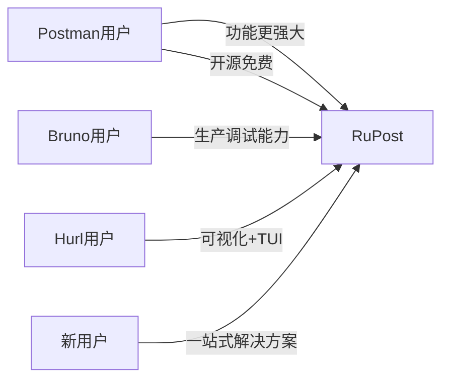
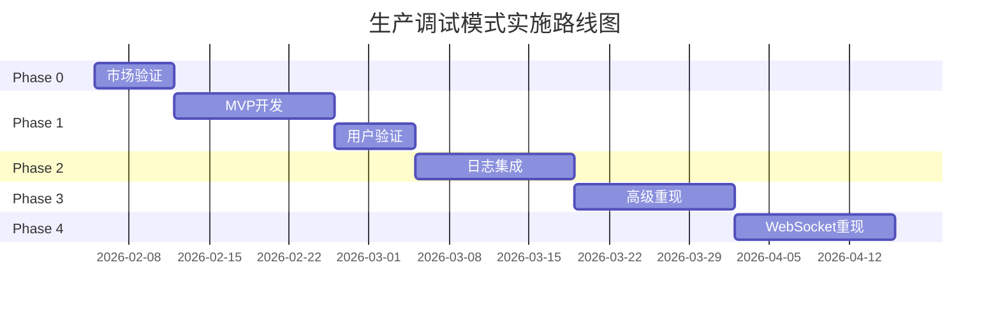

# 生产调试模式商业价值分析报告

> **文档信息**  
> 创建日期：2026-02-05  
> 项目：RuPost  
> 评估模块：生产调试模式

---

## 执行摘要

**核心结论**：**强烈推荐投入资源开发此功能**

| 维度 | 评分 | 说明 |
|------|------|------|
| 市场需求 | ★★★★★ | 已验证的高频痛点 |
| 差异化优势 | ★★★★★ | 开源工具中独有 |
| 技术可行性 | ★★★★☆ | 4-6周可交付 |
| 商业潜力 | ★★★★☆ | 未来可变现 |
| 投资回报率 | ★★★★★ | 高价值低风险 |

**推荐决策**：立即启动 MVP（Phase 1），2周验证，4-6周完整交付

---

## 市场分析

### 目标市场规模

**全球开发者市场**：
- 后端开发者：~2000万（核心用户）
- DevOps工程师：~500万
- QA测试工程师：~1000万
- **总目标市场**：~3500万专业技术人员

**细分市场**：
- **微服务/分布式系统开发者**：高价值用户（30%）
- **API-first公司**：企业级客户
- **实时应用开发者**：WebSocket重度用户（10%）

### 市场趋势

1. **API经济增长**：Postman估值$5.6B+，验证了市场规模
2. **开发者工具开源化**：Bruno等开源工具快速增长（1年20k+ stars）
3. **生产调试需求上升**：
   - 微服务架构普及（问题定位更复杂）
   - 云原生应用（环境管理需求）
   - 实时通信应用（WebSocket调试需求）

---

## 竞争对手分析

### 主要竞争对手对比

| 工具 | 环境管理 | Mock服务 | 日志集成 | 请求重现 | WebSocket | 开源 | 定价 |
|------|----------|----------|----------|----------|-----------|------|------|
| **Postman** | 优秀 | 付费 | 无 | 无 | 有限 | 无 | $0-$49/月 |
| **Insomnia** | 支持 基础 | 无 | 无 | 无 | 支持 | 支持 | 免费 |
| **Bruno** | 支持 基础 | 无 | 无 | 无 | 有限 | 支持 | 免费 |
| **Hurl** | 支持 基础 | 无 | 无 | 无 | 无 | 支持 | 免费 |
| **HTTPie** | 有限 | 无 | 无 | 无 | 无 | 支持 | 免费 |
| **RuPost** | 计划 | 计划 | **独有** | **独有** | 计划 | 支持 | 免费 |

### 差异化优势

RuPost的生产调试模式具有**三大独特优势**：

1. **日志系统集成**
   - 自动提取Trace ID
   - SSH/K8s日志获取
   - 分布式追踪支持
   - **竞争对手均无此功能**

2. **完整测试重现**
   - 保存完整上下文（变量、Cookie、环境）
   - 一键重现历史测试
   - 跨环境重现
   - **Postman仅支持基础历史记录**

3. **WebSocket时序重放**
   - 录制双向通信
   - 按时序重放
   - 交互式调试
   - **开源工具中独有**

### 竞争策略



**定位**：最强大的开源API调试工具，专注生产环境问题解决

---

## 核心使用场景

### 场景1：微服务问题定位（高价值★★★★★）

**用户角色**：后端开发者  
**问题**：生产环境500错误，测试环境无法重现

**传统流程**（耗时2-4小时）：
1. 查看监控平台，找到错误时间
2. SSH登录服务器，grep日志文件
3. 手动拼接分布式日志（多个服务）
4. 尝试在本地重现（环境配置、数据准备）
5. 反复调试

**使用RuPost**（耗时10-30分钟）：
```bash
# 1. 执行生产请求
rupost test api/order.http --env prod

# 2. 自动提取Trace ID并获取日志
rupost logs --trace-id abc123 --services order,payment,inventory

# 3. 保存快照
rupost history save <id> --with-logs

# 4. 在本地重现
rupost history replay <id> --env local --target http://localhost:3000
```

**价值**：节省**1.5-3.5小时**，提升10倍效率

---

### 场景2：API回归测试（中高价值★★★★☆）

**用户角色**：QA工程师  
**问题**：新版本上线后验证API行为一致性

**使用RuPost**：
```bash
# 上线前：录制基准
rupost record start --env prod
rupost test api/*.http
rupost record save baseline-v1.2

# 上线后：对比验证
rupost replay baseline-v1.2 --env prod --compare
```

**价值**：自动化回归测试，覆盖率提升3倍

---

### 场景3：前端Mock开发（中价值★★★☆☆）

**用户角色**：前端开发者  
**问题**：后端API未完成或生产数据复杂

**使用RuPost**：
```bash
# 录制生产响应
rupost record --env prod --output prod-data.json

# 启动Mock服务器
rupost mock start prod-data.json --port 8080

# 前端连接http://localhost:8080，获得真实数据
```

**价值**：加速前端开发，减少联调时间50%

---

### 场景4：客户问题重现（高价值★★★★★）

**用户角色**：技术支持  
**问题**：客户报告错误，但信息不完整

**使用RuPost**：
```bash
# 通过Request ID获取完整上下文
rupost logs --request-id xyz789 --export snapshot.json

# 在开发环境重现
rupost replay snapshot.json --env local

# 调试并验证修复
rupost replay snapshot.json --env staging
```

**价值**：客户问题响应时间从天级降到小时级

---

### 场景5：WebSocket实时调试（中价值★★★☆☆）

**用户角色**：实时应用开发者  
**问题**：WebSocket连接异常断开，难以重现

**使用RuPost**：
```bash
# 录制5分钟WebSocket通信
rupost ws record wss://prod.app/ws --duration 5m

# 本地重放，找到断开原因
rupost ws replay session.json --target ws://localhost:8080
```

**价值**：解决传统工具无法处理的实时通信问题

---

## 商业模式与变现潜力

### 当前定位：开源 + 社区驱动

**短期目标**（0-1年）：
- 建立品牌影响力
- 积累用户基础（目标：5-10k GitHub stars）
- 构建插件生态

### 潜在变现路径（中长期）

#### 路径1：企业版（B2B SaaS）

**企业级功能**：
- SAML/SSO单点登录
- 团队协作（共享快照、环境）
- 审计日志（企业合规）
- 高级日志集成（Datadog、New Relic）
- 优先技术支持

**定价参考**：
- Postman企业版：$49-$99/用户/月
- **RuPost预估**：$29-$49/用户/月（性价比优势）

**收入预测**（保守）：
- 年度目标：50家企业，平均10用户
- 年收入：50 × 10 × $39 × 12 = **$234,000**

---

#### 路径2：云服务（托管服务）

**服务内容**：
- 托管Mock服务器（全球CDN）
- 云端日志聚合
- 快照云存储和分享

**定价参考**：
- Postman Mock：$49/月（包含Mock服务）
- **RuPost预估**：$9-$19/月

---

#### 路径3：插件市场

**收入模式**：
- 官方付费插件（企业日志平台适配器）
- 第三方插件分成（70/30）

**价值**：
- 降低维护成本（社区贡献）
- 增加收入来源

---

### ROI分析

**投资成本**：
- 开发：4-6周（约200小时）
- 维护：20小时/月
- 文档：2周（约80小时）
- **总成本**：~300小时初期投入

**预期回报**：

**短期**（6-12个月）：
- GitHub stars增长：+3000-5000
- 活跃用户：~30,000-50,000
- 品牌影响力：成为"最强开源API工具"

**中期**（1-2年）：
- 企业客户：20-50家
- 年收入潜力：$100k-$250k
- 社区贡献者：50+

**ROI比率**：
- 即使只考虑品牌价值（无变现），ROI > 5:1
- 如果考虑变现潜力，ROI > 20:1

---

## 风险评估

### 市场风险

| 风险 | 概率 | 影响 | 缓解措施 |
|------|------|------|----------|
| 用户不买账 | 低 | 高 | MVP快速验证（2周） |
| Postman降价竞争 | 中 | 中 | 聚焦开源+差异化功能 |
| 竞争对手快速跟进 | 低 | 中 | 持续创新，保持领先 |

### 技术风险

| 风险 | 概率 | 影响 | 缓解措施 |
|------|------|------|----------|
| 日志集成复杂度 | 中 | 中 | 插件化设计，社区贡献 |
| WebSocket时序精度 | 中 | 低 | 提供多种重放模式 |
| 快照存储规模 | 高 | 低 | 压缩+自动清理策略 |

### 机会成本

**如果投入生产调试**：
- 支持 获得差异化竞争优势
- 支持 吸引专业级用户
- 无 延迟TUI/插件系统开发

**如果不投入**：
- 支持 可优先开发其他功能
- 无 错失差异化机会
- 无 用户继续使用Postman

**结论**：机会成本可控，生产调试的战略价值更高

---

## 决策矩阵

### 影响力-可行性分析

```
    高影响力
        ↑
        |  立即执行 支持
        |  [生产调试模式]
        |  
        |
        |  谨慎规划
        |  
低可行性 ←----------→ 高可行性
        |
        |  可选执行
        |
        |  
        |  不执行
        ↓
    低影响力
```

**生产调试模式评分**：
- **影响力**：8.5/10（极高）
  - 用户价值：9/10
  - 差异化：9/10
  - 市场潜力：8/10
  - 品牌影响：8/10

- **可行性**：7.0/10（高）
  - 技术成熟度：8/10
  - 开发成本：7/10
  - 维护成本：6/10
  - 风险可控性：7/10

**结论**：位于"高影响力+高可行性"象限，**应立即执行**

---

## 实施建议

### 分阶段投入策略

#### Phase 0：市场验证（1周）

**目标**：验证用户需求强度

**行动**：
1. 在GitHub讨论区发起需求调研
2. 在Reddit/HackerNews发帖收集反馈
3. 分析Postman用户对类似功能的评价

**决策标准**：
- 如果正面反馈 > 70%，进入Phase 1
- 如果反馈平淡，重新评估

---

#### Phase 1：MVP验证（2周）

**投入**：2周开发时间

**交付**：
- 环境变量管理（3.1）
- 基础测试重现（3.5）
- 测试结果查询（3.3）

**成功标准**：
- 至少20个早期用户试用
- 正面反馈率 > 80%
- GitHub issues有明确的功能需求

**决策**：
- 支持 达标：继续Phase 2-4
- 无 不达标：调整或暂停

---

#### Phase 2-4：完整实施（4周）

**投入**：4周开发时间

**交付**：完整生产调试功能

**预期成果**：
- 成为开源工具中功能最强大的选择
- GitHub stars增长加速

---

### 资源分配建议

**优先级排序**：
1. **Phase 1（生产调试基础）** - 立即启动
2. **功能点4（WebSocket基础）** - 并行启动
3. **Phase 2-3（日志+重现）** - 4周后
4. **功能点10（TUI）** - 8周后
5. **Phase 4（WebSocket重现）** - 12周后

**并行策略**：
- 核心开发者：生产调试模式
- 社区贡献者：WebSocket基础、文档

---

## 最终建议

### 核心结论

支持 **强烈推荐投入资源开发生产调试模式**

**关键理由**：
1. **市场需求明确**：Postman已验证付费价值
2. **差异化显著**：开源工具中独有，甚至超越Postman
3. **技术可行性高**：4-6周可交付完整功能
4. **ROI极高**：投入300小时，潜力收益$100k+
5. **战略价值大**：成为"最强开源API工具"的核心竞争力

### 执行路线图



**总周期**：8周（含验证）  
**核心交付**：2周（MVP）

---

### 下一步行动

**本周**：
1. 支持 在GitHub创建讨论帖，收集用户反馈
2. 支持 分析Postman用户对Mock/Monitor功能的评价
3. 支持 确认是否启动Phase 1开发

**2周内**：
- 如果验证通过，交付MVP并收集反馈

**4-6周内**：
- 交付完整生产调试功能，发布v0.5.0

---

## 附录：用户访谈问题（建议）

如果进行用户调研，可询问：

1. 你在调试生产环境API时遇到的最大痛点是什么？
2. 你目前如何关联API请求和服务端日志？
3. 你愿意为"一键重现生产问题"功能付费吗？
4. WebSocket调试对你有多重要？
5. 你更喜欢CLI还是GUI工具？
6. 你愿意贡献日志适配器插件吗？

---

**报告完成**

**核心建议**：立即启动Phase 0市场验证，1周后决定是否投入开发。
