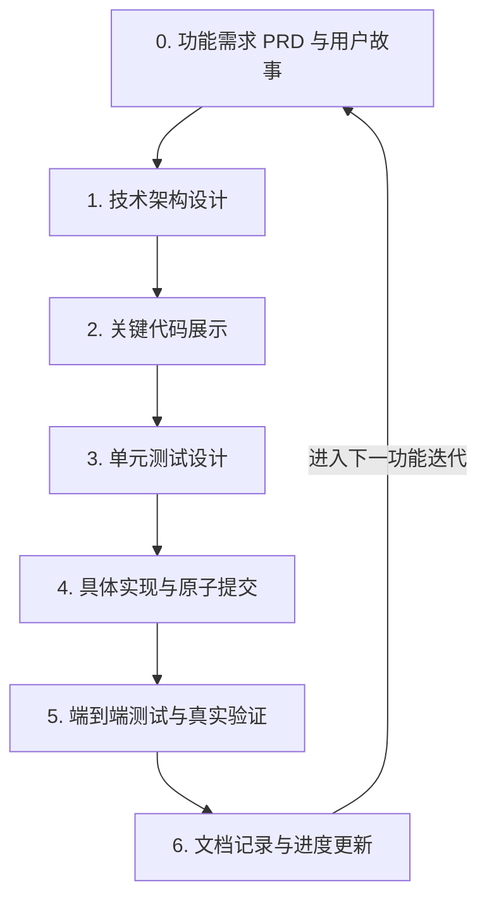

# Rupost 极致研发流程规范 (7-Stage Workflow Spec)

本规范定义了 `rupost` 项目中从“创意构思”到“生产就绪”的完整研发流。所有智能体与人类开发者必须严格遵守本规范，以确保系统符合 Clean Architecture 架构准则，保证代码质量与极致的 CLI 终端美感。

---

## 研发生命周期全览



---

## 0. 功能需求 PRD 和用户故事 (Product Requirements Document & User Stories)

在进入任何编码和设计之前，必须理清“为谁解决什么问题”以及“成功的定义是什么”。

### 1. 功能需求 PRD 模板
每个重大功能必须在 `doc/plans/` 下以 `YYYY-MM-DD-<feature-name>-prd.md` 格式建档，内容需包含：
*   **背景与痛点 (Context & Problem)**：说明当前代码或功能的局限性，以及用户的具体痛点。
*   **目标与非目标 (Goals & Non-Goals)**：明确本次迭代要达成什么，**不要**达成什么，以贯彻 MVP (最小可行性产品) 准则。
*   **非功能性需求 (Non-Functional Requirements)**：包括性能指标 (如网络延迟、内存限制)、终端美感 (HSL 调色板、无冗余输出) 等。
*   **成功指标 (Success Metrics)**：如何定义该功能已上线且运行良好。

### 2. 用户故事与验收条件 (User Stories & Acceptance Criteria)
使用经典的用户故事模板进行细化：
> **As a** `[用户角色/画像]`  
> **I want to** `[执行具体的交互/动作]`  
> **So that** `[获得核心业务价值]`

对于每个用户故事，必须附带 **Given-When-Then** 格式的验收标准：
*   **Given**：前置状态或特定的 HTTP 测试文件内容。
*   **When**：执行特定的 `rupost` 命令（如 `rupost test <file> --verbose`）。
*   **Then**：预期的终端彩色输出、生成的测试报告或环境变量的改变。

---

## 1. 技术架构设计 (Technical Architecture Design)

在 `rupost` 中，架构的优美和简洁高于一切。我们严格执行 **Clean Architecture** 规范，防止代码腐化。

> [!IMPORTANT]
> **依赖规则 (Dependency Rule)**：依赖关系只能由外向内单向依赖。核心层（Entities）绝不能知道任何外部实现细节（如 reqwest、ratatui 等）。

### 架构分层约束

| 层次 | 包含内容 | 约束与依赖 |
| :--- | :--- | :--- |
| **Entities (核心领域层)** | `Request`, `Response`, `CookieJar`, `Assertion` | 纯 Rust 逻辑，无任何 I/O、无外部网络库依赖，保持绝对纯净。 |
| **Use Cases (业务用例层)** | `TestExecutor`, `MetadataParser`, `VariableResolver` | 编排领域模型，实现批量测试、解析的核心流。通过 Trait 隔离具体的网络与文件系统操作。 |
| **Interface Adapters (接口适配层)**| `Cli`, `HttpFormatter`, `HttpClientAdapter` | 将外部输入（CLI 参数、HTTP 文本）转换为用例层能处理的数据结构。 |
| **Frameworks & Drivers (基础设施层)**| `tokio`, `reqwest`, `ratatui` | 具体的网络客户端实现、异步运行时、终端渲染逻辑。 |

---

## 2. 关键代码展示 (Key Code Demonstration)

为防止中途发生大规模重构，必须在设计文档中先写出核心接口和数据结构的声明。

### 核心接口设计规范
*   **Trait 驱动**：定义行为而非具体实现。例如，在尚未实现具体的 HTTP Client 时，先在设计中确定核心 Trait：
    ```rust
    #[async_trait]
    pub trait HttpClient: Send + Sync {
        async fn send(&self, req: &Request) -> Result<Response, RupostError>;
    }
    ```
*   **核心 Struct 与 Enum**：定义好数据传输对象 (DTO) 的结构，确保没有字段溢出或命名歧义：
    ```rust
    pub struct ParsedRequest {
        pub name: Option<String>,
        pub method: Method,
        pub url: String,
        pub headers: HeaderMap,
        pub body: Option<Body>,
    }
    ```
*   **关键控制流伪代码**：使用简化的 Rust 代码来模拟控制流（如 DAG 任务流的拓扑排序算法），确保逻辑闭环。

---

## 3. 单元测试 (Unit Tests)

高质量的项目必须由极高覆盖率的自动化测试作为支撑。

> [!TIP]
> **测试设计三原则**：
> 1. **离线隔离**：单元测试绝不允许发起真实的公网请求。
> 2. **数据驱动**：同一逻辑的不同输入和边界情况应当用表格化（Table-driven）测试列举。
> 3. **极值验证**：必须编写空字符串、长字符串、溢出值等边界测试用例。

### 单元测试代码规范
*   **存放位置**：位于对应源文件底部的 `mod tests` 模块中，并标注 `#[cfg(test)]`。
*   **命名约定**：以 `test_<函数名>_<场景>_<预期结果>` 格式命名。例如：
    ```rust
    #[test]
    fn test_parse_metadata_with_valid_name_should_extract_correctly() { ... }
    ```
*   **依赖 Mock**：使用内存驱动的 Mock 结构。例如利用内部实现的 `MockHttpClient` 来模拟 HTTP 请求的返回，从而测试断言器的行为：
    ```rust
    struct MockHttpClient {
        response_to_return: Response,
    }
    ```

---

## 4. 具体实现 (Implementation & Refactoring)

具体实现时应当保持小步快跑，追求代码本身的干净与极简。

### 1. 编码规范与重构
*   **开闭原则 (OCP)**：新功能的添加（如新增一种元数据指令 `@retry`）应当通过实现特定的 Trait 或者在 Match 匹配分支中进行自然扩展，不应该修改主执行引擎的底层架构。

> [!IMPORTANT]
> **每次开发与原子提交前的强制测试要求**：
> 在开发新功能或修复 Bug 时，必须确保本地的所有测试 100% 跑通。严禁将任何无法通过测试的代码提交或推送到仓库中。在每次提交（使用 `jj` 描述或 `git` 提交）前，请严格执行以下三步测试流程。

#### 步骤 1：静态代码校验与格式化
在提交前，必须运行以下命令，保证代码格式正确且无任何编译器警告：
```bash
cargo fmt --all -- --check
cargo clippy --all-targets --all-features -- -D warnings
```

#### 步骤 2：全量自动化回归测试
运行所有单元测试和集成测试，确保已存在的核心层与网络层功能不被破坏：
```bash
cargo test
```

#### 步骤 3：示例库回归验证 (Examples Regression)
如果您修改了解析器（`parser`）、条件判定、或者是发包执行器（`executor`）等核心引擎，必须至少启动一次本地 Mock 并执行如下典型级联演进用例，防止示例库损坏：
1. 启动级联依赖 Mock 仿真服务：
   ```bash
   cargo run --bin rupost -- mock examples/iteration_scenarios/migration_test.md --port 9000
   ```
2. 另开终端运行测试，验证 3 个级联文件共 10 个用例是否全部绿灯通过：
   ```bash
   cargo run --bin rupost -- test examples/iteration_scenarios/migration_test.md
   ```

### 2. Jujutsu (jj) 版本控制与原子提交
*   **原子提交**：每个 `jj commit` 或 `jj describe` 必须是一个逻辑上独立、且完成了上述**强制测试流程**的代码单元。
*   **提交粒度**：完成一个 Trait 的接口声明 -> 提交；完成对应的 `impl` 和单元测试 -> 提交。严禁一次性提交数千行混合了多个功能和 Bug 修复的代码。

---

## 5. 端到端测试，实际测试用例 (End-to-End Tests & Real-world Test Cases)

端到端测试用以验证整个二进制应用在真实硬件与网络环境中的交互闭环。

### 1. CLI 集成测试
*   在 `tests/` 目录下编写集成测试，测试 `rupost` 编译出的二进制文件的输入输出：
    ```rust
    // tests/cli_tests.rs
    #[test]
    fn test_cli_execute_http_file() {
        let mut cmd = Command::cargo_bin("rupost").unwrap();
        let assert = cmd.arg("test").arg("tests/fixtures/simple.http").assert();
        assert.success().stdout(predicate::str::contains("200 OK"));
    }
    ```

### 2. 真实网络用例
*   在根目录的 `test.http` 或 `examples/` 下提供用例，与稳定的外部网络模拟服务（如 `httpbingo.org`）配合进行物理测试。
*   在文档或测试脚本中指明执行方式，例如：
    ```bash
    cargo run -- test examples/cookie.http --verbose
    ```

---

## 6. 文档记录与进度跟踪 (Documentation & Progress Tracking)

在功能开发稳定后，必须做好收尾与记录工作，这是确保知识不流失和 README 常新不败的关键。

> [!WARNING]
> **严防文档发散 (Single Source of Truth)**：
> 禁止在各个设计文档、GitHub Issues 或 Checkpoint 中碎片化记录进度。统一将 [progress_summary.md](file:///Users/zsyzzx/project/rust/rupost/doc/progress_summary.md) 作为进度的唯一事实来源。

### 规范执行细则

1.  **进度汇总更新**：
    在完成任何一个小功能的合并或开发迭代后，必须第一时间更新 `doc/progress_summary.md`，包括：
    *   **已实现的核心功能**列表。
    *   新发现的**技术债务 (P1/P2/P3)**。
    *   下一阶段的**方案推荐**。
2.  **README 一致性同步**：
    每当 `doc/progress_summary.md` 中的“已实现的核心功能”有变化时，应同步增量更新项目根目录下的 `README.md` 的功能简介和快速上手章节，保证新功能能够立刻被用户发现和使用。
3.  **Checkpoint 进度总结**：
    依据 `rust-dev.md` 规则，每完成 **7 次对话** 必须自动总结当前状态，更新或生成项目根目录底部的 `checkpoint.md`。内容应包括当前所处的进度节点（基于 `progress_summary.md`）和下一步工作计划。
