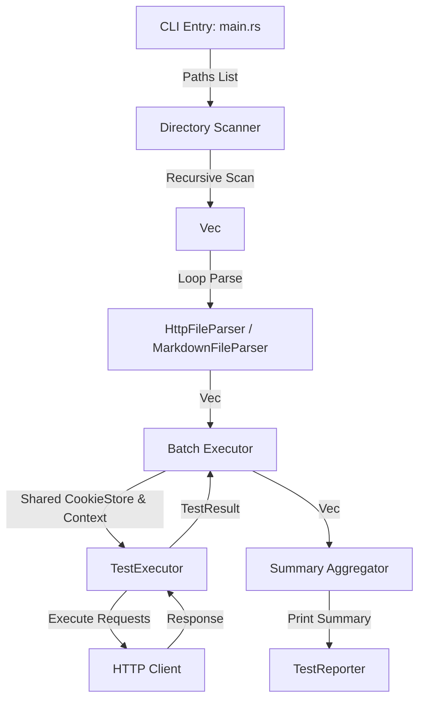

# 设计规格说明书：多文件与目录递归测试 (Multi-file & Directory Testing Support)

本设计规格说明书遵循 **Clean Architecture** 架构原则，旨在为 RuPost 引入多测试文件并行/串行执行、目录递归扫描分类以及测试结果汇总展示的核心功能。

---

## 1. 需求与使用场景

### 1.1 痛点背景
在大型 API 开发中，测试用例不可能全量塞进单一的 `.http` 或 `.md` 文件中。开发者通常会按照业务模块对接口进行拆分和归类，例如：
```text
tests/
  ├── auth/
  │    ├── login.http
  │    └── signup.http
  └── users/
       ├── profile.md
       └── settings.http
```
目前，RuPost 命令行工具仅支持传入单个文件路径，无法一次性跑完所有的 API 用例，极大限制了集成测试与 CI/CD 自动化流水线的接入。

### 1.2 目标特征
1. **多路径输入**：支持同时指定多个文件与目录。
2. **目录自动发现**：传入目录路径时，递归发现其下所有的 `.http` 与 `.md` 格式文件。
3. **隔离与共享可选**：批量执行时，多个测试用例可在同一生命周期内共享全局的 Cookie 隔离文件与变量上下文，方便跨用例串联。
4. **汇总报告**：输出每个测试用例的运行过程，并在执行完毕后打印一份跨文件的全局测试汇总面板。

---

## 2. 命令行设计规范 (CLI Specification)

升级 `rupost test` (别名 `rupost t`) 子命令。

### 2.1 升级后的 Clap 参数结构
```rust
    Test {
        /// 测试文件路径、或包含测试文件的文件夹路径列表
        #[arg(required = true, value_name = "PATHS")]
        paths: Vec<String>,

        /// 指定的环境名称 (加载对应环境变量和 base_url)
        #[arg(short, long)]
        env: Option<String>,

        /// 临时覆盖的变量 (key=value)
        #[arg(long, value_name = "KEY=VALUE")]
        var: Vec<String>,

        /// 显示请求和响应头等详细输出
        #[arg(short, long)]
        verbose: bool,

        /// 是否禁用自动 Cookie 持久化
        #[arg(long)]
        no_cookies: bool,

        /// 指定 Cookie 物理存储文件名
        #[arg(long, value_name = "FILE")]
        cookie_file: Option<String>,
    }
```

### 2.2 CLI 交互用例示范
```bash
# 场景一：混合执行多个特定文件
rupost test tests/auth/login.http tests/users/profile.md

# 场景二：递归运行整个测试目录
rupost test tests/

# 场景三：结合环境，开启高精度网络诊断运行多文件
rupost test tests/auth/ tests/users/ -e dev --debug
```

---

## 3. 架构设计与分层实现 (Clean Architecture & Phased Design)



### 3.1 核心组件分层

#### A. 文件扫描器 (Directory Scanner) - 位于 Infrastructure/Utility 层
* **职责**：实现文件及目录的递归检索与过滤。
* **业务规则**：
  1. 输入为 `Vec<String>`（文件/目录路径列表）。
  2. 遍历路径列表，若为文件，直接确认其有效性并压入队列。
  3. 若为目录，使用 `walkdir` 或标准库递归扫描。
  4. 过滤条件：仅收集以 `.http` 或 `.md` 结尾的文件；**自动排除隐藏目录**（如 `.git/`, `.rupost/`, `target/`）。
  5. 稳定性设计：遇到不存在的文件或无读取权限的目录，及早报错并友好终止测试。

#### B. 批处理引擎 (Batch Executor) - 位于 Application Use Cases 层
* **职责**：编排多个 `ParsedFile` 的串行执行。
* **接口定义**：
  ```rust
  pub struct BatchExecutor {
      test_executor: TestExecutor,
  }
  
  impl BatchExecutor {
      pub async fn execute_batch(
          &self,
          files: Vec<ParsedFile>,
          global_context: &mut VariableContext,
      ) -> Result<Vec<(PathBuf, Vec<TestResult>)>> {
          // 在串行执行中，各文件共享 global_context 变量容器与底层的 CookieStore
          ...
      }
  }
  ```

#### C. 全局汇总报告器 (Aggregator & TestReporter) - 位于 UI/Interface Presenter 层
* **职责**：聚合全量测试结果并输出精致、高端的控制台汇总信息。
* **设计细节**：
  - 每一个文件开始执行时，输出文件级别头部标识：
    `Running 3 requests from tests/auth/login.http...`
  - 每一个文件的详细诊断时序条正常输出。
  - 最后进行全局统计（Total Test Files, Total Requests Passed/Failed, Total Duration）：
    ```text
    ━━━━━━━━━━━━━━━━━━━━━━━━━━━━━━━━━━━━━━━━━━━━━━━━━━
    Batch Test Summary
    ━━━━━━━━━━━━━━━━━━━━━━━━━━━━━━━━━━━━━━━━━━━━━━━━━━
      Files Ran: 4 total (4 passed, 0 failed)
      Tests:     12 passed, 0 failed, 12 total
      Duration:  5.432s
    ```

---

## 4. 变量上下文与 Cookie 共享策略

1. **共享生命周期**：
   在单次命令（如 `rupost test folder/`）的执行过程中，只有一个 `VariableContext` 实例被实例化，并依次传递给每个用例执行步骤。
   这使得前一个测试文件通过 `@capture` 捕获的 token，可以直接在下一个测试文件里通过 `{{token}}` 访问。
2. **Cookie 串联与物理隔离**：
   - 默认的 Ephemeral（内存）模式下，跨文件的 Cookie 在同一个 Batch 运行中是保留并传递的（模拟单次完整会话流程）。
   - 指定 `--cookie-file cookies.json` 及 `-e dev` 后，多个文件写入和读取同一个 `cookies_dev.json` 物理文件，自动处理文件锁。

---

## 5. 验证与质量保障计划 (Verification Plan)

### 5.1 自动化集成测试设计 (`tests/batch_testing_test.rs`)
1. **Mock 目录结构创建**：
   在临时的 `tempdir` 中动态生成测试文件夹和文件（如 `a.http`, `b.md`），每个文件包含 Mock 请求。
2. **校验递归发现**：
   调用扫描器，验证抓取到的测试文件个数、路径以及过滤隐藏文件夹的能力。
3. **检验变量继承**：
   在 `a.http` 中设置 `@capture value`，在 `b.md` 中引用该 `{{value}}`，运行批处理，断言 `b.md` 的请求成功渲染了继承的变量。

### 5.2 手动与边界测试
* **空目录测试**：扫描一个不包含任何 `.http`/`.md` 的空文件夹，验证程序能优雅退出并打印 `No test files found`，不发生 panic。
* **混合失效测试**：若 batch 中第 2 个文件发生断言失败，验证第 3 个文件仍能继续运行，且最终的退出码为 `1`。
