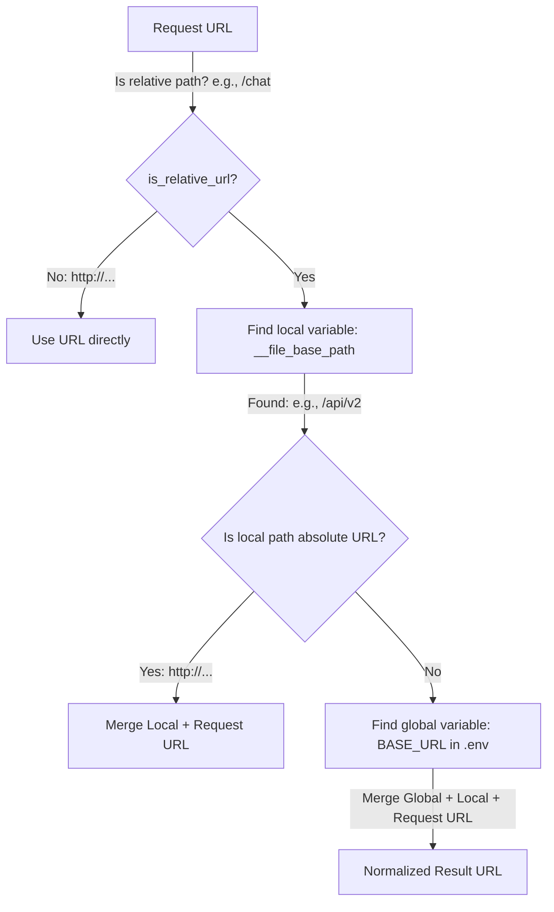

# RuPost 大模型 (LLM) 测试模板与基准路径拼接指引

本指引旨在说明 RuPost 针对大模型（LLM）开发调试场景所设计的测试文件模板，以及如何利用环境配置文件与局部指令智能结合基准路径的机制。

---

## 1. 大模型测试场景模板设计 (Three LLM Scenarios)

RuPost 的 `llm` 模板通过 `rupost init llm` 命令自动生成，内嵌了三种典型大模型开发测试场景的用例骨架，以应对开发与生产周期的不同环境：

### 场景一：本地大模型流式联调 (Local LLM - Ollama / vLLM)
*   **适用场景**：本地部署的轻量级开源大模型（如 Qwen2、Llama3 等），通常免 API 密钥，且用于本地开发闭环。
*   **配置参数**：
    *   在 `.env` 中配置本地 Ollama API 基准：`BASE_URL=http://localhost:11434/v1`
    *   配置当前拉取的模型：`MODEL_NAME=qwen2`
*   **用例模板**：
    ```http
    # @sse 激活 SSE 流式解析
    # @assert status == 200
    # @assert stream.llm.content contains "Rust"
    POST /chat/completions
    Content-Type: application/json
    
    {
      "model": "{{env.MODEL_NAME}}",
      "messages": [{"role": "user", "content": "请用一句话高度概括 Rust 的优势。"}],
      "stream": true
    }
    ```

### 场景二：云端大模型 API 测试与 Token 物理同步 (Cloud LLM API)
*   **适用场景**：直接调用在线商用 API（如 DeepSeek、OpenAI 等），需要配置鉴权密钥。
*   **配置参数**：
    *   配置云端大模型 API 基准：`BASE_URL=https://api.deepseek.com/v1`
    *   配置鉴权令牌：`API_KEY=你的真实大模型密钥`
*   **特色指令：`@stream_to`**：
    *   在请求前声明 `@stream_to ./target/cloud_prompt.md overwrite`。
    *   当大模型流式响应开始吐字时，RuPost 引擎会实时把增量 Token 覆写/追加同步写入物理磁盘文件。开发者可以通过分屏实时阅读大模型的回答。
*   **用例模板**：
    ```http
    # @sse
    # @assert status == 200
    # @stream_to ./target/cloud_prompt.md overwrite
    POST /chat/completions
    Content-Type: application/json
    Authorization: Bearer {{env.API_KEY}}
    
    {
      "model": "{{env.MODEL_NAME}}",
      "messages": [{"role": "user", "content": "请为我生成一份 Rust 教学大纲。"}],
      "stream": true
    }
    ```

### 场景三：大模型令牌转接与网关代理 (Token Relay / Gateway Proxy)
*   **适用场景**：企业内部署的 API 网关、多模型分发路由代理（如 OneAPI）。客户端向代理网关传递“中转专用的 Key（Relay Token）”，网关基于路由分配，将其转接给底层服务商并返回流式 Token。
*   **配置参数**：
    *   中转代理服务基准：`BASE_URL=https://api.your-company-gateway.com/v1`
    *   网关专用中转密钥：`RELAY_TOKEN=你的中转网关密钥`
*   **特色指令：`@capture` 从流式数据捕获变量**：
    *   使用 `@capture gateway_reply from stream.llm.content` 自动将流式响应的拼接文本捕获为临时变量，可用于后续的请求链（如将回复存入数据库或在后续请求中作为历史上下文传入）。
*   **用例模板**：
    ```http
    # @sse
    # @assert status == 200
    # @capture gateway_reply from stream.llm.content
    POST /chat/completions
    Content-Type: application/json
    Authorization: Bearer {{env.RELAY_TOKEN}}
    
    {
      "model": "{{env.MODEL_NAME}}",
      "messages": [{"role": "user", "content": "你好。"}],
      "stream": true
    }
    ```

---

## 2. 全局 `.env` 与局部 `base_path` 的智能拼接机制

为了让请求文件的路径编写足够精简且易于在多套环境（开发、测试、生产）之间无缝平移，RuPost 设计了基准路径合并拼接机制：



### 拼接机制优先级规则：

1.  **绝对路径不拼装**：若请求行（如 `POST https://api.deepseek.com/v1/chat/completions`）本身是以 `http://` 或 `https://` 开头的绝对 URL，则不进行拼装，直接发起请求。
2.  **相对路径自适应拼接**：若请求行是相对路径（以 `/` 开头，如 `POST /chat/completions`），则执行三层拼接算法：
    $$\text{Target URL} = \text{Global Base URL} + \text{Local File Base Path} + \text{Request Relative Path}$$
3.  **局部变量局部优先**：
    *   **全局环境基准**：依次从 `context` 或者是 `.env`/配置中寻找 `base_url`、`BASE_URL`、`base_path`、`BASE_PATH`、`baseUrl`、`basePath` 等键值。
    *   **局部文件基准**：从 Markdown 头部或 `.http` 首部的 `base_path` 元数据属性读取，在执行时作为 `__file_base_path` 临时变量注入。
    *   **特殊绝对化覆盖**：若局部文件基准 `base_path` 本身是个绝对 URL（如 `https://api.openai.com/v1`），系统将**不再**结合全局的 `BASE_URL`，以防多次拼接绝对路径，而是直接拼接局部基准与请求路径。
4.  **自动规整去重 (Slash Deduplication)**：
    *   拼接过程中可能会出现多余的斜杠或缺失斜杠（如 `http://localhost/` + `/chat`）。
    *   RuPost 底层自动对合并路径进行正则化处理，移除多余的重叠斜杠（规整为单个 `/`），保证最终拼接生成的 URL 合法。

---

## 3. 环境配置与模板快速初始化步骤

1.  **一键生成模板**：
    在您的项目目录下执行命令：
    ```bash
    rupost init llm -o my_llm.http
    ```
    此命令将在当前工作区生成 `my_llm.http` 以及伴随的环境配置模板 `.env.example`。

2.  **配置密钥与接口**：
    将 `.env.example` 复制并重命名为 `.env`，然后填写您所用大模型的密钥与地址：
    ```ini
    # .env 示例
    API_KEY=sk-your-real-key-here
    BASE_URL=https://api.deepseek.com/v1
    MODEL_NAME=deepseek-chat
    ```

3.  **本地联调仿真闭环 (极力推荐)**：
    在没有配置线上 Key 时，可以运行 RuPost 本地自带的 Mock 服务验证大模型请求链路：
    ```bash
    # 步骤一：开启本地 Mock 网关 (端口 8080)
    rupost mock --port 8080
    
    # 步骤二：运行大模型调试模板，请求将被安全拦截并返回模拟的流式 Token
    rupost test my_llm.http --verbose
    ```
