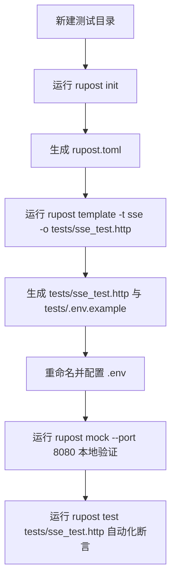

# Rupost SSE (Server-Sent Events) 流式测试与命令行机制设计指南

本指南系统地阐述了 RuPost 对 **SSE (Server-Sent Events) / 流式大模型接口**的测试支持能力，并深度对比剖析了 `rupost template` 与 `rupost init` 两个辅助命令的定位、异同点及架构设计哲学。

---

## 一、 SSE 流式测试与调试指南

### 1. 核心原理解析
传统的 HTTP 测试工具是“请求-立即响应”模式。但在大模型时代，SSE 连接会保持长期开启，服务端不断通过流（Stream）推送增量 Token。

RuPost 针对这一痛点设计了**非阻塞式流解析引擎**：
* 当遇到 `@sse` 标记时，RuPost 会将连接转为 SSE 流监听模式。
* 自动过滤并解析 `data: ` 前缀及控制字符，并将每一帧的 `content` 实时拼接，还原出完整文本。
* 针对非大模型（如系统构建日志流、行情推送等）的通用 SSE 帧，支持底层的控制字段（`event`、`id`）的高级校验。

---

### 2. 核心语法指令集

在 `.http` 或 `.md` 测试文件中，可以通过以下专用元数据指令来编排流式测试：

| 指令语法 | 作用描述 | 核心应用场景 |
| :--- | :--- | :--- |
| **`@sse`** | 启用流式解析器。如果不声明该指令，流式接口会被当作常规长文本下载，无法触发实时断言。 | 流式接口测试的前置声明 |
| **`@assert stream.llm.content contains "X"`** | 断言流式响应拼接后的完整 LLM 文本是否包含指定字符串。 | 大模型输出结果内容正确性校验 |
| **`@assert stream.event == "X"`** | 断言 SSE 的 `event` 事件类型字段。 | 通用推送流的控制帧校验 |
| **`@assert stream.id == "X"`** | 断言最近一帧的事件 ID 标识。 | 重连、追踪链断言 |
| **`@capture var_name from stream.llm.content`** | 在流式响应完全结束后，捕获并保存拼接后的文本到环境变量中。 | 链式调用（如：前一步问大模型，下一步把回答作为 prompt 再次发送） |
| **`@stream_to <path> [overwrite\|append]`** | 将大模型吐出的 Token **实时**写入本地物理文件。`overwrite` 会清空后写入；`append` 会追加写入。 | IDE 分屏预览实时生成 markdown 报告 |

---

### 3. 实战场景演练

以下是 SSE 测试模板的具体使用方式。

#### 场景 1：零配置本地 Mock 闭环测试
在不依赖外部网络与真实 API Key 的情况下，验证 SSE 链路：
```bash
# 终端 1：启动 mock 服务
rupost mock --port 8080
```

```http
# 终端 2 执行的测试 file (example.http)
###
@sse
@assert status == 200
@assert stream.llm.content contains "Rust is perfect."
POST http://127.0.0.1:8080/v1/chat/completions
Content-Type: application/json

{
  "model": "mock",
  "messages": [{"role": "user", "content": "hello"}],
  "stream": true
}
```

#### 场景 2：真实大模型流式调用与变量链式捕获
```http
###
@sse
@assert status == 200
@capture ai_answer from stream.llm.content
POST https://api.openai.com/v1/chat/completions
Content-Type: application/json
Authorization: Bearer {{env.API_KEY}}

{
  "model": "gpt-4",
  "messages": [{"role": "user", "content": "用一句简短的话介绍 Rust。"}],
  "stream": true
}

### 下一步请求：直接使用上一步捕获的内容
POST http://httpbin.org/post
Content-Type: application/json

{
  "previous_result": "{{ai_answer}}"
}
```

---

## 二、 `template` 命令与 `init` 命令深度对比

在 RuPost 的 CLI 功能矩阵中，`template` 与 `init` 都承载了“快速脚手架初始化”的作用，但它们的定位和处理逻辑有着清晰的区别。

### 1. 深度对比表

| 对比维度 | `rupost init` | `rupost template` |
| :--- | :--- | :--- |
| **核心定位** | **项目全局环境与基础配置文件**的底座初始化。 | **特定测试场景/用例资产**的快速脚手架构建。 |
| **产出物文件** | 固定生成 `rupost.toml`（包含全局变量、dev/prod 环境配置等）。 | 生成指定的测试样例（如 `sse_template.http`）以及对应的环境变量说明模板 `.env.example`。 |
| **参数灵活性** | 无参数，开箱即用，面向整个测试项目根目录。 | 支持 `-t/--type` 指定模板类型，支持 `-o/--output` 修改输出路径，支持 `--list` 罗列所有模板。 |
| **资产来源** | 内部硬编码的默认 TOML 字符串模板。 | 采用 `include_str!` 编译在二进制内的物理资产文件包，支持 IDE 语法高亮且易于扩展。 |
| **覆写安全策略**| 如果检测到 `rupost.toml` 存在，则静默跳过不覆盖，保护用户配置。 | 默认检测到文件存在会报错阻断，必须显式传递 `-f/--force` 参数才能强制覆盖。 |

### 2. 相似点解析
* **防止误操作**：两者均内置了防护机制。默认情况下都不会破坏用户已有的配置文件或测试用例，安全系数极高。
* **渐进式上手理念**：降低新手学习曲线。`init` 负责解决“如何配置环境”的问题，`template` 负责解决“如何编写高级语法文件（如 SSE）”的问题。

### 3. 差异点深度剖析
* **作用层级不同**：
  * `init` 是 **Project-level (项目级)**。一个测试工程通常只需要在根目录下执行一次 `rupost init`。
  * `template` 是 **Task-level (任务/用例级)**。针对不同的协议（如 SSE, gRPC, REST），开发者可以在不同的子目录多次执行 `rupost template -t <type> -o <path>`。
* **扩展机制不同**：
  * `init` 极少发生改动，其配置格式遵循 `rupost` 的内核解析协议。
  * `template` 遵循 **开闭原则 (Open-Closed Principle)**，通过 `TemplateStrategy` 抽象 Trait 进行解耦。未来如果新增 `grpc` 或 `auth` 模板，只需实现该 Trait，并在 `get_templates` 中注册即可，而核心写入逻辑（机制层）完全不需要做任何修改。

---

## 三、 命令行工具的最佳实践工作流

如何将这两个命令有机结合，快速在本地开展高效率的接口测试？



### 1. 快速启动三部曲
1. **初始化底座**：
   ```bash
   rupost init
   ```
   这会在当前目录生成 `rupost.toml`。你可以在其中定义全局的 `base_url` 与公共变量。

2. **拉取流式测试用例**：
   ```bash
   rupost template -t sse -o tests/my_sse.http
   ```
   它会在 `tests/` 目录下创建 `my_sse.http`，并在同级生成 `.env.example`。

3. **配置密钥并执行**：
   * 将 `tests/.env.example` 复制为 `tests/.env`，写入大模型 API KEY。
   * 启动本地 mock测试：`rupost mock --port 8080`
   * 执行用例：`rupost test tests/my_sse.http --verbose`
