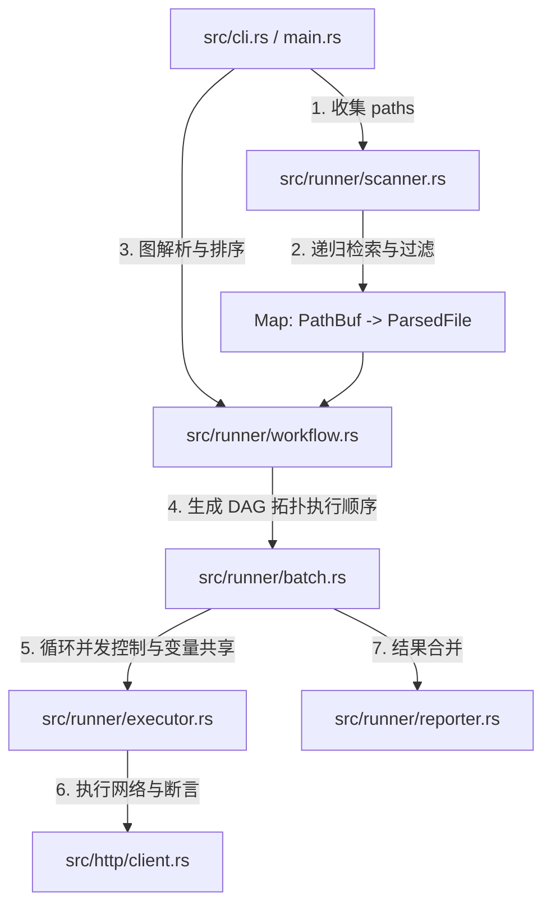

# 设计规格与开发计划：多文件与目录递归测试 (Sprint 2)

本设计文档奠定了 RuPost 批量测试与目录递归扫描的系统架构、数据模型以及逐步实施计划（WBS）。整个开发过程遵循 **Clean Architecture** 规范，采用 **测试先行 (TDD)** 的方式进行质量控制。

---

## 1. 架构目标与 User Story

结合 [project_next_state.md](file:///Users/zsyzzx/project/rust/rupost/doc/project_next_state.md) 后续规划，本阶段核心要实现的 User Story 为：

> **📖 User Story**:
> 作为一名测试开发人员，我希望能够使用命令行一键指定多个文件或整个测试用例目录（如 `rupost test tests/auth/ tests/users/`），系统能够：
> 1. 自动递归扫描出所有 `.http` 和 `.md` 格式文件。
> 2. 默认按文件名首字母顺序排序，同时允许我在用例头部使用 `# @depends_on <relative_path>` 显式声明依赖。
> 3. 基于有向无环图 (DAG) 拓扑排序计算出安全执行序列，并且在遇到循环依赖时抛出编译期警告。
> 4. 运行过程中，跨文件共享同一个 `VariableContext`（传递 Token）与内存 `CookieStore`（保持 Session）。
> 5. 支持 `--fail-fast` 参数：默认容错跑完所有文件，若指定该参数则在遇到第一个失败文件时立即中断。
> 6. 输出极其工整、彩色染色的全局汇总报告。

---

## 2. 接口与配置变更规范 (Interface Specification)

### 2.1 命令行参数升级 (`src/cli.rs`)
`Commands::Test` 子命令中的 `path: String` 变更为 `paths: Vec<String>`，并新增 `--fail-fast` 开关：
```rust
    Test {
        /// 测试文件路径、或包含测试文件的文件夹路径列表
        #[arg(required = true, value_name = "PATHS")]
        paths: Vec<String>,

        /// 遇到第一个失败文件时是否立即停止测试 (默认继续执行)
        #[arg(long)]
        fail_fast: bool,

        // 存量参数保持一致...
    }
```

### 2.2 用例头部显式依赖语法
在 `.http` 或 `.md` 文件的头部（可紧邻 `@name` 标签），支持通过注释定义显式前置依赖：
```http
# @depends_on ../auth/login.http
```

---

## 3. 架构分层设计与数据流 (System Architecture)

系统严格划分为**表现层、用例编排层、核心领域层以及基础设施层**，关系如下图所示：



### 3.1 核心层级职责与数据结构

#### 1. 核心领域层：依赖拓扑图 (`src/runner/workflow.rs`)
*   **WorkflowNode**:
    ```rust
    pub struct WorkflowNode {
        pub file_path: std::path::PathBuf,
        pub depends_on: Vec<std::path::PathBuf>,
    }
    ```
*   **WorkflowGraph** (负责 Kahn 拓扑排序算法及环检测)：
    ```rust
    pub struct WorkflowGraph {
        pub nodes: std::collections::HashMap<std::path::PathBuf, WorkflowNode>,
    }

    impl WorkflowGraph {
        /// 扫描解析出的文件 map，并把 `@depends_on` 的相对路径转换为统一的绝对/规范路径
        pub fn new(files: &[(std::path::PathBuf, crate::parser::ParsedFile)]) -> Self;
        
        /// 拓扑排序，检测出环 (Cycle) 时返回 RupostError::ParseError
        pub fn resolve_execution_order(&self) -> Result<Vec<std::path::PathBuf>, crate::RupostError>;
    }
    ```

#### 2. 基础设施层：目录递归扫描 (`src/runner/scanner.rs`)
*   **DirectoryScanner**:
    递归扫描传入的 `paths`。
    - **文件过滤**：仅收集以 `.http` 或 `.md` 结尾的文件。
    - **隐藏目录拦截**：自动排除 `.git/`、`.rupost/`、`target/` 等目录。
    - **默认排序**：按文件路径字母表顺序进行基础排序。

#### 3. 用例编排层：批量测试引擎 (`src/runner/batch.rs`)
*   **BatchExecutor**:
    ```rust
    pub struct BatchExecutor {
        executor: crate::runner::TestExecutor,
    }

    impl BatchExecutor {
        /// 串行顺序调用 TestExecutor，累加 TestResult。
        /// 关键细节：在此处持有 &mut VariableContext，在文件执行流间完整传递捕获的变量。
        pub async fn execute_batch(
            &self,
            execution_order: Vec<PathBuf>,
            mut files_map: HashMap<PathBuf, ParsedFile>,
            context: &mut VariableContext,
            fail_fast: bool,
        ) -> Result<Vec<(PathBuf, Vec<TestResult>)>, crate::RupostError>;
    }
    ```

#### 4. 表现层：多文件控制台报告器 (`src/runner/reporter.rs`)
*   每个用例文件启动前，输出缩进的日志头，方便调试追踪：
    `📂 [1/3] Running tests/auth/login.http (2 requests)...`
*   最后打印全局汇总：
    ```text
    ━━━━━━━━━━━━━━━━━━━━━━━━━━━━━━━━━━━━━━━━━━━━━━━━━━
    Batch Test Summary
    ━━━━━━━━━━━━━━━━━━━━━━━━━━━━━━━━━━━━━━━━━━━━━━━━━━
      Files:     3 passed, 1 failed, 4 total
      Tests:     12 passed, 2 failed, 14 total
      Duration:  4.123s
    ```

---

## 4. 验证与 TDD 计划 (Verification Plan)

### 4.1 自动化集成测试 (`tests/batch_testing_test.rs`)
我们将新建专属的集成测试文件，并在修改代码前完成测试骨架的编写，保证 TDD “红-绿”闭环：
1.  **test_directory_recursive_scanner**：在一个 TempDir 中创建混有不同文件和隐藏目录的测试结构，验证 Scanner 抓取文件的准确性和默认字典序。
2.  **test_workflow_topological_sort**：定义带有 `@depends_on` 显式依赖链的文件图，验证排序输出是否正确。
3.  **test_workflow_cycle_detection**：构造 `a -> b -> a` 的循环依赖，验证系统能正确拦截并报错，而不是陷入死循环。
4.  **test_batch_variable_inheritance**：测试 `a.http` 里捕获的变量在 `b.http` 中能否被成功继承。
5.  **test_batch_fail_fast_control**：验证在 fail-fast 开启下遇到失败用例时是否能立即打断测试，以及不开启时是否能全部跑完。

---

## 5. WBS 实施步骤与 jj 提交规划

我们拆分为以下 5 个原子化的 WBS 任务，每完成一步均使用 `jj` 封存提交：

*   **Step 1: 编写 TDD 测试用例与脚手架** (`tests/batch_testing_test.rs`)
    *   *JJ commit*: `test(batch): scaffold directory scanner and topological workflow sorting tests`
*   **Step 2: 扩展 Parser 层解析 `@depends_on` 语法**
    *   *JJ commit*: `feat(parser): parse @depends_on dependency tags from HTTP and MD files`
*   **Step 3: 实现 DirectoryScanner 与 WorkflowGraph Kahn 排序算法**
    *   *JJ commit*: `feat(runner): implement directory scanner and topological graph resolver`
*   **Step 4: 实现 BatchExecutor 并融合 VariableContext/CookieStore 共享**
    *   *JJ commit*: `feat(runner): implement batch executor with variable sharing and fail-fast support`
*   **Step 5: 升级 CLI 参数、TestReporter 汇总面板并运行所有测试**
    *   *JJ commit*: `feat(cli): upgrade command line arguments and format batch summary report`
