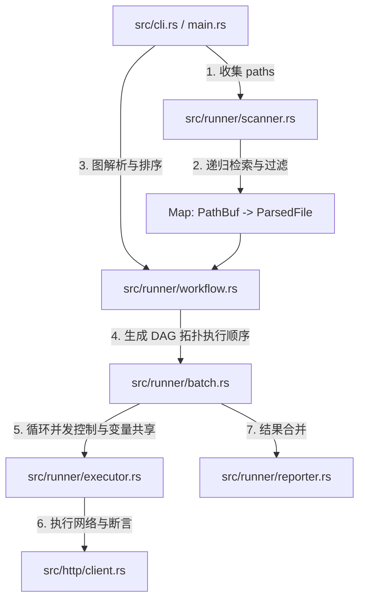

# 设计规格与开发计划：多文件与目录递归测试 (Sprint 2)

本设计文档奠定了 RuPost 批量测试与目录递归扫描的系统架构、数据模型以及逐步实施计划（WBS）。整个开发过程遵循 **Clean Architecture** 规范，采用 **测试先行 (TDD)** 的方式进行质量控制，完全结合并满足了 [doc/folder_execution](file:///Users/zsyzzx/project/rust/rupost/doc/folder_execution) 中的规格说明。

---

## 1. 架构目标与 User Story

结合文件夹执行的核心规划，本阶段核心要实现的 User Story 为：

> **📖 User Story**:
> 作为一名测试开发人员，我希望能够使用命令行一键指定多个文件或整个测试用例目录（如 `rupost test tests/auth/ tests/users/`），系统能够：
> 1. 自动递归扫描出所有 `.http` 和 `.md` 格式文件（排除隐藏路径如 `.git/`）。
> 2. 支持两种执行模式：
>    - **Sequential (顺序模式)**：默认，按文件名首字母顺序排序，同时支持通过头部 `### @depends-on <filename>` 显式拓扑依赖排序。
>    - **Parallel (并行模式)**：借助 `JoinSet` 并发运行，支持 `--concurrency <N>`，且各 Worker 采用独立的 `CookieStore` 隔离副本以防并发竞争。
> 3. 支持 `--fail-fast` 参数，在遇到第一个用例文件失败时即刻中止（只适用于顺序模式）。
> 4. 支持 `--report json` 命令参数，向终端/文件打印完整的结构化 JSON 测试报告以备对接 CI 管道。

---

## 2. 接口与配置变更规范 (Interface Specification)

### 2.1 命令行参数升级 (`src/cli.rs`)
`Commands::Test` 子命令中的 `path: String` 变更为 `paths: Vec<String>`，并新增模式、并发数、报告和 fail-fast 参数：
```rust
    Test {
        /// 测试文件路径、或包含测试文件的文件夹路径列表
        #[arg(required = true, value_name = "PATHS")]
        paths: Vec<String>,

        /// 执行模式: sequential (默认) 或 parallel
        #[arg(long, default_value = "sequential")]
        mode: String,

        /// 并行并发量 (仅在 parallel 模式下生效，默认 4)
        #[arg(long, default_value = "4")]
        concurrency: usize,

        /// 报告格式: terminal (默认) 或 json
        #[arg(long, default_value = "terminal")]
        report: String,

        /// 遇到第一个失败文件时是否立即停止测试 (默认继续执行)
        #[arg(long)]
        fail_fast: bool,

        // 存量参数保持一致...
    }
```

### 2.2 用例头部显式依赖语法
在 `.http` 或 `.md` 文件的头部（可紧邻 `@name` 标签），支持通过注释定义显式前置依赖：
```http
### @depends-on login.http
```

---

## 3. 架构分层设计与数据流 (System Architecture)

系统严格划分为**表现层、用例编排层、核心领域层以及基础设施层**，关系如下图所示：



### 3.1 核心层级职责与数据结构

#### 1. 核心领域层：依赖拓扑图 (`src/runner/workflow.rs`)
*   **WorkflowNode**:
    ```rust
    pub struct WorkflowNode {
        pub file_path: std::path::PathBuf,
        pub depends_on: Vec<std::path::PathBuf>,
    }
    ```
*   **WorkflowGraph** (负责 Kahn 拓扑排序算法及环检测)：
    ```rust
    pub struct WorkflowGraph {
        pub nodes: std::collections::HashMap<std::path::PathBuf, WorkflowNode>,
    }

    impl WorkflowGraph {
        /// 扫描解析出的文件 map，并把 `### @depends-on` 的相对路径转换为统一的绝对/规范路径
        pub fn new(files: &[(std::path::PathBuf, crate::parser::ParsedFile)]) -> Self;
        
        /// 拓扑排序，检测出环 (Cycle) 时返回 RupostError::ParseError
        pub fn resolve_execution_order(&self) -> Result<Vec<std::path::PathBuf>, crate::RupostError>;
    }
    ```

#### 2. 基础设施层：目录递归扫描 (`src/runner/scanner.rs`)
*   **DirectoryScanner**:
    递归扫描传入的 `paths`。
    - **文件过滤**：仅收集以 `.http` 或 `.md` 结尾的文件。
    - **隐藏目录拦截**：自动排除 `.git/`、`.rupost/`、`target/` 等目录。
    - **默认排序**：按文件路径字母表顺序进行基础排序。

#### 3. 用例编排层：批量测试引擎 (`src/runner/batch.rs`)
*   **BatchExecutor**:
    ```rust
    pub struct BatchExecutor {
        executor: crate::runner::TestExecutor,
    }

    impl BatchExecutor {
        /// 批量运行所有用例文件。
        /// 串行模式 (sequential)：按 DAG 顺序执行，共享全局 VariableContext 和 CookieStore 物理文件。
        /// 并行模式 (parallel)：借助 JoinSet 并发调用，各个任务分配独立的 CookieStore 副本，防止数据竞争。
        pub async fn execute_batch(
            &self,
            execution_order: Vec<PathBuf>,
            mut files_map: HashMap<PathBuf, ParsedFile>,
            context: &mut VariableContext,
            mode: &str,
            concurrency: usize,
            fail_fast: bool,
        ) -> Result<Vec<(PathBuf, Vec<TestResult>)>, crate::RupostError>;
    }
    ```

#### 4. 表现层与 JSON 报告器 (`src/runner/reporter.rs`)
*   支持 `--report json`：把聚合后的 `BatchTestSummary` 转化为合法结构化 JSON 格式输出至 stdout。

---

## 4. 验证与 TDD 计划 (Verification Plan)

### 4.1 自动化集成测试 (`tests/batch_testing_test.rs`)
我们将首先编写以下集成测试用例：
1.  `test_scanner_recursive_discover`：校验能自动找出深层文件，拦截隐藏目录，并确保字典序。
2.  `test_workflow_topo_sorting`：定义带有 `### @depends-on` 显式依赖链的文件图，验证排序输出是否正确。
3.  `test_workflow_cycle_detection`：构造 `a -> b -> a` 的循环依赖，验证系统能正确拦截并报错。
4.  `test_batch_variable_inheritance`：测试 `a.http` 里捕获的变量在 `b.http` 中能否被成功继承。
5.  `test_batch_parallel_concurrency_and_cookie_isolation`：在并行模式下验证并发并发度和独立的 Cookie 隔离。
6.  `test_batch_report_json`：验证开启 `--report json` 时能够输出合法且详细的结构化 JSON 数据。

---

## 5. WBS 实施步骤与 jj 提交规划

*   **Step 1: 编写 TDD 测试用例与脚手架** (`tests/batch_testing_test.rs`)
    *   *JJ commit*: `test(batch): scaffold directory scanner and topological sorting tests`
*   **Step 2: 扩展 Parser 层解析 `### @depends-on` 语法**
    *   *JJ commit*: `feat(parser): parse depends-on dependency tags from HTTP and MD files`
*   **Step 3: 实现 DirectoryScanner 与 WorkflowGraph Kahn 排序算法**
    *   *JJ commit*: `feat(runner): implement directory scanner and topological graph resolver`
*   **Step 4: 实现 BatchExecutor 并发控制与 Cookie 线程安全隔离**
    *   *JJ commit*: `feat(runner): implement batch executor with parallel JoinSet and Cookie isolation`
*   **Step 5: 升级 CLI 参数、TestReporter JSON 报告输出并运行所有测试**
    *   *JJ commit*: `feat(cli): upgrade command line arguments and support json report format`
