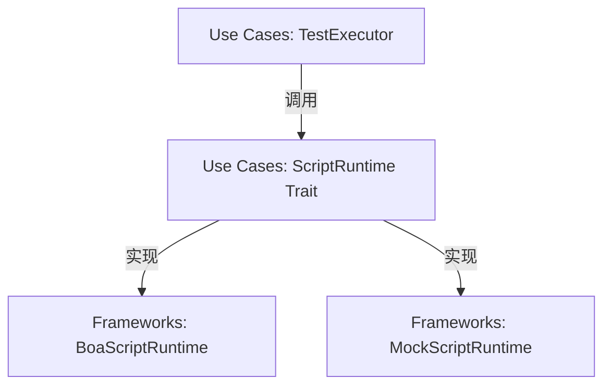

# PRD 与技术架构规划：脚本引擎与高级控制流 (Sprint 3)

本规划遵循 [rupost 研发流程规范](file:///Users/zsyzzx/project/rust/rupost/doc/development_workflow.md)，针对 Sprint 3 的脚本引擎与高级控制流功能（@loop, @skip-if）进行早期的 PRD 需求定义、API 设计以及开发路线规划。

---

## 1. 背景与痛点 (Context & Problem)

目前 RuPost 在多文件执行和变量捕获方面取得了优异的成果，但面对以下高级 API 测试场景依然力不从心：
1.  **动态请求签名**：许多安全性要求高的 API 需要在发送请求前计算 HMAC-SHA256、MD5 签名或加上时间戳防重放，目前的静态变量替换机制无法实现。
2.  **动态控制流判断**：无法在运行期动态判定是否跳过某个危险或无关请求（例如在生产环境跳过 `DELETE` 接口）。
3.  **批量并发/压测**：缺乏对单个用例进行简单的循环压测支持。

---

## 2. 目标与非目标 (Goals & Non-Goals)

### 目标：
*   **指令扩展**：支持文件及请求级别的 `### @loop <N>`（循环执行）和 `### @skip-if <expression>`（条件跳过）声明。
*   **双阶段脚本支持**：在请求发送前（Pre-request）和响应收到后（Post-response）执行自定义 JavaScript 脚本。
*   **标准 API 设计**：设计出安全、极简且高扩展的 `rupost` 全局 JS 接口。
*   **解耦的运行时**：通过 Trait 隔离具体的 JS 引擎（如 Boa 或 QuickJS），保持业务核心纯净。

### 非目标：
*   **NPM 模块加载**：本阶段**不**支持复杂的 Node.js 原生模块及网络 IO，脚本仅用于数据操作与加解密。
*   **复杂的脚本排错 UI**：不涉及 TUI 级的断点调试，只通过 Trace 日志提供脚本内的 `console.log` 重定向。

---

## 3. API 与语法设计规范 (API & Syntax Specification)

结合 API 设计的相关流程，我们在开始编码前首先定义暴露给用户的所有控制流语法与 JavaScript API 接口。

### 3.1 控制流指令语法

在 `.http` 或 `.md` 的请求元数据区块中，新增如下声明方式：

```http
### 循环发送 POST 请求
# @name loop_post
# @loop 5
POST https://httpbin.org/post
Content-Type: application/json

{
  "id": "{{random_int}}"
}

### 条件运行
# @name conditional_delete
# @skip-if env.CI == "true"
DELETE https://httpbin.org/delete
```

### 3.2 JavaScript 脚本区块声明

在 `.http` 文件或 `.md` 中，支持通过特定的注解区块编写脚本：

```http
### 创建带签名的请求
@name signed_request

# @pre-request
# console.log("Calculating signature...");
# let timestamp = Date.now().toString();
# rupost.variables.set("timestamp", timestamp);
# let raw_sig = rupost.request.body + timestamp;
# let signature = rupost.crypto.hmac_sha256(raw_sig, "my_secret_key");
# rupost.variables.set("signature", signature);

GET https://httpbin.org/get?sig={{signature}}&t={{timestamp}}
X-Signature-Key: {{signature}}
```

### 3.3 全局 `rupost` 对象 API 定义 (TypeScript 接口表达)

```typescript
interface RupostGlobal {
  // 变量管理
  variables: {
    get(name: string): string | undefined;
    set(name: string, value: string): void;
  };

  // 请求上下文（前置脚本中可读写，后置脚本中只读）
  request: {
    url: string;
    method: string;
    headers: Record<string, string>;
    body: string | undefined;
  };

  // 响应上下文（仅在后置脚本中可读）
  response?: {
    status: number;
    headers: Record<string, string>;
    body: string;
    responseTimeMs: number;
  };

  // 内置加解密库，防重放和哈希签名
  crypto: {
    md5(data: string): string;
    sha256(data: string): string;
    hmac_sha256(data: string, key: string): string;
  };
}
```

---

## 4. 架构分层设计 (Clean Architecture)

根据依赖倒置原则，核心执行引擎不应该与任何具体的 JS 执行虚拟机硬绑定。



### 4.1 核心 Trait 设计

在 `src/runner/script.rs`（业务用例层）定义抽象接口：

```rust
use crate::Result;
use crate::variable::VariableContext;
use crate::http::{Request, Response};

pub trait ScriptRuntime: Send + Sync {
    /// 执行前置脚本，可以更新变量上下文和修改 Request
    fn execute_pre_request(
        &self,
        script: &str,
        request: &mut Request,
        context: &mut VariableContext,
    ) -> Result<()>;

    /// 执行后置脚本，可以根据响应结果更新变量上下文
    fn execute_post_response(
        &self,
        script: &str,
        request: &Request,
        response: &Response,
        context: &mut VariableContext,
    ) -> Result<()>;
}
```

---

## 5. 开发实施计划 (WBS)

根据 7-Stage 极致规范，我们将开发划分为以下几个敏捷迭代阶段（每个阶段必须包含单元测试且通过 `jj` 独立提交）：

### 🛠️ Stage 1: 指令语法解析与 AST 扩展
*   **内容**：在 `ParsedRequest` 与 `RequestMetadata` 中加入 `loop_count`，`skip_condition`，`pre_script`，`post_script` 字段。升级 HttpFileParser 与 MarkdownFileParser，支持提取 `# @pre-request` 等脚本块。
*   **验收**：编写单元测试解析含脚本块的 `.http` 文件，断言 metadata 提取正常。

### 🛠️ Stage 2: 运行时抽象与 Mock Runtime 引入
*   **内容**：在 Use Cases 层定义 `ScriptRuntime` Trait，并编写一个能够模拟脚本执行（如直接把变量 set 进去）的 `MockScriptRuntime`。
*   **验收**：在 TestExecutor 的主执行流中插入 Pre/Post 钩子，通过 Mock 运行时验证变量流转正确。

### 🛠️ Stage 3: JavaScript 核心引擎接入 (Boa/QuickJS)
*   **内容**：引入 `boa_engine` 依赖。编写 `BoaScriptRuntime` 具体实现，为 JS 上下文注入全局 `rupost` 宿主对象，实现 `rupost.variables` 存取。
*   **验收**：编写单元测试运行一段纯 JS 脚本存取 VariableContext，校验断言。

### 🛠️ Stage 4: 脚本级加密算法实现 (Crypto bindings)
*   **内容**：接入 `ring` 或 `hmac` 等加解密库，为 JS 引擎中的 `rupost.crypto` 对象绑定 HMAC-SHA256、MD5 等计算逻辑。
*   **验收**：在 JS 中调用 `rupost.crypto.hmac_sha256` 并与 Rust 侧直接计算结果做比对断言。

### 🛠️ Stage 5: 高级控制流处理器（Loop & Skip-if）实现
*   **内容**：在 TestExecutor 和 BatchExecutor 中增加对循环及跳过条件表达式的求值计算（可以使用轻量级表达式求值器，或复用已有的 JS 虚拟机执行求值）。
*   **验收**：编写 E2E 测试用例，断言跳过和循环运行正常。

### 🛠️ Stage 6: 回归测试、E2E 实测与文档归档
*   **内容**：在 `examples/` 目录下交付签名、条件跳过的脚本 Demo；更新主 `README.md` 与进度事实来源 `progress_summary.md`。
