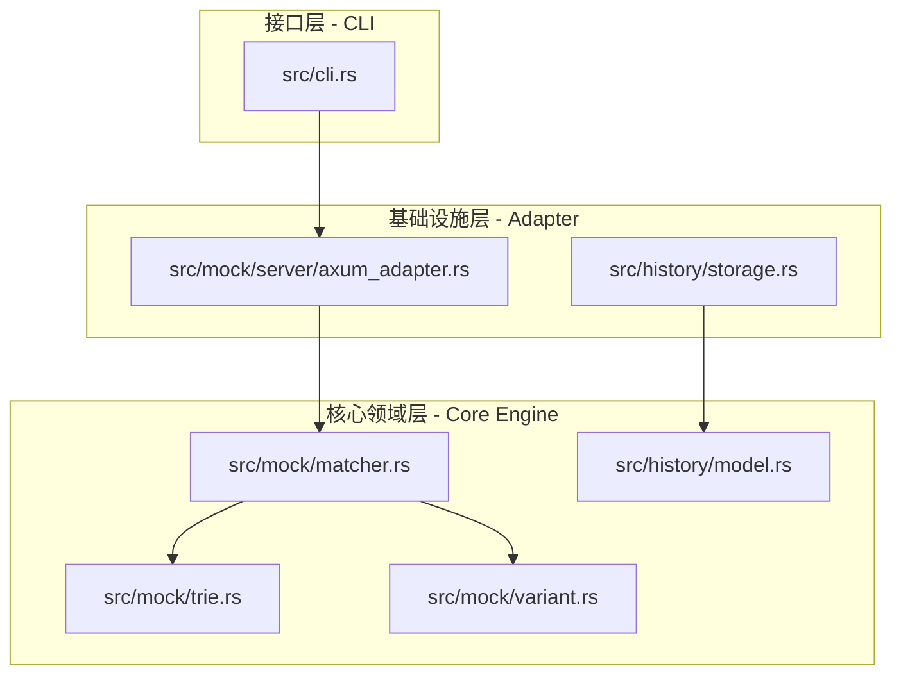

# Rupost 可插拔 Mock 服务器与模糊路径匹配引擎设计方案

本方案根据“场景驱动开发”与“模块高度复用”原则，为 RuPost 设计一个基于 **Clean Architecture** 的可插拔式 Mock 引擎。该引擎能够读取历史请求快照，在本地拉起独立的 Mock 服务器，并支持模糊路由与条件分支变体响应。

---

## 🔍 1. 架构设计 (Clean Architecture)

为了实现底层 Web 服务的**可插拔性**，我们将 Mock 模块在架构上彻底解耦为三个层次：



### 1.1 核心决策引擎 (Domain Core)
核心决策层不依赖任何具体的 Web 框架（如 Axum 或 Hyper），是纯粹的内存匹配算法。
- **`MockMatcher` Trait**：定义请求到响应的决策契约。
- **`Trie` 树路径匹配**：负责将 HTTP 请求路径分割，匹配通配符及捕获路径参数。
- **`Variant` 条件选择器**：比对请求体（JSONPath）、Headers、Query 参数以命中不同分支。

### 1.2 外部驱动适配器 (Server Adapter)
将 HTTP 请求接入和分发抽象为 Trait，使其可随时插拔替换：
```rust
#[async_trait::async_trait]
pub trait MockServer: Send + Sync {
    /// 启动 Mock 服务器并绑定端口，传入核心决策匹配器
    async fn start(&self, port: u16, matcher: std::sync::Arc<dyn MockMatcher>) -> crate::Result<()>;
}
```
- **默认实现**：`AxumMockServer`（基于 `axum` 框架，在 Infrastructure 层实现）。

---

## 💾 2. 数据结构与模块复用 (Data Models)

### 2.1 统一的快照结构升级 (`src/history/model.rs`)
我们将快照/历史记录实体进行升级，合并为一个通用的 `SnapshotEntry`，以同时服务于“历史重放 (Replay)”与“Mock 站点”。

```rust
/// 单个 HTTP 交互快照
#[derive(Debug, Clone, serde::Serialize, serde::Deserialize)]
pub struct SnapshotEntry {
    /// 交互唯一 ID
    pub id: String,
    /// 关联的请求快照
    pub request: RequestSnapshot,
    /// 关联的响应快照 (包含 Body)
    pub response: ResponseSnapshot,
}

/// 响应快照 (带 Body)
#[derive(Debug, Clone, serde::Serialize, serde::Deserialize)]
pub struct ResponseSnapshot {
    pub status: u16,
    #[serde(with = "crate::history::serialization::header_map")]
    pub headers: reqwest::header::HeaderMap,
    pub body: String,
}
```

### 2.2 路径变量提取与变量引擎复用 (`src/variable/`)
在 Mock 服务器解析路由 `/api/users/:id` 时，提取出的 `id` 会注入到一个临时的 `VariableContext` 中。
- **动态响应渲染**：如果 Mock 配置的响应体中含有 `{{id}}`，则在返回前复用 `VariableResolver::resolve(&response_body, &context)` 动态把参数渲染进 Response。

---

## 🌲 3. 模糊路径匹配引擎 (Trie Route Matcher)

我们手写基于 Trie 树的模糊路径检索，处理带有参数捕获和通配符的路由：

### 3.1 节点定义 (`src/mock/trie.rs`)
```rust
pub enum RouteSegment {
    /// 精确匹配段 (如 "users")
    Literal(String),
    /// 参数捕获段 (如 ":id"，将捕获变量 id)
    Param(String),
    /// 单段通配符 (如 "*")
    Wildcard,
    /// 多段通配符 (如 "**")
    MultiWildcard,
}

pub struct TrieNode<T> {
    pub segment: RouteSegment,
    pub children: Vec<TrieNode<T>>,
    /// 节点绑定的数据 (例如变体响应列表)
    pub data: Option<T>,
}
```

---

## 🔀 4. 多路条件分支匹配变体 (Mock Variant)

对于同一个路由端点，根据请求的参数或内容返回不同的变体响应：

```rust
pub struct MockVariant {
    /// 命中此变体的条件。若为 None，则作为默认兜底响应
    pub condition: Option<VariantCondition>,
    pub status: u16,
    pub headers: std::collections::HashMap<String, String>,
    pub response_body: String,
}

pub struct VariantCondition {
    pub source: ConditionSource, // Header, Query, Body
    pub key: String,             // 键名或 JSONPath (例如 "$.user.role")
    pub operator: CompareOp,     // Equals, Contains, Exists
    pub expected_value: String,
}
```

---

## 💻 5. CLI 命令接口设计

新增 `rupost mock` 子命令：

```bash
$ rupost mock start <snapshot_file> --port <port>
```

在终端输出精致且高品质的实时访问日志：
```text
[RuPost Mock Server Running]
  Listening on http://localhost:9000
  Loaded 12 routes from billing-mock.json
  
  [Incoming Request]
  GET /api/users/123/profile  ->  Matched: /api/users/:id/profile (id=123)
  Status: 200 OK  |  Source: Snapshot #8  |  Duration: 2ms
```

---

## 🧪 6. 验证与测试计划

1. **单元测试 (`src/mock/trie.rs` / `src/mock/variant.rs`)**：
   - 测试 Trie 树对 `:id` 参数捕获、`*` 和 `**` 的各种边缘匹配行为。
   - 测试 JSONPath 对 Body 条件变体的命中正确性。
2. **集成测试 (`tests/mock_integration_test.rs`)**：
   - 在测试用例中启动 `AxumMockServer`，发送真实的 HTTP 请求，验证模糊路由匹配、参数动态渲染以及多条件分支的完整网络闭环。
