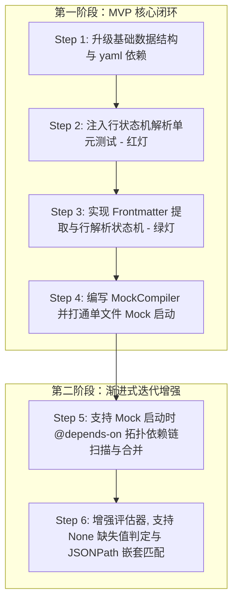

# RuPost Markdown API 全生命周期开发规范与后续规划设计规格书

本文件总结了利用 Markdown 管理 API 全生命周期（设计、Mock、测试、迭代）的方案细节，明确了 MVP 及后续迭代开发规划，并根据 `AGENTS.md` 制定了详细的开发规范与注意事项。

---

## 📅 1. 业务背景与方案总结

### 1.1 场景背景
在 API 全生命周期中，我们采用 `.md` 文件作为 API 的单一事实来源 (Single Source of Truth)：
- **设计与 Mock**：通过 YAML Frontmatter 定义全局规则（如安全限制、限流、Agent 提示），将普通 HTTP 代码块视为 Mock 契约，并通过 `@mock-when` 条件表达式实现多响应分支匹配。
- **自动化测试**：通过在 HTTP 块中附加 `@test` 标签，声明具体的请求与断言用例，供 Runner 运行。
- **API 迭代**：在同一份契约中管理 V1 的兼容性 Mock 与 V2 的全新规则拦截，依靠拓扑依赖（`@depends-on`）加载整条依赖链。

### 1.2 现存解析差距 (Parser Gap)
现有的 HTTP 与 Markdown 解析器仅处理单请求-单响应的扁平数据。我们必须：
1. 支持提取 YAML Frontmatter，反序列化为 `FileMetadata` 并作为全局 Memory 注入。
2. 实现**行解析状态机**，防止把 Mock 契约中的多个 HTTP 响应报文误读为请求的 Body。
3. 支持 Mock 启动时读取依赖链并联合编译。

---

## 🛠️ 2. 开发规划与路线图 (MVP 驱动)

根据 MVP 原则，我们将开发划分为两个清晰阶段：



### 2.1 第一阶段 (Phase 1: MVP 核心闭环)
- **目标**：能使用单文件 `.md` 进行 API 设计、变体 Mock 以及测试运行。
- **范围**：
  - 在 `src/parser/types.rs` 中升级 `ParsedFile` 和 `RequestMetadata`，承载全局 `FileMetadata` 及 `ParsedMockVariant` 向量。
  - 在 `src/parser/markdown_file.rs` 中基于 `Line-State-Machine` 实现解析，正确切分出 `@mock-when` 响应流与 `@test` 集成测试块。
  - 实现内存编译模块 `MockCompiler` 将契约转换成底层的 `MockRouteConfig`，交付 Axum 引擎。

### 2.2 第二阶段 (Phase 2: 渐进式迭代增强)
- **目标**：全面支持复杂的分布式场景和智能体交互。
- **范围**：
  - **多文件依赖链合并**：在 Mock 服务启动时，复用 Runner 的 `DirectoryScanner` 和 `WorkflowGraph`，解析拓扑依赖图，自动读取依赖文件并进行内存编译合并。
  - **缺失值匹配与 JSONPath**：支持 `header.Authorization == None` 的 401 鉴权越权模拟，支持 `body.$.user.role` 等 JSON 字段条件判定。

---

## 📏 3. 开发规范与架构约束 (AGENTS.md 准则)

本项目的后续开发必须无条件遵循以下行为指南与技术约束：

### 3.1 核心行为规范
1. **Surgical Changes (外科手术式修改)**：
   - **绝不改动邻近无关代码**：只修改实现本任务必须触及的代码，严禁为了“美观”去格式化或重构相邻的旧代码。
   - **Match Existing Style**：必须严格保持既有的代码风格、命名规范以及缩进（例如，`http_file.rs` 的解析代码块模式）。
   - **清理垃圾**：若因为本修改导致原有的某些 Import 或变量废弃，必须立刻删除，不留死代码。
2. **Simplicity First (极简主义与 YAGNI)**：
   - **杜绝过度设计**：不编写任何未经请求的“扩展接口”或“兜底参数”。
   - **代码行数约束**：若能用 50 行清晰写完逻辑，绝不写 100 行。
3. **Goal-Driven (目标与测试驱动)**：
   - **TDD 流程**：先定义单元测试用例（Step 2 写入红灯测试，确保编译正常且失败原因与预期一致），然后编写实现逻辑使其全部转绿。
   - **Mock 隔离原则**：单测应局限在 `mod tests` 中，通过内存结构注入，严禁在单元测试中进行任何物理网络 IO 或未隔离的文件读写。

### 3.2 架构约束 (Clean Architecture)
- **核心数据流**：继续保持 `ParsedRequest`（解析层原始数据）到 `Request` / `MockRouteConfig`（执行层/运行层数据）的严格单向流转。转换工作交由 `MockCompiler` 处理，不污染 `src/parser` 下的解析实体。
- **可插拔原则**：新解析的 `is_test` 必须对原有的 `TestExecutor` 完全兼容。运行测试时忽略非测试块，确保原有的集成测试（142 个用例）在重构过程中 100% 成功，绝不阻碍主线发布。
- **Tokio 异步安全**：在 Axum Mock 服务中提取路径参数或注入临时 Context 时，必须使用 Tokio 提供的异步原语，严禁使用任何阻塞式的 Lock，防止高并发 Mock 请求发生死锁。
- **Rust 2024 版本约束**：对于 `&Value` 匹配或 `impl trait`，遵循 implicit borrowing 规则，消除 binding modes 警告，保持零 Warning 编译。

---

## 🧪 4. 冒烟测试验证计划 (Smoke Test Plan)

我们将通过在 `tests/mock_integration_test.rs` 中新增集成测试套件，使用真实拉起的 `AxumMockServer` 对所有用户场景及示例文件进行闭环冒烟测试：

### 4.1 冒烟测试用例与预期结果

1. **V1 核心 Mock 匹配与路径参数渲染 (对应 US 1)**:
   - **输入**：加载 `examples/iteration_scenarios/v1_api.md`。向 Mock 服务发送 `GET /api/v1/orders/101?status=completed` 和 `GET /api/v1/orders/999`。
   - **预期**：101 请求成功命中 `completed` 变体，返回 200，且 Body 中自动把 ID 渲染替换为 `"101"`；999 请求未命中任何条件，正确命中兜底响应返回 404。
2. **网关安全鉴权与限流模拟 (对应 US 2)**:
   - **输入**：加载 `examples/design_scenarios/security_and_ratelimit.md`。
     - 请求 1：不带 `Authorization` Header 发送请求。
     - 请求 2：带 `Authorization: Bearer expired_token` 发送请求。
     - 请求 3：带合规 Token 并带 `X-RateLimit-Trigger: true` 发送请求。
   - **预期**：
     - 请求 1 返回 401，且 Body 包含 `"Missing Authorization"`（证明 `None` 缺省匹配逻辑正常）。
     - 请求 2 返回 403，且 Body 包含 `"expired"`。
     - 请求 3 返回 429。
3. **交易幂等性与防重校验 (对应 US 3)**:
   - **输入**：加载 `examples/design_scenarios/idempotency_api.md`。
     - 请求 1：带 `Idempotency-Key: repeat_key_12345`。
     - 请求 2：带 `Idempotency-Key: new_key_999`。
   - **预期**：
     - 请求 1 命中重复支付逻辑，返回 200 并包含 `"duplicated": true`。
     - 请求 2 命中全新支付，返回 201 且 `"duplicated": false`。
4. **多版本兼容过渡与向前兼容 (对应 US 4)**:
   - **输入**：加载 `examples/iteration_scenarios/v2_api_evolution.md`。向旧接口 `GET /api/v1/orders/102?status=completed` 发送请求。
   - **预期**：返回 200，且自动补充返回 V2 过渡兼容字段 `"compat_mode": true`。
5. **多文件级联依赖合并加载 (对应 US 5 & Step 5)**:
   - **输入**：启动 Mock 指向 `examples/iteration_scenarios/migration_test.md`（其级联依赖 `v1_api.md` 和 `v2_api_evolution.md`）。
   - **预期**：Mock 服务成功从依赖图融合全部路由。分别发送 V1 接口请求与 V2 接口请求，均能命中对应的条件响应分支并成功返回。

---

## 💻 5. 代码实现规则与核心示例代码

为保证代码的极致简洁（YAGNI）、高效与开闭原则，我们定义以下代码实现规则，并提供核心状态机及条件解析的骨架示例：

### 5.1 代码实现规则 (Implementation Rules)
1. **外科手术式精修**：在修改 `markdown_file.rs` 时，除添加新 API 外，原有函数（如依赖提取）禁止发生任何多余的换行、缩进或格式重排，保持原有 Style。
2. **开闭与分层清晰**：`src/parser` 只做文本抓取与结构拼装；`src/mock` 只做内存路由分发匹配。所有的跨文件依赖拓扑加载、条件表达式语义提取等复杂翻译，统一由内存编译模块 `MockCompiler` 完成。
3. **高效解析无死锁**：在 Axum 适配层注入 Context 时，严禁使用任何阻塞式的 Lock，使用 Tokio 原生的并发与异步读写原语。
4. **统一 Error 包裹**：解析中遇到的任何 Frontmatter 故障或状态机错乱，均包裹为 `ParseError::InvalidFormat`，并传递精准的错误代码行号。

### 5.2 核心示例一：Markdown 代码块状态机解析器 (Line-based State Machine)
我们将使用以下行解析器，对混合了请求及多响应变体的 HTTP 代码块进行提取：

```rust
#[derive(Debug, PartialEq, Eq)]
enum ParseState {
    RequestLineAndHeaders, // 解析请求行 (METHOD URL) 与请求 Headers
    ExpectVariant,         // 期望遇到下一个 @mock-when 或 @mock-default
    VariantHeaders,        // 解析当前 Response 变体的 Headers (如 Content-Type)
    VariantBody,           // 收集当前 Response 变体的 Body 内容
}

pub fn parse_mock_block(block_content: &str, start_line: usize) -> ParseResult<ParsedRequest> {
    let mut request = ParsedRequest::new(start_line);
    let mut state = ParseState::RequestLineAndHeaders;
    
    let mut current_variant: Option<ParsedMockVariant> = None;
    let mut current_body_lines = Vec::new();

    for (line_idx, line) in block_content.lines().enumerate() {
        let current_line_num = start_line + line_idx;
        let trimmed = line.trim();

        match state {
            ParseState::RequestLineAndHeaders => {
                if trimmed.starts_with("@mock-when") || trimmed.starts_with("@mock-default") {
                    // 遇到响应分支，状态流转。如果是第一个变体，这里将触发状态切换
                    state = ParseState::ExpectVariant;
                    // ... 接着利用 ExpectVariant 处理当前行
                } else if trimmed.starts_with('@') {
                    // 解析普通请求级元数据 (如 @name, @test)
                    if let Some(meta) = metadata::parse_metadata(trimmed)? {
                        metadata::apply_metadata(&meta, &mut request.metadata);
                    }
                } else if request.url.is_empty() {
                    // 解析首行 Request Line
                    HttpFileParser::parse_request_line(trimmed, current_line_num, &mut request)?;
                } else if !trimmed.is_empty() {
                    // 解析请求 Headers
                    if let Some((k, v)) = HttpFileParser::parse_header(trimmed) {
                        request.headers.push((k.to_string(), v.to_string()));
                    }
                }
            }
            ParseState::ExpectVariant => {
                // 如果之前有正在收集的变体，保存之
                if let Some(mut var) = current_variant.take() {
                    var.body = Some(current_body_lines.join("\n"));
                    request.metadata.mock_variants.push(var);
                    current_body_lines.clear();
                }

                if trimmed.starts_with("@mock-when") {
                    let condition = trimmed["@mock-when".len()..].trim().to_string();
                    current_variant = Some(ParsedMockVariant {
                        condition_expr: Some(condition),
                        status: 200, // 默认
                        headers: Vec::new(),
                        body: None,
                    });
                    state = ParseState::VariantHeaders;
                } else if trimmed.starts_with("@mock-default") {
                    current_variant = Some(ParsedMockVariant {
                        condition_expr: None,
                        status: 200,
                        headers: Vec::new(),
                        body: None,
                    });
                    state = ParseState::VariantHeaders;
                }
            }
            ParseState::VariantHeaders => {
                if trimmed.is_empty() {
                    // 空行表示 Headers 结束，开始收集 Response Body
                    state = ParseState::VariantBody;
                } else if trimmed.starts_with("HTTP/1.1") || trimmed.starts_with("HTTP/2") {
                    // 解析 Response 状态行，例如 "HTTP/1.1 200 OK"
                    let parts: Vec<&str> = trimmed.split_whitespace().collect();
                    if parts.len() >= 2 {
                        if let Ok(code) = parts[1].parse::<u16>() {
                            if let Some(ref mut var) = current_variant {
                                var.status = code;
                            }
                        }
                    }
                } else if let Some((k, v)) = HttpFileParser::parse_header(trimmed) {
                    // 解析 Response Headers
                    if let Some(ref mut var) = current_variant {
                        var.headers.push((k.to_string(), v.to_string()));
                    }
                }
            }
            ParseState::VariantBody => {
                if trimmed.starts_with("@mock-when") || trimmed.starts_with("@mock-default") {
                    // 遇到下一个变体标记，回流处理
                    state = ParseState::ExpectVariant;
                    // ... 并在 ExpectVariant 里将当前收集的 current_variant 归档
                } else {
                    current_body_lines.push(line);
                }
            }
        }
    }

    // 最后一包归档
    if let Some(mut var) = current_variant {
        var.body = Some(current_body_lines.join("\n"));
        request.metadata.mock_variants.push(var);
    }

    Ok(request)
}
```

### 5.3 核心示例二：MockCompiler 表达式翻译与 None 缺省判定
我们将使用以下逻辑在 `MockCompiler::parse_condition_expression` 中处理等于及缺失值匹配：

```rust
pub fn parse_condition_expression(expr: &str) -> Option<VariantCondition> {
    // 简单支持 "==" 切分
    let parts: Vec<&str> = expr.split("==").map(|s| s.trim()).collect();
    if parts.len() != 2 {
        return None;
    }
    let lhs = parts[0];
    let rhs_val = parts[1].trim_matches('"').trim();

    let (source, key) = if lhs.starts_with("query.") {
        (ConditionSource::Query, lhs["query.".len()..].to_string())
    } else if lhs.starts_with("header.") {
        (ConditionSource::Header, lhs["header.".len()..].to_string())
    } else if lhs.starts_with("body.") {
        (ConditionSource::Body, lhs["body.".len()..].to_string())
    } else {
        return None;
    };

    if rhs_val.eq_ignore_ascii_case("None") {
        // 映射为 Exists 操作，且期望值设为 "None" 以触发 evaluate 中的缺失判定
        Some(VariantCondition {
            source,
            key,
            operator: CompareOp::Exists,
            expected_value: "None".to_string(),
        })
    } else {
        Some(VariantCondition {
            source,
            key,
            operator: CompareOp::Equals,
            expected_value: rhs_val.to_string(),
        })
    }
}
```

---

## ⚠️ 6. 注意事项与防错 checklist

- [ ] **Frontmatter 格式校验**：在切分 `---` 时，如果不存在 Frontmatter，必须能够优雅退化，不能 Panic 或导致整个 Markdown 文件解析报错。
- [ ] **空行与空白字符容错**：在状态机解析多响应分支时，`@mock-when` 之后可能存在空行或前导空格。提取条件表达式及首行状态码时必须做 `trim()` 净化。
- [ ] **保留老版本 JSON 路由兼容**：启动 Mock 命令行命令时，若文件为 `.json`，必须保持原有的 JSON 快照重放或 Mock 配置直接反序列化逻辑，不能因升级 Markdown 编译器而导致原有快照 Mock 故障。
- [ ] **jj 提交验证**：每次 Step 完成后，必须先在本地运行 `cargo test` 确认全绿，方可使用 `jj` 提交物理修改并刷新 working copy。
