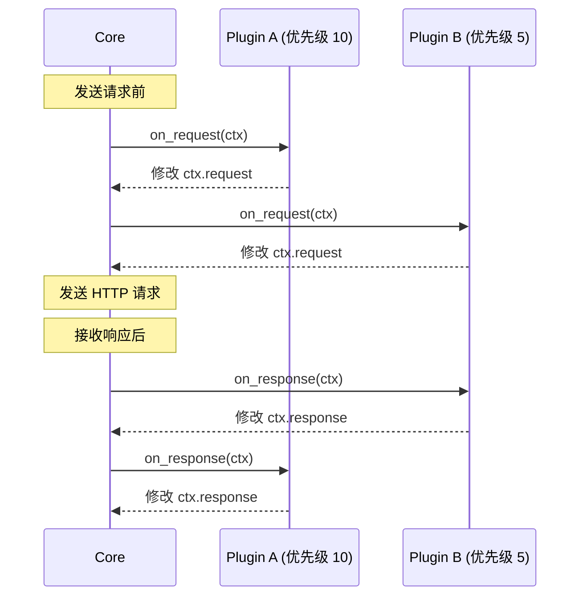
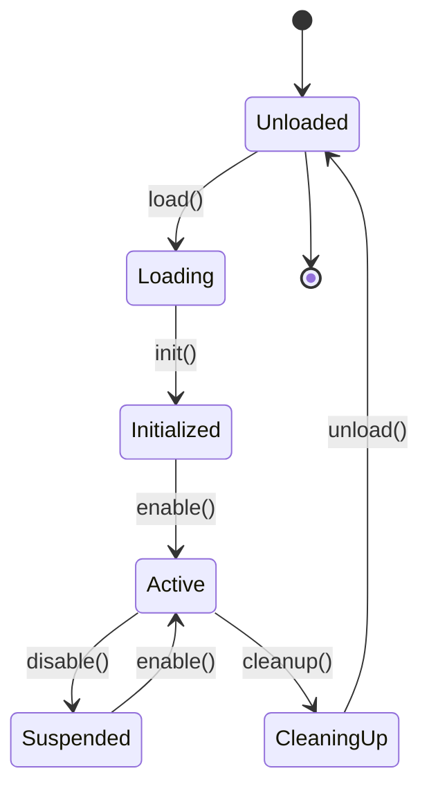

# 插件 API 参考

> 🔧 **API 版本**: v1.0.0  
> 📅 **最后更新**: 2026-02-03  
> 🎯 **稳定性**: 实验性（Phase 1）

---

## 一、核心 Trait 定义

### 1.1 Plugin Trait

所有插件必须实现的核心接口：

```rust
// src/plugin/api.rs
use async_trait::async_trait;

#[async_trait]
pub trait Plugin: Send + Sync {
    /// 插件元数据
    fn metadata(&self) -> PluginMetadata;
    
    /// 插件初始化
    async fn init(&mut self, config: &PluginConfig) -> Result<()>;
    
    /// 插件清理
    async fn cleanup(&mut self) -> Result<()>;
    
    /// 请求钩子（可选）
    async fn on_request(&mut self, ctx: &mut PluginContext) -> Result<()> {
        Ok(())
    }
    
    /// 响应钩子（可选）
    async fn on_response(&mut self, ctx: &mut PluginContext) -> Result<()> {
        Ok(())
    }
    
    /// 断言钩子（可选）
    async fn on_assert(&mut self, ctx: &mut PluginContext) -> Result<()> {
        Ok(())
    }
    
    /// 格式化输出钩子（可选）
    async fn format_output(
        &self,
        response: &Response,
    ) -> Result<Option<String>> {
        Ok(None)
    }
}
```

### 1.2 PluginMetadata 定义

```rust
#[derive(Debug, Clone, Serialize, Deserialize)]
pub struct PluginMetadata {
    /// 插件唯一标识符（小写字母、数字、连字符）
    pub name: String,
    
    /// 语义化版本号
    pub version: String,
    
    /// 作者信息
    pub author: String,
    
    /// 插件描述
    pub description: String,
    
    /// 主页 URL
    pub homepage: Option<String>,
    
    /// 插件所需权限
    pub permissions: Vec<Permission>,
    
    /// 支持的钩子
    pub hooks: Vec<Hook>,
    
    /// 最低 RuPost 版本要求
    pub min_rupost_version: String,
}
```

---

## 二、核心数据类型

### 2.1 PluginContext

插件上下文，包含请求/响应和运行时信息：

```rust
#[derive(Debug)]
pub struct PluginContext {
    /// HTTP 请求（可修改）
    pub request: Request,
    
    /// HTTP 响应（仅在 on_response 可用）
    pub response: Option<Response>,
    
    /// 变量存储（跨插件共享）
    pub variables: HashMap<String, String>,
    
    /// 环境信息
    pub environment: String,
    
    /// 插件私有状态存储
    pub state: HashMap<String, serde_json::Value>,
    
    /// 日志接口
    pub logger: PluginLogger,
}

impl PluginContext {
    /// 设置请求头
    pub fn set_header(&mut self, key: &str, value: &str) {
        self.request.headers.insert(key.to_string(), value.to_string());
    }
    
    /// 获取请求头
    pub fn get_header(&self, key: &str) -> Option<&str> {
        self.request.headers.get(key).map(|s| s.as_str())
    }
    
    /// 设置变量
    pub fn set_variable(&mut self, key: &str, value: String) {
        self.variables.insert(key.to_string(), value);
    }
    
    /// 获取变量
    pub fn get_variable(&self, key: &str) -> Option<&str> {
        self.variables.get(key).map(|s| s.as_str())
    }
    
    /// 保存插件状态
    pub fn set_state(&mut self, key: &str, value: impl Serialize) {
        self.state.insert(
            key.to_string(),
            serde_json::to_value(value).unwrap(),
        );
    }
    
    /// 读取插件状态
    pub fn get_state<T: DeserializeOwned>(&self, key: &str) -> Option<T> {
        self.state
            .get(key)
            .and_then(|v| serde_json::from_value(v.clone()).ok())
    }
}
```

### 2.2 Request 定义

```rust
#[derive(Debug, Clone, Serialize, Deserialize)]
pub struct Request {
    /// HTTP 方法
    pub method: Method,
    
    /// 请求 URL
    pub url: Url,
    
    /// 请求头
    pub headers: HeaderMap,
    
    /// 请求体
    pub body: Option<Vec<u8>>,
    
    /// 超时时间（毫秒）
    pub timeout: Option<u64>,
}

impl Request {
    /// 设置 JSON 请求体
    pub fn set_json_body(&mut self, value: impl Serialize) -> Result<()> {
        self.body = Some(serde_json::to_vec(&value)?);
        self.headers.insert(
            "Content-Type",
            "application/json".to_string(),
        );
        Ok(())
    }
    
    /// 解析 JSON 请求体
    pub fn body_json<T: DeserializeOwned>(&self) -> Result<T> {
        let body = self.body.as_ref().ok_or("No body")?;
        Ok(serde_json::from_slice(body)?)
    }
}
```

### 2.3 Response 定义

```rust
#[derive(Debug, Clone, Serialize, Deserialize)]
pub struct Response {
    /// HTTP 状态码
    pub status: u16,
    
    /// 响应头
    pub headers: HeaderMap,
    
    /// 响应体
    pub body: Vec<u8>,
    
    /// 响应时间（毫秒）
    pub elapsed: u64,
}

impl Response {
    /// 解析 JSON 响应体
    pub fn body_json<T: DeserializeOwned>(&self) -> Result<T> {
        Ok(serde_json::from_slice(&self.body)?)
    }
    
    /// 获取响应体文本
    pub fn body_text(&self) -> Result<String> {
        Ok(String::from_utf8(self.body.clone())?)
    }
    
    /// 检查状态码
    pub fn is_success(&self) -> bool {
        (200..300).contains(&self.status)
    }
}
```

---

## 三、钩子系统

### 3.1 Hook 枚举

```rust
#[derive(Debug, Clone, Copy, PartialEq, Eq, Hash)]
pub enum Hook {
    /// 请求发送前
    OnRequest,
    
    /// 响应接收后
    OnResponse,
    
    /// 断言执行时
    OnAssert,
    
    /// 格式化输出时
    FormatOutput,
    
    /// 插件加载时
    OnLoad,
    
    /// 插件卸载时
    OnUnload,
}
```

### 3.2 钩子执行顺序



> [!IMPORTANT]
> - `on_request`: 按优先级**从高到低**执行
> - `on_response`: 按优先级**从低到高**执行（逆序）
> - 这种设计类似中间件的洋葱模型

---

## 四、权限系统

### 4.1 Permission 枚举

```rust
#[derive(Debug, Clone, Serialize, Deserialize, PartialEq, Eq)]
pub enum Permission {
    /// 读取请求信息
    ReadRequest,
    
    /// 修改请求信息
    ModifyRequest,
    
    /// 读取响应信息
    ReadResponse,
    
    /// 修改响应信息
    ModifyResponse,
    
    /// 网络访问（发起 HTTP 请求）
    Network { allowed_domains: Vec<String> },
    
    /// 文件系统访问
    FileSystem { allowed_paths: Vec<PathBuf> },
    
    /// 环境变量访问
    Environment { allowed_keys: Vec<String> },
    
    /// 日志输出
    Log { max_level: LogLevel },
    
    /// 执行外部命令
    Execute { allowed_commands: Vec<String> },
}
```

### 4.2 权限检查示例

```rust
impl PluginManager {
    fn check_permission(
        &self,
        plugin: &PluginMetadata,
        permission: &Permission,
    ) -> Result<()> {
        if !plugin.permissions.contains(permission) {
            return Err(anyhow!(
                "Plugin '{}' lacks permission: {:?}",
                plugin.name,
                permission
            ));
        }
        Ok(())
    }
}
```

---

## 五、宿主函数 API

插件可以调用的宿主函数（由 RuPost 核心提供）：

### 5.1 日志 API

```rust
// 提供给插件的日志接口
pub struct PluginLogger {
    plugin_name: String,
}

impl PluginLogger {
    /// 输出调试日志
    pub fn debug(&self, message: &str) {
        tracing::debug!(plugin = %self.plugin_name, "{}", message);
    }
    
    /// 输出信息日志
    pub fn info(&self, message: &str) {
        tracing::info!(plugin = %self.plugin_name, "{}", message);
    }
    
    /// 输出警告日志
    pub fn warn(&self, message: &str) {
        tracing::warn!(plugin = %self.plugin_name, "{}", message);
    }
    
    /// 输出错误日志
    pub fn error(&self, message: &str) {
        tracing::error!(plugin = %self.plugin_name, "{}", message);
    }
}
```

### 5.2 HTTP 客户端 API

```rust
// 插件发起 HTTP 请求（需要 Network 权限）
#[async_trait]
pub trait PluginHttpClient {
    async fn request(&self, req: Request) -> Result<Response>;
    
    async fn get(&self, url: &str) -> Result<Response> {
        self.request(Request {
            method: Method::GET,
            url: url.parse()?,
            ..Default::default()
        })
        .await
    }
    
    async fn post(&self, url: &str, body: Vec<u8>) -> Result<Response> {
        self.request(Request {
            method: Method::POST,
            url: url.parse()?,
            body: Some(body),
            ..Default::default()
        })
        .await
    }
}
```

### 5.3 变量访问 API

```rust
// 通过 PluginContext 访问
impl PluginContext {
    /// 获取全局变量（继承自 rupost.toml）
    pub fn get_global_variable(&self, key: &str) -> Option<&str>;
    
    /// 设置临时变量（仅当前请求有效）
    pub fn set_temp_variable(&mut self, key: &str, value: String);
    
    /// 设置持久变量（写回 rupost.toml，需要 FileSystem 权限）
    pub async fn set_persistent_variable(
        &mut self,
        key: &str,
        value: String,
    ) -> Result<()>;
}
```

---

## 六、配置 API

### 6.1 PluginConfig 定义

```rust
#[derive(Debug, Clone, Serialize, Deserialize)]
pub struct PluginConfig {
    /// 插件是否启用
    pub enabled: bool,
    
    /// 插件优先级（数字越大优先级越高）
    pub priority: i32,
    
    /// 自定义配置（插件特定）
    pub settings: HashMap<String, serde_json::Value>,
}

impl PluginConfig {
    /// 获取配置项
    pub fn get<T: DeserializeOwned>(&self, key: &str) -> Option<T> {
        self.settings
            .get(key)
            .and_then(|v| serde_json::from_value(v.clone()).ok())
    }
    
    /// 设置配置项
    pub fn set(&mut self, key: &str, value: impl Serialize) {
        self.settings.insert(
            key.to_string(),
            serde_json::to_value(value).unwrap(),
        );
    }
}
```

### 6.2 配置文件示例

```toml
# rupost.toml
[plugins.header-injector]
enabled = true
priority = 10

[plugins.header-injector.settings]
custom_header = "X-Custom-Value"
inject_timestamp = true
```

---

## 七、错误处理

### 7.1 错误类型

```rust
use thiserror::Error;

#[derive(Debug, Error)]
pub enum PluginError {
    #[error("Plugin not found: {0}")]
    NotFound(String),
    
    #[error("Permission denied: {0}")]
    PermissionDenied(String),
    
    #[error("Invalid metadata: {0}")]
    InvalidMetadata(String),
    
    #[error("Initialization failed: {0}")]
    InitFailed(String),
    
    #[error("Hook execution failed: {0}")]
    HookFailed(String),
    
    #[error("WASM error: {0}")]
    WasmError(#[from] wasmtime::Error),
}
```

### 7.2 错误传播

```rust
// 插件返回错误不应中断整个流程
impl PluginManager {
    async fn call_hook_safe(
        &mut self,
        plugin: &mut PluginInstance,
        hook: Hook,
        ctx: &mut PluginContext,
    ) {
        if let Err(e) = plugin.call_hook(hook, ctx).await {
            tracing::warn!(
                plugin = %plugin.metadata().name,
                hook = ?hook,
                error = %e,
                "Plugin hook failed, skipping"
            );
        }
    }
}
```

---

## 八、生命周期管理

### 8.1 生命周期钩子



### 8.2 状态转换 API

```rust
pub enum PluginState {
    Unloaded,
    Loading,
    Initialized,
    Active,
    Suspended,
    CleaningUp,
}

impl PluginInstance {
    pub fn state(&self) -> PluginState;
    
    pub async fn enable(&mut self) -> Result<()>;
    pub async fn disable(&mut self) -> Result<()>;
    pub async fn reload(&mut self) -> Result<()>;
}
```

---

## 九、版本兼容性

### 9.1 API 版本策略

```rust
pub struct ApiVersion {
    pub major: u32,
    pub minor: u32,
    pub patch: u32,
}

impl ApiVersion {
    /// 检查兼容性（遵循 SemVer）
    pub fn is_compatible(&self, required: &ApiVersion) -> bool {
        self.major == required.major && self.minor >= required.minor
    }
}
```

### 9.2 版本声明

```toml
# plugin.toml
[plugin]
name = "my-plugin"
version = "1.0.0"
api_version = "1.0.0"  # 所需 RuPost Plugin API 版本
```

---

## 十、示例代码

### 10.1 简单的请求头注入插件

```rust
use rupost_plugin_sdk::*;

pub struct HeaderInjectorPlugin {
    custom_header: String,
}

#[async_trait]
impl Plugin for HeaderInjectorPlugin {
    fn metadata(&self) -> PluginMetadata {
        PluginMetadata {
            name: "header-injector".to_string(),
            version: "1.0.0".to_string(),
            author: "RuPost Team".to_string(),
            description: "Inject custom headers".to_string(),
            homepage: None,
            permissions: vec![Permission::ModifyRequest],
            hooks: vec![Hook::OnRequest],
            min_rupost_version: "0.1.0".to_string(),
        }
    }
    
    async fn init(&mut self, config: &PluginConfig) -> Result<()> {
        self.custom_header = config
            .get::<String>("custom_header")
            .unwrap_or_else(|| "X-Custom".to_string());
        Ok(())
    }
    
    async fn on_request(&mut self, ctx: &mut PluginContext) -> Result<()> {
        ctx.set_header(&self.custom_header, "injected-value");
        ctx.logger.info("Header injected");
        Ok(())
    }
    
    async fn cleanup(&mut self) -> Result<()> {
        Ok(())
    }
}

// 导出插件
rupost_plugin_export!(HeaderInjectorPlugin::default());
```

### 10.2 响应格式化插件

```rust
pub struct JsonFormatterPlugin;

#[async_trait]
impl Plugin for JsonFormatterPlugin {
    fn metadata(&self) -> PluginMetadata {
        PluginMetadata {
            name: "json-formatter".to_string(),
            version: "1.0.0".to_string(),
            author: "Community".to_string(),
            description: "Pretty-print JSON responses".to_string(),
            homepage: None,
            permissions: vec![Permission::ReadResponse],
            hooks: vec![Hook::FormatOutput],
            min_rupost_version: "0.1.0".to_string(),
        }
    }
    
    async fn init(&mut self, _config: &PluginConfig) -> Result<()> {
        Ok(())
    }
    
    async fn format_output(
        &self,
        response: &Response,
    ) -> Result<Option<String>> {
        // 仅处理 JSON 响应
        if let Some(ct) = response.headers.get("content-type") {
            if ct.contains("application/json") {
                let json: serde_json::Value = response.body_json()?;
                return Ok(Some(serde_json::to_string_pretty(&json)?));
            }
        }
        Ok(None)
    }
    
    async fn cleanup(&mut self) -> Result<()> {
        Ok(())
    }
}
```

---

## 十一、预留扩展 API

以下 API 在 Phase 1 中**不实现**,但预留接口设计：

### 11.1 数据库访问（Phase 3+）

```rust
#[async_trait]
pub trait PluginDatabase {
    /// 执行 SQL 查询（需要 Database 权限）
    async fn query(&self, sql: &str) -> Result<Vec<Row>>;
    
    /// 执行事务
    async fn transaction<F>(&self, f: F) -> Result<()>
    where
        F: FnOnce(&Transaction) -> Result<()>;
}
```

### 11.2 事件总线（Phase 2+）

```rust
pub trait PluginEventBus {
    /// 订阅事件
    fn subscribe(&mut self, event: &str, handler: EventHandler);
    
    /// 发布事件
    fn publish(&self, event: &str, data: serde_json::Value);
}
```

### 11.3 UI 扩展（Phase 4+，TUI 模式）

```rust
pub trait PluginUI {
    /// 渲染自定义 UI 组件
    fn render(&self, area: Rect, buf: &mut Buffer);
    
    /// 处理键盘事件
    fn handle_key(&mut self, key: KeyEvent) -> Result<()>;
}
```

---

**API 稳定性承诺**：
- ✅ **Phase 1-2**：实验性 API，可能有破坏性变更
- ⚠️ **Phase 3-4**：稳定 API v1.0，遵循 SemVer
- 🔒 **Phase 5+**：向后兼容保证

**文档维护者**: RuPost API 工作组  
**反馈渠道**: GitHub Issues (#plugin-api)
