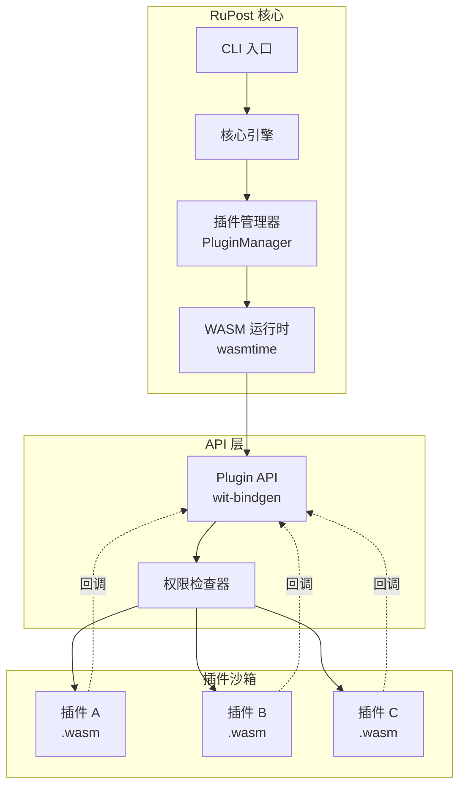
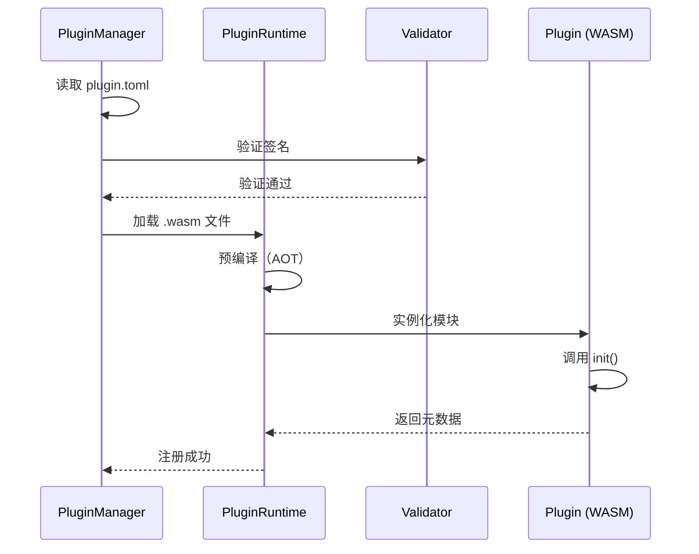
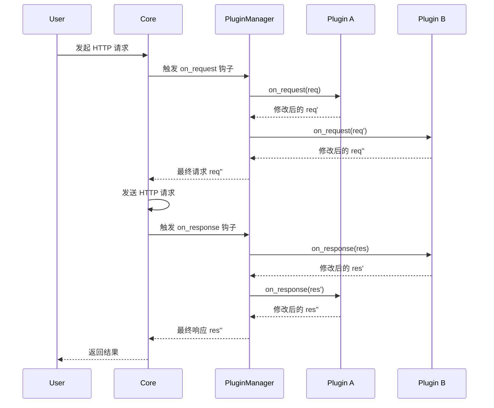
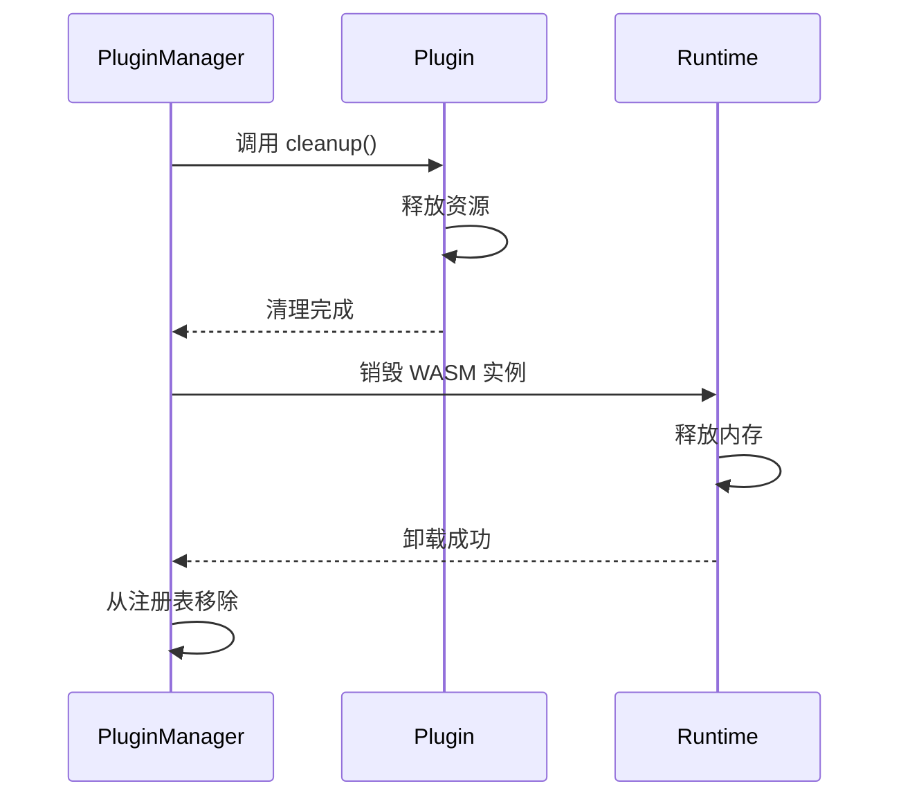

# 插件系统架构设计

> 📐 **设计版本**: v1.0  
> 📅 **最后更新**: 2026-02-03  
> 🎯 **阶段**: Phase 1 - 核心框架

---

## 一、架构概览

RuPost 插件系统采用 **WebAssembly (WASM)** 作为插件运行时，通过 **Component Model** 实现插件与核心的安全隔离和高效通信。

### 1.1 整体架构图



### 1.2 核心模块

| 模块 | 职责 | 关键类型 |
|------|------|----------|
| **PluginManager** | 插件生命周期管理 | `load()`, `unload()`, `list()` |
| **PluginRuntime** | WASM 运行时封装 | `wasmtime::Engine`, `wasmtime::Store` |
| **PluginApi** | 插件 API 接口定义 | `Plugin` trait, `PluginContext` |
| **PermissionChecker** | 权限验证 | `has_permission()`, `enforce()` |
| **PluginRegistry** | 插件注册表 | 本地配置 + 远程市场 |

---

## 二、技术选型

### 2.1 WASM 运行时：Wasmtime

**选择理由**：
- ✅ Bytecode Alliance 官方维护，稳定性高
- ✅ 完整 WASI 支持，成熟的沙箱机制
- ✅ AOT 编译性能优异
- ✅ Rust-first API 设计，集成简单

**备选方案**：
- `wasmer`：功能更丰富，但 API 复杂度较高
- `wasmtime-py`：仅适用于 Python 生态

### 2.2 插件接口：wit-bindgen

使用 **WebAssembly Interface Types (WIT)** 定义插件接口：

```wit
// plugin.wit
package rupost:plugin@1.0.0

interface plugin-api {
    // 插件生命周期钩子
    record plugin-metadata {
        name: string,
        version: string,
        author: string,
    }
    
    // 请求/响应类型
    record request {
        method: string,
        url: string,
        headers: list<tuple<string, string>>,
        body: option<list<u8>>,
    }
    
    record response {
        status: u16,
        headers: list<tuple<string, string>>,
        body: list<u8>,
    }
    
    // 插件核心方法
    on-request: func(req: request) -> result<request, string>
    on-response: func(res: response) -> result<response, string>
}
```

### 2.3 数据交换格式

| 场景 | 格式 | 理由 |
|------|------|------|
| 插件元数据 | TOML | 人类可读，Rust 生态标准 |
| API 调用 | WIT 原生类型 | 零拷贝，类型安全 |
| 复杂对象 | MessagePack | 高效二进制序列化 |
| 日志输出 | JSON | 结构化日志标准 |

---

## 三、核心流程

### 3.1 插件加载流程



**关键步骤**：
1. **解析元数据**：读取 `plugin.toml`，提取名称、版本、权限
2. **签名验证**：检查 `.wasm` 文件签名（Phase 4）
3. **预编译**：使用 wasmtime AOT 提升性能
4. **实例化**：创建 WASM 实例并初始化
5. **注册**：将插件加入激活列表

### 3.2 请求处理流程



**钩子顺序**：
- `on_request`：按插件优先级顺序调用
- `on_response`：按插件优先级**逆序**调用（类似洋葱模型）

### 3.3 插件卸载流程



---

## 四、模块设计

### 4.1 PluginManager 设计

```rust
// src/plugin/manager.rs
use wasmtime::*;
use std::collections::HashMap;

pub struct PluginManager {
    engine: Engine,
    plugins: HashMap<String, PluginInstance>,
    config: PluginConfig,
}

impl PluginManager {
    pub fn new(config: PluginConfig) -> Result<Self> {
        let engine = Engine::default();
        Ok(Self {
            engine,
            plugins: HashMap::new(),
            config,
        })
    }
    
    /// 加载插件
    pub async fn load(&mut self, path: &Path) -> Result<()> {
        // 1. 读取并验证插件
        let metadata = self.read_metadata(path)?;
        
        // 2. 检查权限
        self.check_permissions(&metadata)?;
        
        // 3. 加载 WASM 模块
        let module = Module::from_file(&self.engine, path)?;
        
        // 4. 实例化
        let instance = PluginInstance::new(module, metadata)?;
        
        // 5. 注册
        self.plugins.insert(metadata.name.clone(), instance);
        
        Ok(())
    }
    
    /// 卸载插件
    pub async fn unload(&mut self, name: &str) -> Result<()> {
        if let Some(mut plugin) = self.plugins.remove(name) {
            plugin.cleanup().await?;
        }
        Ok(())
    }
    
    /// 触发钩子
    pub async fn trigger_hook(
        &mut self,
        hook: Hook,
        context: &mut PluginContext,
    ) -> Result<()> {
        for plugin in self.plugins.values_mut() {
            if plugin.has_hook(&hook) {
                plugin.call_hook(hook, context).await?;
            }
        }
        Ok(())
    }
}
```

### 4.2 PluginInstance 设计

```rust
// src/plugin/instance.rs
pub struct PluginInstance {
    store: Store<PluginState>,
    metadata: PluginMetadata,
    hooks: HashMap<Hook, TypedFunc<Request, Response>>,
}

impl PluginInstance {
    pub fn new(module: Module, metadata: PluginMetadata) -> Result<Self> {
        let mut store = Store::new(&module.engine(), PluginState::default());
        
        // 链接导入的宿主函数
        let mut linker = Linker::new(&module.engine());
        linker.func_wrap("env", "log", |msg: String| {
            tracing::info!("Plugin log: {}", msg);
        })?;
        
        let instance = linker.instantiate(&mut store, &module)?;
        
        // 提取导出的钩子函数
        let hooks = Self::extract_hooks(&instance, &mut store)?;
        
        Ok(Self { store, metadata, hooks })
    }
    
    pub async fn call_hook(
        &mut self,
        hook: Hook,
        context: &mut PluginContext,
    ) -> Result<()> {
        if let Some(func) = self.hooks.get(&hook) {
            func.call_async(&mut self.store, context.request.clone())
                .await?;
        }
        Ok(())
    }
}
```

---

## 五、性能优化

### 5.1 AOT 编译

```rust
// 预编译插件
let engine = Engine::new(Config::new().cranelift_opt_level(OptLevel::Speed))?;
let module = Module::from_file(&engine, "plugin.wasm")?;

// 缓存编译结果
let compiled = module.serialize()?;
std::fs::write("plugin.cwasm", compiled)?;

// 从缓存加载
let cached = std::fs::read("plugin.cwasm")?;
let module = unsafe { Module::deserialize(&engine, &cached)? };
```

### 5.2 实例池化

```rust
pub struct PluginPool {
    instances: Vec<PluginInstance>,
    available: VecDeque<usize>,
}

impl PluginPool {
    pub async fn acquire(&mut self) -> PluginInstance {
        if let Some(idx) = self.available.pop_front() {
            self.instances.swap_remove(idx)
        } else {
            self.create_instance().await
        }
    }
    
    pub fn release(&mut self, instance: PluginInstance) {
        self.instances.push(instance);
        self.available.push_back(self.instances.len() - 1);
    }
}
```

### 5.3 懒加载策略

```rust
pub enum LoadStrategy {
    Eager,      // 启动时立即加载
    Lazy,       // 首次使用时加载
    OnDemand,   // 每次使用时加载（无缓存）
}
```

---

## 六、扩展性考虑

### 6.1 插件依赖管理

```toml
# plugin.toml
[dependencies]
"rupost-http-utils" = "1.0"
"json-parser" = "2.3"
```

**依赖解析算法**：
- 使用拓扑排序确定加载顺序
- 检测循环依赖
- 支持版本约束（SemVer）

### 6.2 插件热重载

```rust
impl PluginManager {
    pub async fn reload(&mut self, name: &str) -> Result<()> {
        // 1. 保存当前状态
        let state = self.plugins.get(name)
            .map(|p| p.export_state())?;
        
        // 2. 卸载旧版本
        self.unload(name).await?;
        
        // 3. 加载新版本
        self.load(&format!("plugins/{}.wasm", name)).await?;
        
        // 4. 恢复状态
        if let Some(state) = state {
            self.plugins.get_mut(name)
                .unwrap()
                .import_state(state)?;
        }
        
        Ok(())
    }
}
```

---

## 七、测试策略

### 7.1 单元测试

```rust
#[cfg(test)]
mod tests {
    use super::*;
    
    #[tokio::test]
    async fn test_plugin_load() {
        let mut manager = PluginManager::new(Default::default()).unwrap();
        manager.load(Path::new("test-plugin.wasm")).await.unwrap();
        assert_eq!(manager.plugins.len(), 1);
    }
    
    #[tokio::test]
    async fn test_hook_execution() {
        let mut manager = setup_test_manager().await;
        let mut ctx = PluginContext::default();
        
        manager.trigger_hook(Hook::OnRequest, &mut ctx).await.unwrap();
        
        assert_eq!(ctx.request.headers.get("X-Test"), Some("injected"));
    }
}
```

### 7.2 集成测试

```rust
// tests/plugin_integration.rs
#[tokio::test]
async fn test_real_http_with_plugin() {
    let app = RuPost::builder()
        .with_plugin("header-injector")
        .build()
        .await
        .unwrap();
    
    let response = app.get("https://httpbin.org/get").await.unwrap();
    
    assert_eq!(response.status, 200);
    assert!(response.body.contains("X-Custom-Header"));
}
```

---

## 八、未来演进

### 8.1 Component Model 迁移

当 WASM Component Model 成熟后，迁移到标准化接口：

```wit
// component.wit
world rupost-plugin {
    import wasi:http/types
    import wasi:logging/logger
    
    export plugin-api
}
```

### 8.2 多语言支持

通过 Component Model，支持非 Rust 语言编写插件：
- JavaScript/TypeScript (via componentize-js)
- Python (via componentize-py)
- Go (via TinyGo)

---

**文档维护者**: RuPost 架构组  
**下次审查**: Phase 1 实现完成后
