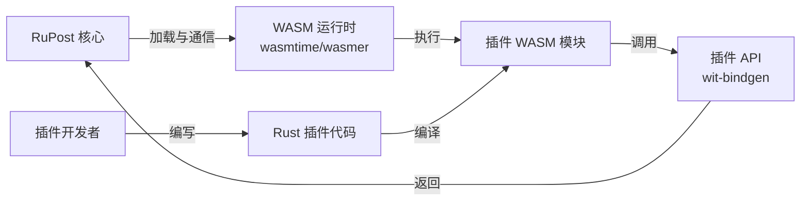
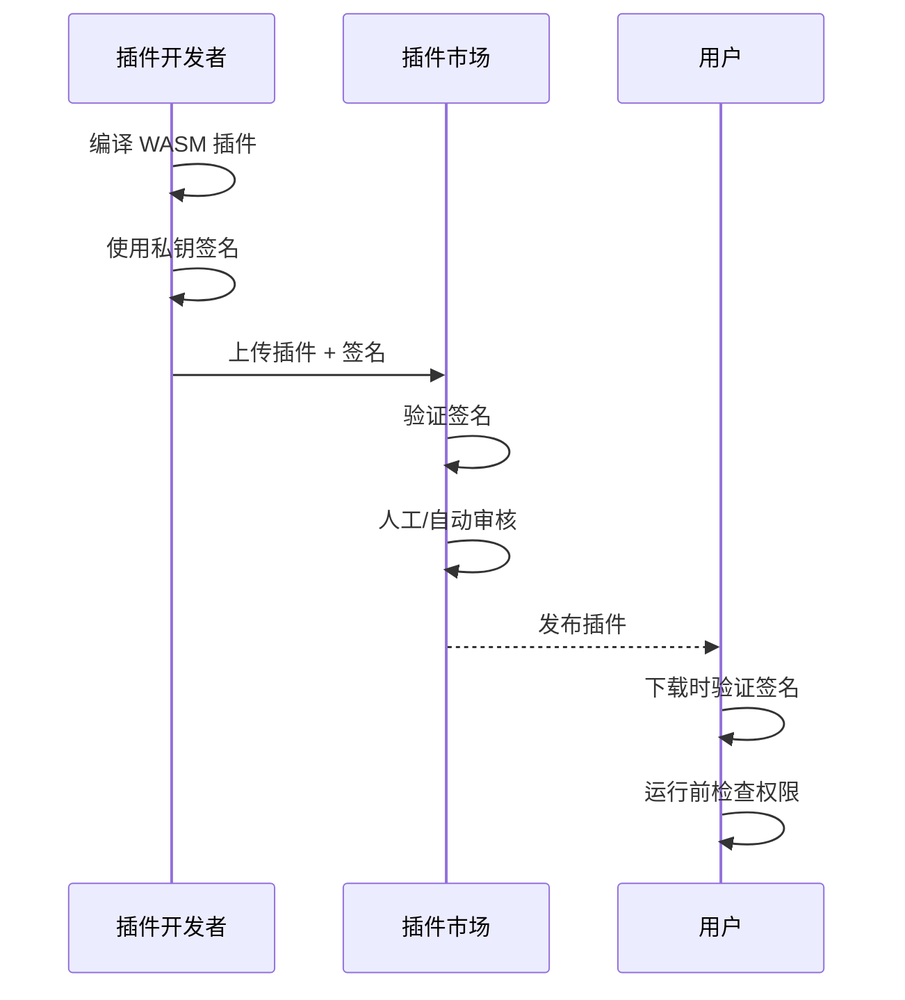
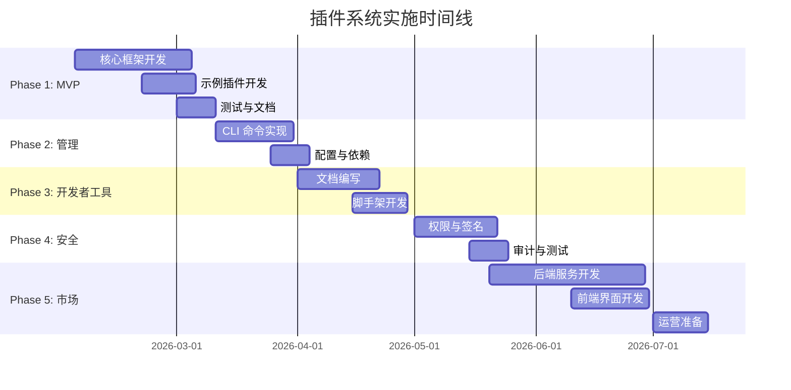

# RuPost 插件系统可行性报告

> **版本**: v1.0  
> **日期**: 2026-02-03  
> **状态**: 需求分析与方案设计阶段

---

## 一、执行摘要

本报告针对 RuPost 项目规划中的**插件系统**（规划第1项）进行全面可行性分析。经过深入技术调研和商业价值评估，**结论为：该项目高度可行**，但需要采用分阶段、MVP 驱动的实施策略。

**核心判断**：
- ✅ **技术可行性**：Rust + WASM 工具链成熟，Clean Architecture 便于扩展
- ✅ **商业价值**：构建差异化竞争优势，吸引企业客户和开发者生态
- ⚠️ **实施风险**：需要高质量 API 设计、安全机制和文档投入
- 🎯 **建议行动**：立即启动 Phase 1（核心插件框架 MVP）

---

## 二、项目背景

### 2.1 RuPost 项目概览

RuPost 是一个基于 Rust 的现代化终端 HTTP 客户端与 API 测试工具，核心特性包括：
- 📝 支持 `.http` 和 `.md` 文件解析
- ✅ 强大的断言系统（`@assert`）
- 🔄 变量与多环境管理
- 📜 请求历史追踪
- 🏗️ Clean Architecture 设计模式

### 2.2 插件系统需求

根据 [`project_next_state.md`](file:///Users/zsyzzx/project/rust/rupost/doc/project_next_state.md#L2-L13)，插件系统包含以下模块：

1. **服务端功能插件**：扩展核心功能
2. **插件开发文档**：API 规范与开发指南
3. **插件管理**：安装/卸载/命令执行
4. **插件安全**：权限控制与代码签名
5. **插件市场**：发布、发现与社区生态

---

## 三、技术可行性分析

### 3.1 技术方案对比

| 方案 | 优势 | 劣势 | 适用性 |
|------|------|------|--------|
| **动态库 (dylib)** | 🟢 性能极佳<br>🟢 无缝集成 | 🔴 ABI 不稳定<br>🔴 跨平台困难 | ⚠️ 低 |
| **WebAssembly (WASM)** | 🟢 沙箱安全<br>🟢 跨平台<br>🟢 ABI 稳定 | 🟡 性能略有开销 | ✅ **推荐** |
| **进程隔离** | 🟢 最高安全性 | 🔴 性能开销大<br>🔴 通信复杂 | ⚠️ 低 |
| **脚本语言嵌入** | 🟢 开发简单 | 🔴 性能较低<br>🔴 生态割裂 | ⚠️ 低 |

> [!IMPORTANT]
> **推荐采用 WebAssembly (WASM) 方案**，理由如下：
> 1. 平衡性能、安全性和开发体验
> 2. Rust 的 `wasmtime`/`wasmer` 工具链成熟
> 3. 天然支持跨平台（macOS、Linux、Windows）
> 4. 符合 Web 标准，长期演进路径清晰

### 3.2 核心技术栈



**技术选型**：

| 组件 | 方案 | 备注 |
|------|------|------|
| WASM 运行时 | `wasmtime` | 官方推荐，稳定性高 |
| 插件接口 | `wit-bindgen` | WASM Component Model，未来标准 |
| 权限系统 | WASI + 自定义 | Capability-based security |
| 插件管理 | 自研 CLI | `rupost plugin install/remove` |
| 插件市场 | Axum + PostgreSQL | 后端服务 + 对象存储 |

---

## 四、商业价值与优势

### 4.1 商业优势

#### 1️⃣ **生态系统构建**
- 🌐 吸引第三方开发者，形成网络效应
- 📈 降低核心团队负担，让社区满足长尾需求
- 🔗 增加产品粘性和用户留存

#### 2️⃣ **差异化竞争**
与 Postman、Insomnia 等竞品相比：
- ⚡ **性能优势**：Rust + WASM 更高效
- 🔒 **安全优势**：沙箱隔离 + 代码签名
- 🤖 **AI 协同**：结合规划中的 AI 功能（规划12），打造智能插件生态

#### 3️⃣ **变现潜力**
- 💼 **企业插件付费**：定制化合规/审计插件
- 💰 **插件市场分成**：优质插件收费模式
- 🏅 **认证服务**：官方认证收费

#### 4️⃣ **企业客户吸引力**
- 🏢 支持内部私有插件开发
- 📊 结合企业审计功能（规划14），符合大客户合规要求
- 🔐 增强安全性和可控性

### 4.2 与现有规划的协同效应

| 规划项 | 协同方式 | 优先级 |
|--------|----------|--------|
| 导入/导出（规划2） | Postman、Apifox 等转换器作为插件 | 🟢 高 |
| WebSocket（规划4） | 协议支持先通过插件验证 | 🟢 高 |
| GraphQL（规划13） | 作为插件实现，成熟后集成核心 | 🟡 中 |
| AI 接入（规划12） | 不同 AI 服务（OpenAI、Claude）各自为插件 | 🟢 高 |
| 企业审计（规划14） | 企业定制审计逻辑插件化 | 🟡 中 |

> [!TIP]
> 插件系统作为**基础设施**，可以显著加速后续功能的实施速度。

---

## 五、优劣势分析 (SWOT)

### 5.1 优势 (Strengths)

| 优势 | 说明 |
|------|------|
| **🔧 技术基础扎实** | Rust 类型安全 + Clean Architecture 易扩展 |
| **🚀 功能扩展性强** | 支持自定义协议、断言、输出格式、CI/CD 集成 |
| **⚖️ 核心保持轻量** | 按需安装插件，避免功能臃肿 |
| **🌍 跨平台天然支持** | WASM 一次编译，到处运行 |
| **🤝 社区驱动创新** | 快速响应用户长尾需求 |

### 5.2 劣势 (Weaknesses)

| 劣势 | 风险等级 | 缓解措施 |
|------|----------|----------|
| **🏗️ 架构复杂度高** | 🔴 高 | 分阶段实施，MVP 先行 |
| **🔒 安全风险** | 🔴 高 | 沙箱隔离 + 代码签名 + 人工审核 |
| **📚 文档投入大** | 🟡 中 | 预留 20% 时间用于文档编写 |
| **🐣 生态冷启动** | 🟡 中 | 核心团队先开发 5-10 个官方插件 |
| **🔧 维护成本** | 🟡 中 | 自动化测试 + 明确的 SLA |

### 5.3 机遇 (Opportunities)

- 📊 开发者工具市场增长迅速
- 🤖 AI 浪潮带来新的插件需求（代码生成、智能断言）
- 🏢 企业数字化转型需要定制化 API 测试工具
- 🌐 开源社区愿意为好工具贡献插件

### 5.4 威胁 (Threats)

- ⚔️ Postman 等成熟竞品已有完善插件生态
- 🔄 WASM 工具链快速演进，可能需要适配新标准
- 💸 插件市场运营成本高，需要持续投入

---

## 六、设计注意事项

### 6.1 API 设计原则

> [!CAUTION]
> API 一旦发布，修改成本极高。必须遵循以下原则：

1. **最小权限原则**  
   插件默认无权限，需显式声明所需能力（如网络访问、文件读写）

2. **稳定性优先**  
   核心 API 保证向后兼容，使用语义化版本（SemVer）

3. **文档先行**  
   先编写 API 文档和示例，再实现代码

4. **渐进式暴露**  
   Phase 1 仅暴露最小 API 集，后续根据需求逐步扩展

#### 示例 API 设计

```rust
// 插件访问请求上下文
trait PluginApi {
    // 读取请求信息（只读权限）
    fn get_request(&self) -> &Request;
    
    // 修改响应（需 modify_response 权限）
    fn modify_response(&mut self, response: Response);
    
    // 日志输出（需 log 权限）
    fn log(&self, level: LogLevel, message: &str);
    
    // 调用外部 HTTP（需 network 权限）
    fn http_call(&self, req: Request) -> Result<Response>;
}
```

### 6.2 插件安全机制

#### 6.2.1 权限声明（plugin.toml）

```toml
[plugin]
name = "custom-formatter"
version = "0.1.0"
author = "your-name"

[permissions]
read_request = true
modify_response = false
network = false
filesystem = []  # 空数组表示无文件系统访问权限
```

#### 6.2.2 代码签名流程



#### 6.2.3 沙箱限制

| 资源 | 限制 | 配置 |
|------|------|------|
| **内存** | 默认 64MB | 可在 `plugin.toml` 配置 |
| **CPU 时间** | 单次调用 5 秒超时 | 防止死循环 |
| **网络** | 需显式权限 | 仅允许 HTTPS |
| **文件系统** | 仅限指定目录 | 使用 WASI 虚拟文件系统 |

### 6.3 性能优化策略

1. **懒加载**  
   仅在需要时加载插件，避免拖慢启动速度

2. **缓存编译结果**  
   缓存 WASM 模块的 AOT 编译结果

3. **并发执行**  
   插件间无依赖时并行调用

4. **资源池化**  
   复用 WASM 实例，减少初始化开销

---

## 七、实施路线图

### 7.1 分阶段方案（遵循 MVP 原则）

#### 📋 Phase 1: 核心插件框架（MVP）
**目标**: 验证技术可行性，实现最小可用系统  
**时间**: 4-6 周

- [x] 插件接口定义（`Plugin` trait）
- [x] WASM 运行时集成（`wasmtime`）
- [x] 本地插件加载功能
- [x] 基本权限检查
- [x] 开发 2 个官方示例插件：
  - `custom-formatter`：自定义输出格式
  - `header-injector`：自动注入通用请求头
- [x] 单元测试覆盖率 > 80%

#### 📦 Phase 2: 插件管理
**目标**: 用户可以方便地安装和管理插件  
**时间**: 3-4 周

- [ ] CLI 命令实现：
  ```bash
  rupost plugin install <name>
  rupost plugin remove <name>
  rupost plugin list
  rupost plugin update <name>
  ```
- [ ] `rupost.toml` 插件配置扩展
- [ ] 插件依赖自动解析
- [ ] 本地插件缓存管理
- [ ] 集成测试

#### 🛠️ Phase 3: 开发者工具
**目标**: 降低插件开发门槛  
**时间**: 4-5 周

- [ ] 官方插件开发文档（mdBook）
- [ ] 脚手架工具：
  ```bash
  rupost plugin new my-plugin
  ```
- [ ] 本地调试支持（日志、断点）
- [ ] 插件测试框架
- [ ] 5+ 示例插件代码

#### 🔒 Phase 4: 安全强化
**目标**: 达到生产级安全标准  
**时间**: 3-4 周

- [ ] 完善权限系统（细粒度控制）
- [ ] 代码签名与验证
- [ ] 安全审计工具
- [ ] 沙箱资源限制
- [ ] 渗透测试

#### 🌐 Phase 5: 插件市场
**目标**: 构建社区生态  
**时间**: 6-8 周

- [ ] 市场后端服务（Axum + PostgreSQL）
- [ ] 插件上传与发布流程
- [ ] 搜索与推荐算法
- [ ] 评分、评论、下载统计
- [ ] 自动化审核系统
- [ ] CDN 加速下载

### 7.2 时间线与里程碑



> [!NOTE]
> **总耗时约 5-6 个月**，Phase 1 完成后即可对外发布 Beta 版本。

### 7.3 资源需求

| 角色 | Phase 1-2 | Phase 3-4 | Phase 5 | 总计 |
|------|-----------|-----------|---------|------|
| **后端工程师** | 1 人 | 1 人 | 2 人 | 2 人 |
| **安全工程师** | 0.5 人 | 1 人 | 0.5 人 | 1 人 |
| **技术文档** | 0.5 人 | 1 人 | 0.5 人 | 1 人 |
| **前端工程师**（市场页面） | - | - | 1 人 | 1 人 |

---

## 八、风险评估与缓解

| 风险 | 概率 | 影响 | 缓解措施 |
|------|------|------|----------|
| **API 设计失误导致需要破坏性变更** | 🟡 中 | 🔴 高 | 1. 充分调研竞品 API<br>2. 社区早期反馈<br>3. 版本化隔离 |
| **恶意插件绕过沙箱** | 🟢 低 | 🔴 高 | 1. 代码审核<br>2. 赏金计划<br>3. 持续安全更新 |
| **生态冷启动失败** | 🟡 中 | 🟡 中 | 1. 官方开发 10+ 插件<br>2. 激励早期开发者<br>3. 集成到主要工作流 |
| **维护负担过重** | 🟡 中 | 🟡 中 | 1. 自动化测试<br>2. 明确废弃策略<br>3. 社区维护者招募 |
| **WASM 工具链变更** | 🟢 低 | 🟡 中 | 1. 使用稳定版本<br>2. 关注标准演进<br>3. 保持适配层 |

---

## 九、成本收益分析

### 9.1 投入成本

| 阶段 | 人力成本 | 基础设施成本 | 总计 |
|------|----------|--------------|------|
| Phase 1-2 | 2 人 × 2.5 月 | ¥0（本地开发） | 5 人月 |
| Phase 3-4 | 2 人 × 2 月 | ¥0 | 4 人月 |
| Phase 5 | 4 人 × 2 月 | ¥2000/月（服务器+CDN） | 8 人月 + ¥4000 |
| **总计** | **17 人月** | **¥4000** | **约 ¥340,000**（假设人月成本 ¥20,000） |

### 9.2 预期收益（2 年周期）

| 收益来源 | 保守估计 | 乐观估计 |
|----------|----------|----------|
| **用户增长** | +30% | +100% |
| **企业客户转化** | 5 家 × ¥50,000/年 | 20 家 × ¥100,000/年 |
| **插件市场分成** | ¥10,000/年 | ¥100,000/年 |
| **品牌价值提升** | 不可量化 | 不可量化 |
| **总计** | **¥260,000** | **¥2,100,000** |

### 9.3 投资回报率 (ROI)

- **保守场景**: ROI = (260,000 - 340,000) / 340,000 = **-24%**（2 年内未回本，需延长周期）
- **乐观场景**: ROI = (2,100,000 - 340,000) / 340,000 = **518%**（2 年内 5 倍回报）

> [!IMPORTANT]
> 插件系统是**战略性投资**，短期 ROI 可能为负，但长期生态价值巨大。建议结合企业客户开发降低风险。

---

## 十、竞品对标

| 工具 | 插件系统特点 | 优劣对比 |
|------|--------------|----------|
| **Postman** | JavaScript 插件，Newman 集成 | 🔴 生态成熟但性能一般<br>🟢 RuPost 可用性能优势 |
| **Insomnia** | 插件架构基于 Electron | 🔴 体验好但资源占用高<br>🟢 RuPost 更轻量 |
| **Bruno** | 无插件系统（开源社区贡献） | 🟡 灵活性不足<br>🟢 RuPost 机会明显 |
| **HTTPie** | 无官方插件系统 | 🟡 功能受限<br>🟢 RuPost 可填补空白 |

**差异化策略**：
1. Rust + WASM 的性能与安全优势
2. 与 AI 深度集成（智能插件推荐、代码生成）
3. 企业级安全特性（审计、权限、签名）

---

## 十一、建议与下一步行动

### 11.1 立即行动项

1. ✅ **批准本可行性报告**（需用户确认）
2. 📝 **启动 Phase 1 详细设计**：
   - 编写 `Plugin` trait 规范
   - 选择 `wasmtime` vs `wasmer`（推荐 wasmtime）
   - 设计权限声明格式
3. 🛠️ **搭建开发环境**：
   - 创建 `rupost-plugin-sdk` 子 crate
   - 配置 WASM 编译工具链
4. 📚 **技术预研**：
   - 深入学习 `wit-bindgen` 和 WASM Component Model
   - 研究 VS Code 插件系统作为参考

### 11.2 中期规划（3-6 个月）

1. 发布 **Phase 1 Beta 版本**，邀请 10-20 个早期开发者试用
2. 收集反馈，迭代 API 设计
3. 开发 5-10 个官方插件作为生态启动

### 11.3 长期愿景（1-2 年）

1. 插件市场月活跃插件数 > 100
2. 前 10 款插件下载量 > 10,000
3. 至少 3 家企业客户采用私有插件方案
4. 插件收入占总收入 20%+

---

## 十二、结论

**RuPost 插件系统项目具备高度可行性，建议立即启动。**

**核心理由**：
1. ✅ **技术成熟**：Rust + WASM 工具链完善，风险可控
2. ✅ **商业价值明确**：生态建设、差异化竞争、企业客户吸引力
3. ✅ **架构适配性强**：与现有 Clean Architecture 无缝集成
4. ✅ **长期战略意义**：为未来功能（AI、WebSocket、GraphQL）提供基础设施

**关键成功因素**：
- 🎯 严格遵循 MVP 原则，快速验证核心价值
- 📖 高质量文档和示例代码
- 🔒 安全性不妥协
- 🌱 官方插件示范最佳实践

**投入产出比**：
- 短期（6 个月）：投入高，产出低（基础设施建设）
- 中期（1-2 年）：投入中，产出中（生态初具规模）
- 长期（2 年+）：投入低，产出高（社区自驱动）

---

## 附录

### A. 参考资料

- [Wasmtime 官方文档](https://docs.wasmtime.dev/)
- [WASM Component Model](https://github.com/WebAssembly/component-model)
- [VS Code 插件系统设计](https://code.visualstudio.com/api)
- [Rust 插件架构最佳实践](https://adventures.michaelfbryan.com/posts/plugins-in-rust/)

### B. 词汇表

| 术语 | 解释 |
|------|------|
| **WASM** | WebAssembly，二进制指令格式，可在沙箱中安全执行 |
| **WIT** | WebAssembly Interface Types，定义 WASM 模块接口的 IDL |
| **WASI** | WebAssembly System Interface，标准化系统调用接口 |
| **ABI** | Application Binary Interface，应用程序二进制接口 |
| **Capability-based Security** | 基于能力的安全模型，显式授权访问权限 |

### C. 示例插件代码

```rust
// plugins/custom-formatter/src/lib.rs
use rupost_plugin_sdk::*;

#[plugin_export]
fn format_response(ctx: &PluginContext, response: &Response) -> String {
    format!(
        "🎨 Status: {}\n📦 Body: {}",
        response.status,
        response.body
    )
}

#[plugin_metadata]
fn metadata() -> PluginMetadata {
    PluginMetadata {
        name: "custom-formatter",
        version: "0.1.0",
        author: "RuPost Team",
        permissions: vec![Permission::ReadResponse],
    }
}
```

---

**文档维护者**: RuPost 核心团队  
**最后更新**: 2026-02-03  
**下次审查**: 2026-03-03（Phase 1 完成后）
