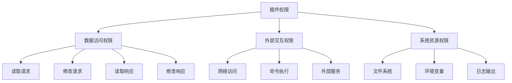
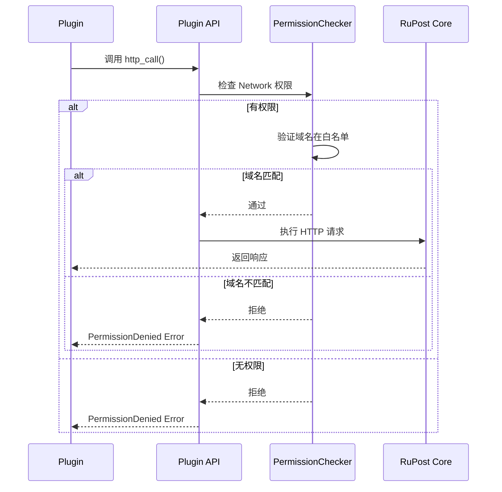

# 插件权限系统

> 🔐 **版本**: v1.0  
> 📅 **最后更新**: 2026-02-03  
> 🎯 **设计原则**: 最小权限 + 显式授权

---

## 一、权限模型

### 1.1 设计原则

RuPost 插件权限系统遵循以下核心原则：

1. **最小权限原则 (Principle of Least Privilege)**  
   插件默认无任何权限，必须显式声明所需能力

2. **显式授权 (Explicit Grant)**  
   用户安装插件时必须审查并同意权限列表

3. **细粒度控制 (Fine-grained Control)**  
   权限可精确到特定域名、文件路径、环境变量

4. **运行时检查 (Runtime Enforcement)**  
   每次 API 调用都验证权限，而非仅在加载时检查

### 1.2权限分类



---

## 二、权限定义

### 2.1 核心权限类型

```rust
#[derive(Debug, Clone, Serialize, Deserialize, PartialEq, Eq)]
#[serde(tag = "type")]
pub enum Permission {
    /// 读取 HTTP 请求信息（只读）
    ReadRequest,
    
    /// 修改 HTTP 请求（可能影响目标服务器）
    ModifyRequest,
    
    /// 读取 HTTP 响应信息（只读）
    ReadResponse,
    
    /// 修改 HTTP 响应（可能影响测试结果）
    ModifyResponse,
    
    /// 网络访问（发起独立的 HTTP 请求）
    Network {
        /// 允许访问的域名列表（支持通配符）
        allowed_domains: Vec<String>,
        
        /// 是否允许 HTTPS
        allow_https: bool,
        
        /// 是否允许 HTTP（不安全）
        allow_http: bool,
    },
    
    /// 文件系统访问
    FileSystem {
        /// 允许访问的路径列表
        allowed_paths: Vec<PathBuf>,
        
        /// 读取权限
        read: bool,
        
        /// 写入权限
        write: bool,
    },
    
    /// 环境变量访问
    Environment {
        /// 允许读取的环境变量名称列表
        allowed_keys: Vec<String>,
    },
    
    /// 日志输出
    Log {
        /// 最大日志级别
        max_level: LogLevel,
    },
    
    /// 执行外部命令（高风险）
    Execute {
        /// 允许执行的命令列表（白名单）
        allowed_commands: Vec<String>,
    },
    
    /// 访问变量存储
    Variables {
        /// 是否可以修改全局变量
        modify_global: bool,
    },
}
```

### 2.2 权限风险等级

| 权限 | 风险等级 | 说明 |
|------|----------|------|
| `ReadRequest` | 🟢 低 | 仅读取请求信息，无副作用 |
| `ReadResponse` | 🟢 低 | 仅读取响应信息，无副作用 |
| `Log` | 🟢 低 | 日志输出，可能泄露信息但风险可控 |
| `ModifyRequest` | 🟡 中 | 可能向服务器发送非预期数据 |
| `ModifyResponse` | 🟡 中 | 可能影响测试结果的准确性 |
| `Variables` | 🟡 中 | 可能污染变量空间 |
| `Network` | 🟠 中高 | 可能泄露敏感数据到外部服务 |
| `Environment` | 🟠 中高 | 可能读取敏感环境变量（如密钥） |
| `FileSystem` | 🔴 高 | 可能读写本地文件，数据泄露风险 |
| `Execute` | 🔴 高 | 可以执行任意命令，极高风险 |

---

## 三、权限声明

### 3.1 plugin.toml 配置

```toml
[plugin]
name = "custom-auth"
version = "1.0.0"
author = "your-name"

# 权限声明
[[permissions]]
type = "ReadRequest"

[[permissions]]
type = "ModifyRequest"

[[permissions]]
type = "Network"
allowed_domains = ["auth.example.com", "*.googleapis.com"]
allow_https = true
allow_http = false

[[permissions]]
type = "Environment"
allowed_keys = ["AUTH_TOKEN", "API_KEY"]

[[permissions]]
type = "Log"
max_level = "Info"
```

### 3.2 代码中声明（替代方案）

```rust
impl Plugin for CustomAuthPlugin {
    fn metadata(&self) -> PluginMetadata {
        PluginMetadata {
            name: "custom-auth".to_string(),
            version: "1.0.0".to_string(),
            permissions: vec![
                Permission::ReadRequest,
                Permission::ModifyRequest,
                Permission::Network {
                    allowed_domains: vec![
                        "auth.example.com".to_string(),
                        "*.googleapis.com".to_string(),
                    ],
                    allow_https: true,
                    allow_http: false,
                },
                Permission::Environment {
                    allowed_keys: vec![
                        "AUTH_TOKEN".to_string(),
                    ],
                },
            ],
            // ...
        }
    }
}
```

---

## 四、权限检查机制

### 4.1 检查流程



### 4.2 检查实现

```rust
pub struct PermissionChecker {
    granted: Vec<Permission>,
}

impl PermissionChecker {
    /// 检查是否有指定权限
    pub fn has_permission(&self, required: &Permission) -> bool {
        self.granted.iter().any(|p| p == required)
    }
    
    /// 检查网络访问权限
    pub fn check_network_access(&self, url: &Url) -> Result<()> {
        for perm in &self.granted {
            if let Permission::Network { allowed_domains, allow_https, allow_http } = perm {
                // 检查协议
                let scheme = url.scheme();
                if scheme == "https" && !allow_https {
                    return Err(anyhow!("HTTPS not allowed"));
                }
                if scheme == "http" && !allow_http {
                    return Err(anyhow!("HTTP not allowed"));
                }
                
                // 检查域名
                if let Some(host) = url.host_str() {
                    for domain in allowed_domains {
                        if Self::domain_matches(host, domain) {
                            return Ok(());
                        }
                    }
                }
            }
        }
        
        Err(anyhow!("Network access denied for: {}", url))
    }
    
    /// 域名匹配（支持通配符）
    fn domain_matches(host: &str, pattern: &str) -> bool {
        if pattern.starts_with("*.") {
            let suffix = &pattern[2..];
            host.ends_with(suffix) || host == &suffix[1..]
        } else {
            host == pattern
        }
    }
    
    /// 执行权限检查（泛型版本）
    pub fn enforce<T>(
        &self,
        permission: &Permission,
        action: impl FnOnce() -> Result<T>,
    ) -> Result<T> {
        if !self.has_permission(permission) {
            return Err(anyhow!(
                "Permission denied: {:?}",
                permission
            ));
        }
        action()
    }
}
```

---

## 五、用户授权流程

### 5.1 安装时授权

```bash
$ rupost plugin install header-injector

⚠️  插件权限审查
━━━━━━━━━━━━━━━━━━━━━━━━━━━━━━━━━━
📦 插件：header-injector v1.0.0
👤 作者：RuPost Team

需要以下权限：
  🟢 ReadRequest    - 读取 HTTP 请求信息
  🟡 ModifyRequest  - 修改 HTTP 请求内容

是否安装？[y/N]:
```

### 5.2 权限升级提示

当插件更新并请求新权限时：

```bash
$ rupost plugin update custom-auth

⚠️  权限变更检测
━━━━━━━━━━━━━━━━━━━━━━━━━━━━━━━━━━
📦 插件：custom-auth v1.0.0 → v1.1.0

新增权限：
  🟠 Network - 网络访问
     允许域名：auth.example.com

是否继续更新？[y/N]:
```

### 5.3 运行时权限请求（未来扩展）

```rust
// Phase 3+ 功能：动态请求权限
impl PluginContext {
    /// 请求额外权限（需要用户确认）
    pub async fn request_permission(
        &self,
        permission: Permission,
        reason: &str,
    ) -> Result<bool> {
        // 弹出用户确认对话框
        // 仅在 TUI 模式下可用
        todo!()
    }
}
```

---

## 六、安全沙箱

### 6.1 WASM 沙箱限制

```rust
use wasmtime::*;

pub fn create_sandboxed_instance() -> Result<Instance> {
    let mut config = Config::new();
    
    // 内存限制
    config.max_wasm_stack(1024 * 1024); // 1MB 栈
    
    let engine = Engine::new(&config)?;
    
    // 创建受限的 Store
    let mut store = Store::new(&engine, PluginState {
        memory_limit: 64 * 1024 * 1024, // 64MB 堆
        fuel: Some(1_000_000), // 计算配额
    });
    
    // 启用燃料（Fuel）限制，防止死循环
    store.set_fuel(1_000_000)?;
    
    // 创建线性内存限制
    let memory_type = MemoryType::new(1, Some(64)); // 最多 64 页 (4MB)
    let memory = Memory::new(&mut store, memory_type)?;
    
    // ... 实例化模块
    Ok(instance)
}
```

### 6.2 资源配额

```toml
# rupost.toml
[plugins.limits]
# 单个插件最大内存（MB）
max_memory = 64

# 单次调用最大执行时间（秒）
max_execution_time = 5

# 最大并发插件数
max_concurrent_plugins = 10

# 日志输出速率限制（条/秒）
log_rate_limit = 100
```

### 6.3 WASI 限制

```rust
use wasmtime_wasi::{WasiCtx, WasiCtxBuilder};

fn create_restricted_wasi() -> WasiCtx {
    WasiCtxBuilder::new()
        // 禁用标准输入
        .inherit_stdin(false)
        
        // 允许标准输出（用于日志）
        .inherit_stdout()
        .inherit_stderr()
        
        // 限制文件系统访问
        .preopened_dir(
            Dir::open_ambient_dir("/tmp/rupost-plugins", ambient_authority())?,
            "/",
        )?
        
        // 禁用网络（除非有 Network 权限）
        .build()
}
```

---

## 七、权限审计

### 7.1 审计日志

```rust
pub struct PermissionAuditLog {
    plugin_name: String,
    timestamp: DateTime<Utc>,
    permission: Permission,
    action: String,
    result: AuditResult,
}

pub enum AuditResult {
    Granted,
    Denied { reason: String },
}

impl PermissionChecker {
    fn log_audit(&self, log: PermissionAuditLog) {
        tracing::info!(
            plugin = %log.plugin_name,
            permission = ?log.permission,
            action = %log.action,
            result = ?log.result,
            "Permission audit"
        );
        
        // 写入审计文件
        if let Some(audit_file) = &self.audit_file {
            // Phase 4 实现
        }
    }
}
```

### 7.2 权限报告

```bash
$ rupost plugin audit header-injector

权限使用报告 - header-injector
━━━━━━━━━━━━━━━━━━━━━━━━━━━━━━━━━━
总调用次数：1,234
成功：1,230
拒绝：4

权限使用统计：
  ReadRequest     ████████████████████ 800 次
  ModifyRequest   █████████████        600 次

最近拒绝记录：
  [2026-02-03 21:30:15] Network - auth.evil.com
  [2026-02-03 18:45:32] FileSystem - /etc/passwd
```

---

## 八、最佳实践

### 8.1 插件开发者

✅ **DO**:
- 仅请求必要的权限
- 在文档中清晰说明每个权限的用途
- 使用最小范围的权限（如指定具体域名而非 `*`）
- 优雅处理权限拒绝错误

❌ **DON'T**:
- 请求不需要的权限"以防万一"
- 在权限被拒绝时崩溃
- 使用通配符 `*` 匹配所有域名

### 8.2 插件用户

✅ **DO**:
- 仔细审查插件权限列表
- 仅安装来自可信来源的插件
- 定期检查插件权限变更
- 启用审计日志

❌ **DON'T**:
- 盲目批准所有权限请求
- 安装未知来源的插件
- 忽略权限升级提示

---

## 九、参考实现

### 9.1 完整权限检查示例

```rust
// src/plugin/permission.rs
impl PluginContext {
    pub async fn http_call(&self, req: Request) -> Result<Response> {
        // 1. 检查权限
        self.permission_checker.check_network_access(&req.url)?;
        
        // 2. 记录审计日志
        self.permission_checker.log_audit(PermissionAuditLog {
            plugin_name: self.plugin_name.clone(),
            timestamp: Utc::now(),
            permission: Permission::Network {
                allowed_domains: vec![req.url.host_str().unwrap().to_string()],
                allow_https: req.url.scheme() == "https",
                allow_http: req.url.scheme() == "http",
            },
            action: format!("HTTP {} {}", req.method, req.url),
            result: AuditResult::Granted,
        });
        
        // 3. 执行请求
        let client = reqwest::Client::new();
        let response = client.execute(req.try_into()?).await?;
        
        Ok(response.try_into()?)
    }
}
```

---

**安全承诺**：
- 🔒 所有插件在沙箱中运行
- 🔍 权限检查在运行时执行
- 📝 完整的审计日志记录
- 🛡️ 定期安全审查和更新

**文档维护者**: RuPost 安全团队  
**安全问题报告**: security@rupost.dev
