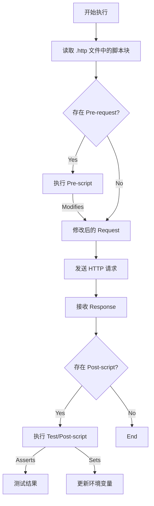

# RuPost 动态脚本能力 (Dynamic Scripting) 技术方案

## 1. 概述
本方案旨在为 RuPost 引入动态脚本执行能力，使用户能够在 **请求发送前 (Pre-request)** 和 **响应接收后 (Test/Post-response)** 执行自定义代码。这对于处理复杂的 API 签名、环境与变量联动、以及自动化测试断言至关重要。

## 2. 脚本引擎选型对比 (Engine Comparison)

在 Rust 生态中，主要有三种主流嵌入式脚本方案：**Rhai**, **Boa (JavaScript)**, **mlua (Lua)**。以下是详细对比：

| 特性 | **Rhai** (推荐) | **Boa** (备选) | **mlua / rlua** | **Deno / V8** |
| :--- | :--- | :--- | :--- | :--- |
| **语言风格** | 类似 Rust/JS 的混合体 | 标准 ECMAScript (JS) | Lua | 标准 JS/TS |
| **集成难度** | **极低** (Rust 原生) | **低** (Rust 原生) | 中 (需 C 绑定) | **极高** (复杂绑定) |
| **二进制体积** | **极小** (+300KB) | 中等 (+2MB+) | 小 (视系统库而定) | 巨大 (+20MB+) |
| **性能** | 高 (足够 API 逻辑使用) | 中 (解释执行) | **极高** (JIT) | 极高 (JIT) |
| **生态库** | 少 (需 Rust 手动暴露) | 逐步完善 | 丰富 | 极其丰富 (npm) |
| **用户学习成本**| 低 (类似 JS) | **0** (前端都会) | 中 (需学 Lua) | 0 |
| **安全性** | **高** (Sandbox 默认隔离) | 中 (需配置) | 中 | 高 |

### 选型结论
**推荐方案**: **Rhai** (或者 **Boa**)。

*   **Rhai 的理由**: 它是专门为 Rust 设计的脚本语言，并发安全，与 Rust 类型系统集成完美，编译体积增加几乎可以忽略不计。其语法足够像 JS，用户迁移成本低。
*   **Boa 的理由**: 如果一定要追求 "Postman 兼容性" (Postman 使用 JS)，Boa 是唯一选择。但 Boa 目前尚未完全达到 100% ECMA 标准，且体积较大。

**本方案暂定采用 Rhai**，因为 RuPost 作为 CLI 工具，轻量级和稳定性是核心追求。

## 3. 功能设计

### 3.1 脚本执行生命周期


### 3.2 语法定义 (.http 扩展)
我们需要在 `.http` 文件中定义脚本区域。建议参考 Hurl 或 Postman 的注释风格，或者自定义块。

**方案 A (注释式 - 兼容性好)**:
```http
GET https://api.example.com/data

> 

> 
```

### 3.3 暴露给脚本的 API (Sandbox API)

我们需要向 Rhai 引擎注册以下 Rust 对象和函数：

#### 全局对象 (Scope)
1.  **`request`**: (可读写)
    *   `url`: String
    *   `method`: String
    *   `headers`: Dictionary (Map)
    *   `body`: String
2.  **`response`**: (只读，仅在 Post-hooks 可用)
    *   `status`: Integer
    *   `headers`: Dictionary
    *   `body`: Dictionary (自动 parse JSON) 或 String
3.  **`client`** / **`rupost`**: (工具)
    *   `global.set(key, value)`: 设置全局变量
    *   `global.get(key)`: 获取全局变量
    *   `env.get(key)`: 获取当前环境变量

#### 工具函数 (Std Lib)
1.  **Crypto**: `md5()`, `sha256()`, `base64_encode()`, `hmac()`
2.  **Time**: `now()`, `sleep()`
3.  **Utils**: `uuid()`, `random_int()`

## 4. 风险点与注意事项

### 4.1 死循环与超时 (Infinite Loops)
*   **风险**: 用户写了 `while(true) {}`。
*   **对策**: Rhai 提供了 `set_max_operations` 或 `on_progress` 回调，必须限制脚本的最大指令数（例如 100,000 条指令）或最大执行时间（1秒）。

### 4.2 恶意代码 (Security)
*   **风险**: 用户试图读取 `/etc/passwd` 或执行 `rm -rf`。
*   **对策**: 脚本引擎必须运行在 **Sandbox** 模式。**绝对不要** 暴露 `std::fs` 或 `std::process` 给脚本层。Rhai 默认就是沙盒化的，这一点比 Lua/JS 更安全。

### 4.3 调试困难
*   **风险**: 脚本写错了，报错 `Error at line 1`，用户不知道发生了什么。
*   **对策**:
    1.  暴露 `print()` 或 `console.log()` 函数，将输出打印到 RuPost 的 stderr 或 TUI 的 Log 面板。
    2.  确保详细的错误堆栈映射回 `.http` 文件的原始行号。

## 5. 参考资料来源

*   **Rhai 官方文档 & 仓库**:
    *   Source: [https://github.com/rhaiscript/rhai](https://github.com/rhaiscript/rhai)
    *   Book: [https://rhai.rs/book/](https://rhai.rs/book/)
*   **Boa (JS Engine)**:
    *   Source: [https://github.com/boa-dev/boa](https://github.com/boa-dev/boa)
*   **Postman Sandbox API Reference** (作为 API 设计参考):
    *   Link: [https://learning.postman.com/docs/writing-scripts/script-references/postman-sandbox-api-reference/](https://learning.postman.com/docs/writing-scripts/script-references/postman-sandbox-api-reference/)

## 6. 实施路线建议

1.  **Step 1**: 引入 `rhai` crate。
2.  **Step 2**: 实现 `ScriptEngine` struct，封装 Engine 初始化和 API 注册。
3.  **Step 3**: 在 Parser 中识别 `> ` 块。
4.  **Step 4**: 在 `Runner` 的 `execute_request` 前后插入执行钩子。
